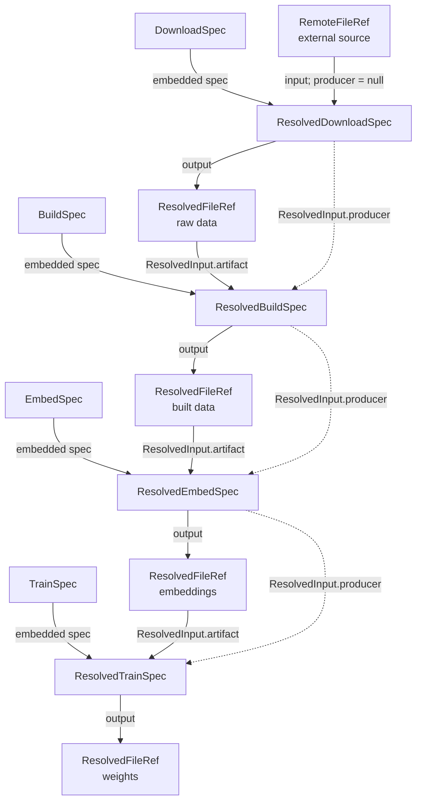

# MANTRA provenance models

This package defines the data contract for artifact provenance in MANTRA.

## The core model

Every artifact-producing operation has two representations:

1. A **Spec** (`*.spec.yaml`) records the intended parameters for constructing an artifact. Namely, the intended inputs, output, script invocation command, hyperparameter values, and runtime environment settings.
2. A **ResolvedSpec** (`*.spec.resolved.yaml`) is complementary to the spec and connects a successfully produced artifact to the exact inputs, code, environment, parameters, and command that produced it.

The protocol tracks four separate facts about a file:

| Concept | Question answered | Model field |
|---|---|---|
| Content identity | Which exact bytes? | `ResolvedFileRef.sha256` and `.bytes` |
| Workspace binding | Where does the script see it? | `ResolvedFileRef.path` |
| Durable storage | Where can MANTRA retrieve it? | `ResolvedFileRef.stored_at` |
| Provenance | Which execution produced it? | `ResolvedInput.producer` |

A workspace path may be a symlink into the local Hugging Face cache. MANTRA
records the logical repository-relative path, not the machine-specific cache
target.

## End-to-end provenance pipeline



Each box now names a class or artifact role; field-level details stay in the
sections below. Solid arrows show specs and artifact flow. Dotted arrows show
producer-record references. A downstream `ResolvedInput` contains both:

- The artifact SHA verifies the bytes presented to the script.
- The producer record ID identifies the execution that created those bytes.

The graph terminates at the download input because `producer` is explicitly
`null`.

## Shared protocol primitives

### `ProtocolModel`

All protocol objects inherit from `ProtocolModel`:

```python
model_config = ConfigDict(extra="forbid", frozen=True)
```

`extra="forbid"` rejects unknown fields, protecting the protocol from silent
YAML misspellings. `frozen=True` prevents field reassignment on validated model
instances. Resolved records must still be serialized and treated as immutable
documents because nested dictionaries can remain mutable Python objects.

### Validated scalar types

The module defines reusable annotated types:

- `RepoRelPath`: normalized POSIX repository-relative path with no absolute,
  empty, `.` or `..` components.
- `SHA256`: exactly 64 lowercase hexadecimal characters.
- `ByteCount`: a strict nonnegative integer.
- `GitObjectID`: a 40- or 64-character Git object identifier.
- `InputName`: a stable name used to match unresolved and resolved inputs.
- `HuggingFaceRepoID`: an `owner/repository` identifier.

These types use `Annotated` so their validation follows the type wherever it is
used.

## Location references

Location references describe where bytes are expected or stored. They do not,
by themselves, identify the bytes.

### `RepoFileRef`

```python
class RepoFileRef:
    kind: Literal["repo"]
    path: RepoRelPath
```

A logical path inside the MANTRA repository. For large artifacts, this path is
normally a symlink or materialized binding rather than the durable copy.

### `RemoteFileRef`

```python
class RemoteFileRef:
    kind: Literal["remote"]
    url: AnyHttpUrl
```

An external HTTP(S) origin controlled outside MANTRA. It is accepted as a
download source but excluded from `StorageRef` because the endpoint may mutate.

### `HuggingFaceFileRef`

```python
class HuggingFaceFileRef:
    kind: Literal["huggingface"]
    repo_type: Literal["dataset", "model"]
    repo_id: HuggingFaceRepoID
    revision: GitObjectID
    path: RepoRelPath
```

A structured reference to durable MANTRA storage. `revision` must be an
immutable Git object ID; mutable names such as `main` are rejected.

### `FileRef` and `StorageRef`

`FileRef` is the discriminated union of repository, remote and Hugging Face
references. It is used in stage specs.

`StorageRef` is narrower: it permits repository and pinned Hugging Face
references, but not arbitrary remote endpoints.

Pydantic uses each object's `kind` field to choose the appropriate union member.

## Resolved references

### `ResolvedFileRef`

```python
class ResolvedFileRef:
    sha256: SHA256
    bytes: ByteCount
    path: RepoRelPath | None
    stored_at: StorageRef | None
```

This is the primitive for exact artifact bytes.

- `sha256` and `bytes` identify and verify the content.
- `path` is where the executing script sees the artifact.
- `stored_at` is its canonical durable location.

An external download input may initially have neither a workspace binding nor a
MANTRA storage location. A completed output must have both a matching workspace
path and durable storage before its resolved spec can validate.

### `ResolvedSpecRef`

```python
class ResolvedSpecRef:
    record_id: SHA256
    location: StorageRef
```

This identifies a producer execution receipt, not ordinary file bytes.

`record_id` is calculated from the canonical JSON representation of the
validated `ResolvedSpec`. The record may be stored as readable YAML, so its
formatting, comments and key order do not affect its semantic identity.

To verify a `ResolvedSpecRef`, MANTRA loads the referenced document, validates
it as a `ResolvedSpec`, canonicalizes it and recalculates `record_id`.

### `ResolvedInput`

```python
class ResolvedInput:
    artifact: ResolvedFileRef
    producer: ResolvedSpecRef | None  # required field
```

`producer` is required but nullable:

- `producer: null` explicitly declares an external provenance boundary.
- A `ResolvedSpecRef` declares an internal artifact and supplies the next graph
  node for backward traversal.

The derived `is_external` property is not serialized; it simply tests whether
`producer is None`.

## Environment and code models

### `PythonLockEnvironmentSpec`

Declares a repository lockfile and supported Python version range. This is the
lightweight environment option for the first implementation.

### `OCIEnvironmentSpec`

Declares an OCI image name. The resolved form must contain an immutable
`sha256:...` image digest.

### `ResolvedPythonEnvironment`

Records the exact lockfile bytes through `ResolvedFileRef`, along with the
Python implementation and version actually used.

### `ResolvedOCIEnvironment`

Records the requested image name and immutable OCI image digest.

### `ResolvedCodeRef`

```python
class ResolvedCodeRef:
    repository: AnyHttpUrl | None
    commit: GitObjectID
    tree: GitObjectID
    entrypoint: RepoRelPath
    entrypoint_sha256: SHA256
```

Pins the clean Git snapshot used by the invocation. The commit/tree capture
imported repository modules and configuration; the entrypoint SHA directly
verifies the named script.

### `ResolvedSpecSource`

Identifies the exact YAML stage spec by repository path, raw-byte
SHA-256 and Git commit. This is distinct from the resolved record ID:

- `raw_sha256` verifies the literal original YAML bytes.
- `record_id` identifies the canonical semantic execution receipt.

### `ExecutionContext`

Captures observed runtime facts such as operating system, architecture,
accelerator, device and important runtime versions. These facts help diagnose
replay differences but do not replace the environment definition.

## Stage specs

### `BaseSpec`

Common schema for one artifact-producing invocation:

```python
class BaseSpec:
    schema_version: Literal[2]
    kind: str
    inputs: dict[InputName, FileRef]
    script: RepoRelPath
    environment: EnvironmentSpec
    params: dict[str, JsonValue]
    output: RepoRelPath
```

Every operation has named inputs and exactly one logical output path.

### `DownloadSpec`

Canonical external-ingestion operation. Every input must be a `RemoteFileRef`.
Its resolved form is the provenance root for the captured raw artifact.

### `BuildSpec`

Transforms a canonical raw artifact into a model-ready artifact.

### `EmbedSpec`

Transforms a built artifact into embeddings.

### `TrainSpec`

Consumes embeddings or other training inputs and produces the final weights or
model bundle.

The `Spec` alias is a discriminated union of these operation-specific models.

### Parameter resolution

Requested parameters record the user's request. Resolved parameters are needed
only when the executor turns that request into more specific values. Common
causes of parameter resolution include:

- `auto` selections;
- output-affecting library defaults;
- values derived from verified input dimensions;
- generated seeds; and
- hardware- or backend-dependent choices.

A resolved parameter value must be concrete. In particular, `auto` and other
deferred choices are not valid in resolved parameters. For example, a requested
PCA request may permit `solver: auto`, while its resolved form must name the
solver actually executed, such as `full`, `covariance_eigh`, `arpack` or
`randomized`. If the randomized solver ran, its resolved parameters must also
record the effective seed, iteration count, oversampling and normalization
strategy.

When the resolved alternatives have different meaningful fields, model them as
a discriminated union. A resolved randomized-PCA variant can require its random
seed and iteration settings, while a resolved full-SVD variant does not carry
irrelevant nullable fields.

The governing rule is:

> A resolved parameter class exists only when parameter resolution actually
> occurs.

If an operation already requires every output-affecting parameter explicitly
and executes those values unchanged, its parameter class in the spec is sufficient.
This keeps requested intent distinct from executed fact without creating
duplicate classes that add no information.

## Resolved execution receipts

### `BaseResolvedSpec`

Common post-execution receipt:

```python
class BaseResolvedSpec:
    schema_version: Literal[2]
    kind: str
    spec: BaseSpec
    spec_source: ResolvedSpecSource
    inputs: dict[InputName, ResolvedInput]
    code: ResolvedCodeRef
    environment: ResolvedEnvironment
    command: tuple[str, ...]
    output: ResolvedFileRef
    execution_context: ExecutionContext | None
```

Its validators enforce that:

- The resolved operation kind matches the embedded spec.
- Resolved input names exactly match spec input names.
- The resolved entrypoint matches the spec script.
- Requested and resolved environment kinds match.
- Repository input bindings match their spec paths.
- The output binding matches the spec output path.
- The output has been published to durable storage.
- A resolved lockfile binding matches the requested lockfile path.

### `ResolvedDownloadSpec`

Requires every input to have `producer: null`. It is the canonical transition
from an external origin into MANTRA-controlled artifact storage.

For a byte-preserving download, the external input and output should have equal
SHA-256 and byte count. The executor should enforce this when byte-preserving
behavior is part of the operation contract.

### `ResolvedInternalSpec`

Shared base class for operations whose inputs must all reference prior MANTRA
producers.

### `ResolvedBuildSpec`, `ResolvedEmbedSpec`, `ResolvedTrainSpec`

Operation-specific internal receipts. Each narrows the embedded `spec` type and
inherits the requirement that every input has a producer reference.

The `ResolvedSpec` alias is the discriminated union of all concrete resolved
receipt types.

## Example input binding

A build spec names the logical input:

```yaml
inputs:
  raw_data:
    kind: repo
    path: artifacts/raw/expression.csv
```

The resolved build receipt records the exact bytes, durable copy and producer:

```yaml
inputs:
  raw_data:
    artifact:
      sha256: aaaaaaaaaaaaaaaaaaaaaaaaaaaaaaaaaaaaaaaaaaaaaaaaaaaaaaaaaaaaaaaa
      bytes: 1048576
      path: artifacts/raw/expression.csv
      stored_at:
        kind: huggingface
        repo_type: dataset
        repo_id: example/mantra-artifacts
        revision: 8af2c1d9e356de45c0e62da19bf661d28d203f53
        path: raw/expression.csv
    producer:
      record_id: bbbbbbbbbbbbbbbbbbbbbbbbbbbbbbbbbbbbbbbbbbbbbbbbbbbbbbbbbbbbbbbb
      location:
        kind: repo
        path: provenance/download.bbbbbbbb.resolved.spec.yaml
```

At execution time, the future resolver will:

1. Retrieve `stored_at` into a local content cache.
2. Verify the byte count and SHA-256.
3. Materialize or link it at `path`.
4. Verify the referenced producer record.
5. Only then launch the recorded command.

## Record lifecycle

The intended runtime lifecycle is:

1. Load and validate the stage spec.
2. Capture the clean Git code snapshot and original spec identity.
3. Resolve and verify all input artifacts and producer records.
4. Resolve the environment.
5. Construct the exact argument vector.
6. Execute using a temporary output destination.
7. Close and hash the one output artifact.
8. Upload it to a pinned Hugging Face revision.
9. Create the workspace symlink or binding.
10. Construct and validate the resolved spec.
11. Compute its canonical `record_id`.
12. Write the immutable `*.resolved.spec.yaml` last.

No resolved spec is committed if execution, verification or publication fails.

## Current implementation status

Implemented:

- V2 Pydantic class hierarchy and structural invariants.
- Canonical model serialization and SHA-256 helper.
- V1 duplicate-safe YAML loading and golden download/build fixtures.
- Focused v2 tests for storage bindings, immutable Hugging Face revisions,
  explicit external boundaries and required producer references.

Still to implement for v2:

- Version-aware YAML loading and dumping.
- V2 download/build golden fixtures.
- Streaming artifact hashing and remote resolution.
- Hugging Face upload/download integration.
- Local cache and symlink materialization.
- Clean Git snapshot enforcement.
- Atomic resolved-spec writing.
- Record-store lookup and provenance graph traversal.
- Replay and verification reports.

Run the complete current test suite with:

```bash
.venv/bin/python -m unittest discover -v
```
