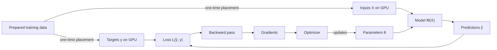

# Full-Batch Training on GPU-Resident Data: Architecture, Determinism, and Exact Continuation

*Related papers: [Part I — From Source Code to Silicon](E2E_execution.md) and [Part II — From Training Data to Updated Weights](../archive/E2E_ML_training.md).*

## Abstract

This paper follows one supervised-learning program from prepared training tensors to updated model parameters. Before optimization begins, the complete input tensor and target tensor are placed on one NVIDIA GPU. Their allocations remain in GPU global memory, and every optimization step uses all training examples.

The Python loop requests each training operation in order. PyTorch turns each request into CPU or GPU work. During the forward pass, autograd records the relationships it will need to calculate gradients. CUDA places the resulting GPU work in an ordered queue called a stream. The GPU then executes that work in parallel across its streaming multiprocessors.

A random seed fixes the starting state of a pseudorandom-number generator, but it does not control parallel arithmetic or the GPU implementation selected for an operation. Exact continuation therefore requires the program to restore changing training values and reproduce the fixed data, software, hardware, and numerical settings. The execution manifest and checkpoint described below record these two classes of information.

---

## Table of contents

- [1. The training calculation](#1-the-training-calculation)
- [2. Establishing GPU residency](#2-establishing-gpu-residency)
- [3. The memory required by a full training step](#3-the-memory-required-by-a-full-training-step)
- [4. What the CPU process and Python do](#4-what-the-cpu-process-and-python-do)
- [5. PyTorch tensors and dispatch](#5-pytorch-tensors-and-dispatch)
- [6. Eager execution and graph compilation](#6-eager-execution-and-graph-compilation)
- [7. Autograd and the optimizer](#7-autograd-and-the-optimizer)
- [8. CUDA streams and asynchronous submission](#8-cuda-streams-and-asynchronous-submission)
- [9. Kernels, thread blocks, warps, and SMs](#9-kernels-thread-blocks-warps-and-sms)
- [10. How kernels use the GPU memory hierarchy](#10-how-kernels-use-the-gpu-memory-hierarchy)
- [11. How PyTorch obtains optimized GPU kernels](#11-how-pytorch-obtains-optimized-gpu-kernels)
- [12. Reductions and order-sensitive floating-point arithmetic](#12-reductions-and-order-sensitive-floating-point-arithmetic)
- [13. Numerical precision and mixed-precision training](#13-numerical-precision-and-mixed-precision-training)
- [14. Seeds, generators, and RNG state](#14-seeds-generators-and-rng-state)
- [15. Deterministic execution controls](#15-deterministic-execution-controls)
- [16. The exact-continuation checkpoint](#16-the-exact-continuation-checkpoint)
- [17. Capturing the fixed execution context](#17-capturing-the-fixed-execution-context)
- [18. Restoring a checkpoint](#18-restoring-a-checkpoint)
- [19. Locating the first divergence](#19-locating-the-first-divergence)
- [20. Connecting checkpoints to provenance](#20-connecting-checkpoints-to-provenance)
- [21. End-to-end trace of one optimization step](#21-end-to-end-trace-of-one-optimization-step)
- [Conclusion](#conclusion)
- [References](#references)

---

## 1. The training calculation

Assume a supervised training set containing $N$ examples. The complete input tensor is $X$, the corresponding target tensor is $y$, and the model parameters at step $t$ are $\theta_t$. Let $\hat{y}_t$ denote the model's predictions for $X$. For a mean per-example loss,

$$
L_t = \frac{1}{N}\sum_{i=1}^{N}\ell(\hat{y}_{t,i}, y_i).
$$

Backward differentiation calculates the gradient of this loss with respect to the model parameters. Plain gradient descent subtracts the gradient multiplied by a learning rate. Optimizers such as momentum SGD and Adam also retain values from earlier steps and use them in the next update.

Every step uses all $N$ examples. The input and target tensors keep the same values and order throughout training. Preprocessing and element-data-type (`dtype`) conversion finish before the first optimization step, so the repeated computation begins with final CUDA tensors.



The two data branches have different roles. Inputs enter the model because the model transforms them into predictions. Targets enter the loss because they provide the reference values used to score those predictions. The optimizer changes the parameters, after which the same input and target tensors participate in the next step.

---

## 2. Establishing GPU residency

CUDA calls the GPU-attached dynamic random-access memory (DRAM) accessible across the device **global memory**. A CUDA allocation remains live until the program frees it, resets the device, or terminates the process. The [CUDA programming model](https://docs.nvidia.com/cuda/cuda-programming-guide/01-introduction/programming-model.html) distinguishes this persistent device storage from smaller on-chip resources used while kernels execute.

A PyTorch CUDA tensor is a Python-visible description of data held in GPU memory. Its storage contains the element values. The tensor's dimensions give the number of elements along each axis, and its dtype gives the representation of each element. Its strides specify how far to move through storage when an index changes, its storage offset identifies the first element of a view, and its device identifies the GPU holding the storage. A transposed view, for example, can present the same storage with different strides without copying it. Reproducing a tensor therefore requires the stored values and the tensor information that determines how they are interpreted.

One-time placement can be as simple as:

```python
device = torch.device("cuda:0")

# Loading and deterministic preprocessing finish before these copies.
training_inputs = cpu_inputs.to(device=device, dtype=torch.float32)
training_targets = cpu_targets.to(device=device)

assert training_inputs.device == device
assert training_targets.device == device

model = build_model().to(device)
optimizer = torch.optim.Adam(model.parameters(), lr=learning_rate)
```

The model is moved before the optimizer is constructed so that the optimizer receives the CUDA parameter objects it will update. Model buffers—tensors attached to the model but not updated as parameters, such as batch-normalization statistics—must also be on that device when the forward pass uses them.

All CPU-side data preparation finishes before optimization. Once the complete CUDA tensors exist, the training loop passes them directly to the model and loss function.

The dtype conversion in this example is part of data preparation. Converting FP64 CPU values to FP32 rounds them before training begins, so the model receives the final FP32 values. Record both the conversion and the source-data version before training; Section 17 places that information in the execution manifest.

During training, `training_inputs` and `training_targets` continue to refer to the same live CUDA allocations. Passing either tensor to a PyTorch operation does not duplicate its elements. PyTorch passes their tensor information and storage addresses to the compiled code that performs the requested operation. Section 5 explains how PyTorch selects that code.

**Residency** means that an allocation remains in GPU global memory across training steps. The allocations holding the inputs and targets remain live and their contents stay fixed. Model parameters and optimizer state also remain allocated, but the optimizer changes their contents after each backward pass. Every kernel still has to load the particular values it uses from global memory into the GPU's on-chip working storage. If the process ends, all of these live allocations disappear; a resumed process allocates new storage and reloads the saved values.

---

## 3. The memory required by a full training step

The training tensors may fit in GPU memory while the complete forward, backward, and optimizer step exceeds device capacity. The step must also hold parameters, intermediate forward values, gradients, optimizer state, and temporary memory requested by numerical libraries.

| Memory category | Lifetime and purpose |
|---|---|
| Inputs and targets | Persistent allocations read on every step |
| Parameters and persistent model buffers | Retained model state used by forward operations |
| Forward activations | Intermediate outputs retained until their backward formulas use them |
| Gradients | Derivatives accumulated for the parameters |
| Optimizer state | Values retained for the next parameter update |
| Temporary memory | Storage required only while an operation runs |

PyTorch's [CUDA caching allocator](https://docs.pytorch.org/docs/stable/notes/cuda.html#memory-management) can reuse an allocation after its previous value is no longer needed, so these accounting categories do not always correspond to separate allocations. Full-batch activation memory is often the largest term because the model retains intermediate values for all $N$ examples until backward uses them.

Test capacity by running a complete step with the actual training configuration. [`torch.cuda.reset_peak_memory_stats()`](https://docs.pytorch.org/docs/stable/generated/torch.cuda.memory.reset_peak_memory_stats.html) resets PyTorch's allocator statistics before the step. Afterward, `torch.cuda.max_memory_allocated()` reports the peak memory occupied by tensors, while `torch.cuda.max_memory_reserved()` reports the peak managed by the caching allocator. These statistics do not include every allocation made outside that allocator.

---

## 4. What the CPU process and Python do

The operating system starts one process for the training program. That process contains the Python interpreter, imported PyTorch code, program objects, and the connection to the GPU driver.

The process begins with a main CPU thread. A **thread** is one sequence of CPU instructions running within the process. The operating system can pause it by saving the next instruction, registers, and call stack, then restore those values to resume it. The main thread executes the Python training loop:

```python
completed_step = 0

for _ in range(num_steps):
    optimizer.zero_grad(set_to_none=True)
    prediction = model(training_inputs)
    loss = criterion(prediction, training_targets)
    loss.backward()
    optimizer.step()
    completed_step += 1
```

Python executes the loop and requests each operation in order. Large tensor operations transfer control to compiled PyTorch code. If that code launches GPU work, the GPU can continue executing after the Python call returns.

One Python thread can direct millions of logical GPU threads because Python requests a tensor operation once and compiled code maps that operation across tensor elements. An explicit Python loop inside the model remains under interpreter control, while a matrix multiplication or pointwise tensor operation executes in compiled CPU or GPU code.

A CUDA thread is distinct from the operating-system thread running Python. It is one logical execution instance of a GPU function. Section 8 follows a PyTorch CUDA operation from the CPU call that submits this GPU work through the ordered CUDA stream that carries it to the device. Section 9 then explains how the GPU organizes the logical CUDA threads created for that work.

---

## 5. PyTorch tensors and dispatch

Consider a matrix multiplication:

```python
output = torch.matmul(a, b)
```

The Python call specifies matrix multiplication, but it does not contain the machine instructions that perform it. PyTorch first checks where `a` and `b` are stored. CPU tensors require CPU code; CUDA tensors require GPU code. It also checks their element type and dimensions because an implementation that accepts FP32 matrices may not accept integers or a different arrangement of dimensions.

PyTorch calls this routing step [**dispatch**](https://docs.pytorch.org/devlogs/dispatcher/2026-04-16-how-does-the-dispatcher-work/). For CUDA matrix multiplication, dispatch commonly calls a routine in **cuBLAS**, NVIDIA's GPU implementation of the Basic Linear Algebra Subprograms interface. That routine submits the calculation to the GPU.

Gradient tracking happens alongside dispatch. If the result participates in a calculation that requires gradients, autograd records the relationship between the inputs and output. The autograd record tells the later backward pass which derivative calculation to request; it does not itself multiply the matrices.

The GPU kernel or library algorithm reached through dispatch determines how the calculation is divided. Two matrix-multiplication kernels can combine partial sums in different orders. Both compute a matrix product, yet rounding can make their low-order bits differ.

Preserving the Python expression alone therefore does not fix its result bit for bit. Reproduction also requires the same tensor values and descriptions together with the software versions and settings that control implementation selection.

---

## 6. Eager execution and graph compilation

In eager mode, PyTorch handles each operation as Python reaches it. A GPU operation may complete later, but dispatch and submission occur one operator at a time from Python's perspective.

With [`torch.compile`](https://docs.pytorch.org/docs/stable/generated/torch.compile), PyTorch represents a sequence of tensor operations as a graph and compiles that graph. The compiler can generate GPU kernels and call numerical libraries for operations they implement.

The compiler can **fuse** neighboring operations into one kernel. Fusion can avoid writing an intermediate tensor to global memory before the next operation reads it.

Compilation can change floating-point order because several Python-visible operations may become one kernel. It can also benchmark candidate generated kernels and retain a fast one, a selection process called **autotuning**.

A compiled kernel can be specialized for facts observed during compilation, such as tensor dimensions or dtype. PyTorch calls the checks that verify those facts [**guards**](https://docs.pytorch.org/docs/stable/user_guide/torch_compiler/compile/programming_model.html). If a guarded value changes, PyTorch may compile another version. For bit-parity testing, the execution manifest must identify the compiler backend, mode, and options and state whether the new process reuses compiled output or repeats kernel selection.

---

## 7. Autograd and the optimizer

[PyTorch autograd](https://docs.pytorch.org/docs/stable/notes/autograd.html) implements reverse-mode automatic differentiation. During the forward pass, operations involving tensors that require gradients record how their outputs were produced. Each operation also saves the forward tensors required by its derivative formula. These dependencies form an autograd graph for the calculation that actually occurred.

For a composition

$$
z=f(u), \qquad u=g(x),
$$

reverse mode applies the chain rule:

$$
\frac{\partial z}{\partial x}=\frac{\partial z}{\partial u}\frac{\partial u}{\partial x}.
$$

Training usually starts backward from a scalar loss. Autograd follows dependencies from that loss toward the parameters, invokes the corresponding backward operators, and accumulates their contributions in parameter gradient tensors. The backward pass is therefore another sequence of dispatched PyTorch operations and CUDA launches. It is not a reversal of the forward machine instructions.

A parameter may affect the loss through many examples or many paths through the model. Backward combines those gradient contributions into one `.grad` tensor. Section 12 defines this many-to-one operation as a reduction and explains why the addition order can affect its low-order bits.

The optimizer begins after backward has produced the gradients. Momentum SGD retains a velocity $v_t$:

$$
v_{t+1}=\mu v_t+g_t,
$$

$$
\theta_{t+1}=\theta_t-\eta_t v_{t+1}.
$$

Adam retains moving averages and a step count because its next update reads them. A learning-rate scheduler retains the state needed to determine the next learning rate.

The optimizer reads the gradients and its retained state, then updates the retained state and model parameters. The updated parameters are ready for the next forward pass.

---

## 8. CUDA streams and asynchronous submission

Dispatch selects compiled CPU code registered for the requested CUDA operation. That code prepares the operation and calls the CUDA runtime directly or enters an NVIDIA numerical library. The **CUDA runtime** is a host library that exposes functions for operations such as launching GPU code, managing device memory, and waiting for GPU work. It passes device-level work to the NVIDIA driver, which keeps track of the process's loaded GPU code and GPU-memory allocations and sends commands to the device.

The GPU instructions must exist before they can be launched. PyTorch and NVIDIA libraries include GPU code built in advance. A compiler such as the one used by `torch.compile` can also generate code for the current tensor calculation. The executable form may already contain native instructions for the target GPU architecture, or it may contain NVIDIA's [Parallel Thread Execution (PTX)](https://docs.nvidia.com/cuda/cuda-programming-guide/01-introduction/cuda-platform.html#parallel-thread-execution-ptx) intermediate instructions, which the driver compiles for the installed GPU. This is the GPU counterpart of the compilation and loading stages in Part I.

A **CUDA kernel** is one of these compiled GPU functions. A **CUDA stream** is an ordered queue of GPU commands submitted by CPU code. A **kernel launch** is the CPU's submission of one execution of a kernel to such a queue. The launch identifies the loaded kernel function, supplies the values its parameters will receive, and describes the logical CUDA threads that will execute it.

This CUDA C++ statement illustrates a launch of a vector-add kernel:

```cpp
int blocks = (n + 255) / 256;
vector_add<<<blocks, 256>>>(a_ptr, b_ptr, output_ptr, n);
```

The CPU executes these statements. Integer division calculates enough 256-thread blocks to cover `n` elements. `vector_add` identifies the compiled GPU function. The values in parentheses become its arguments: three GPU-memory addresses and the number of elements. Between the angle brackets, `blocks` gives the number of thread blocks and `256` gives the CUDA threads per block. This abbreviated form uses CUDA's default stream. Compiled PyTorch and CUDA-library code perform the equivalent submission through lower-level APIs that also identify PyTorch's current stream.

For a PyTorch tensor operation, the compiled CPU implementation extracts the tensor's device-memory address and any dimensions or strides the kernel needs. The GPU receives those values, rather than the Python tensor object. The addresses already refer to allocations containing the resident inputs, parameters, or intermediate results, so the launch does not copy the tensor contents.

The launch also defines the logical parallel execution. Its **grid dimensions** state how many groups of threads belong to the execution. Each group is a thread block. The **block dimensions** state how many CUDA threads belong to each block. These dimensions create thread indices used by the kernel; they do not assign blocks to particular physical processor cores. Section 9 follows that logical grid onto the GPU hardware.

After the runtime and driver prepare the launch command, they append it to the selected stream and can return control to the CPU before the kernel finishes. The GPU begins a command after earlier commands in that stream have satisfied their ordering requirements. NVIDIA specifies this behavior in the [CUDA asynchronous-execution model](https://docs.nvidia.com/cuda/cuda-programming-guide/02-basics/asynchronous-execution.html).

Unless the program explicitly selects another stream, the loop in Section 4 uses PyTorch's current stream on the selected GPU. The forward kernels enter that stream before the loss kernels, and the loss kernels enter it before backward. Stream order therefore prevents the loss from reading predictions before they are produced. Work submitted to another stream needs an event or another explicit dependency before it can safely consume those predictions.

Asynchronous submission matters at a checkpoint. Python may reach the save statement while an earlier optimizer kernel is still running. `torch.cuda.synchronize(device)` waits until previously submitted work on that GPU has finished, so the saved tensors represent the completed step. Synchronization establishes the save point; it does not change the arithmetic performed by a kernel.

---

## 9. Kernels, thread blocks, warps, and SMs

The [CUDA thread hierarchy](https://docs.nvidia.com/cuda/cuda-programming-guide/02-basics/writing-cuda-kernels.html#thread-hierarchy) organizes one kernel launch as a **grid**, the complete collection of logical CUDA threads executing the same kernel. The grid is divided into **thread blocks**. Each thread has an index within its block, and each block has an index within the grid. The kernel reads those indices to determine which output element or matrix tile that logical thread should process.

For example, a one-dimensional vector-add kernel can calculate an element index as

```c
int i = blockIdx.x * blockDim.x + threadIdx.x;
if (i < n) {
    output[i] = a[i] + b[i];
}
```

`threadIdx.x` identifies a thread within its block, `blockIdx.x` identifies the block, and `blockDim.x` is the number of threads in the block. A launch with 256 threads per block creates enough blocks to cover the vector. The final block may contain threads whose calculated index is beyond `n`; the condition prevents those threads from accessing the arrays.

The grid is a logical description, not a set of operating-system thread records. A block can begin when an SM has enough warp slots, registers, and shared memory for it. The SM reserves those resources, executes the block's threads, and releases the resources when the block finishes. Blocks are designed to execute independently, so CUDA may assign them in any order.

Each block is assigned to one **streaming multiprocessor**, or SM, for its lifetime. An SM contains warp schedulers, circuits that execute instructions, and on-chip storage such as registers, shared memory, and cache. Several blocks can reside on one SM when their combined register and shared-memory requirements fit. If the grid contains more blocks than all SMs can hold, completed blocks make room for later blocks.

Within an SM, hardware groups threads into **warps** of 32. A warp scheduler examines the resident warps and issues the next instruction from one whose input values are available and whose required hardware is free. An **execution circuit** is physical electronic hardware that carries out the operation encoded by an instruction. Addition and multiplication circuits perform arithmetic on register values; load/store circuits move values between registers and memory. The instruction also specifies the numeric format used to interpret those values. CUDA calls this organization **single instruction, multiple threads**, or SIMT, because one issued instruction acts on the separate register values of the warp's active threads.

Threads in one warp can take different branches. The SM then executes each required branch with only the participating threads active. This **warp divergence** preserves each thread's program behavior but can reduce throughput because some threads are inactive while the other branch runs.

---

## 10. How kernels use the GPU memory hierarchy

The resident input, target, parameter, and optimizer tensors occupy allocations in GPU global memory. A kernel argument gives the kernel an address within one of those allocations. When a warp executes a load instruction, the memory system checks the on-chip caches and obtains the value from global memory if no cached copy is available. The value is placed in a register belonging to the requesting thread, where a later instruction can use it.

Four storage levels account for most tensor movement during a kernel:

| Storage | Typical role during a kernel |
|---|---|
| Registers | Per-thread operands and temporary values |
| Shared memory | Programmer-managed on-chip storage shared by threads in one block |
| L1 and L2 caches | Hardware-managed reuse of recently accessed memory |
| Global memory | Large device-wide storage holding persistent tensors and kernel outputs |

The storage levels serve different lifetimes. Global-memory allocations persist across kernel launches until the program frees them. Registers and shared memory exist for the threads and blocks currently resident on an SM. Caches retain recently accessed data according to hardware policy and may replace it at any time. Finishing a kernel therefore leaves the training tensors in global memory but does not preserve its registers or shared-memory contents for the next launch.

System RAM attached to the CPU is outside this GPU hierarchy. The one-time placement in Section 2 copied the prepared values from system RAM into global memory. Subsequent kernel launches pass addresses of the global-memory allocations and do not repeat that CPU-to-GPU copy.

When neighboring threads access neighboring addresses, the hardware can serve their loads or stores with fewer memory transactions, a property called [**coalescing**](https://docs.nvidia.com/cuda/cuda-programming-guide/02-basics/writing-cuda-kernels.html#coalesced-global-memory-access). A matrix-multiplication kernel may also load a small tile into shared memory so several threads can reuse it without repeating the same global-memory loads. Coalescing makes each group of accesses more efficient; shared-memory reuse reduces how often the data must be fetched from global memory.

When a kernel executes supported matrix instructions, an SM can use **tensor cores**, circuits specialized for matrix multiply-accumulate operations. The instruction and library implementation determine the input and accumulation precision, which Section 13 connects to numerical reproducibility.

---

## 11. How PyTorch obtains optimized GPU kernels

A PyTorch operation and a kernel launch are not necessarily one-to-one. A pointwise operation may use one CUDA kernel. Matrix multiplication commonly enters cuBLAS, while convolution commonly enters **cuDNN**, NVIDIA's GPU library for deep-learning operations. The library routine first executes as CPU code to select and configure an algorithm. It then submits one or several kernels to the current CUDA stream; some algorithms also reserve temporary workspace in GPU global memory.

The Python operation name specifies the required mathematical result, while the library chooses how to calculate it on the installed GPU. For convolution, cuDNN considers implementations that divide the input into different tiles, use different temporary workspaces, and combine partial results differently. Tensor dimensions and dtype rule out incompatible implementations; the configured workspace and determinism policy further restrict the eligible choices.

With cuDNN benchmarking enabled, PyTorch asks cuDNN to time eligible convolution implementations when it encounters a new input configuration. cuDNN retains the fastest measured choice for later calls with that configuration. Timing noise can make two processes choose different implementations. Setting `torch.backends.cudnn.benchmark = False` removes timing from selection, while deterministic-algorithm controls determine whether the selected implementation itself has repeatable output. PyTorch documents the two controls separately in its [reproducibility guidance](https://docs.pytorch.org/docs/2.13/notes/randomness.html).

Implementation choice matters numerically because different kernels can partition a sum differently or use different internal precision. The next section examines that effect through reductions.

---

## 12. Reductions and order-sensitive floating-point arithmetic

A **reduction** combines many input values into fewer output values. Summing $[2,5,1,4]$ reduces four values to one. A mean loss reduces one loss per example to a scalar, and backward reduces many example-level contributions into each parameter gradient.

On a GPU, a large reduction is divided across the grid. Threads first combine separate portions of the input. Threads in one block can place their partial sums in shared memory and wait at a block-wide barrier until the required values have been written. The block then combines those values and writes a block-level partial sum to global memory. A later kernel can reduce the block-level results, or blocks can use **atomic addition**, an instruction that completes one update to a shared destination without allowing a simultaneous update to overwrite it.

These steps define a **reduction tree**: the pairing and grouping of partial results from the original inputs to the final output. For example, one tree might calculate

$$
s_1=(a+b)+(c+d),
$$

while another calculates

$$
s_2=((a+b)+c)+d.
$$

In exact real arithmetic the groupings are equal. [Binary floating-point arithmetic](https://docs.nvidia.com/cuda/cuda-programming-guide/05-appendices/mathematical-functions.html#floating-point-introduction) stores only a finite set of values, so it rounds each intermediate result to the active format. Changing the tree changes where rounding occurs, making addition order-sensitive; PyTorch's [numerical-accuracy guidance](https://docs.pytorch.org/docs/stable/notes/numerical_accuracy.html) identifies the same non-associativity as a source of differences between mathematically equivalent computations:

$$
\operatorname{fl}(\operatorname{fl}(a+b)+c) \neq \operatorname{fl}(a+\operatorname{fl}(b+c))
$$

for some representable $a$, $b$, and $c$. Goldberg's classic survey explains how finite representation and rounding produce this behavior. The difference can begin in low-order bits and then propagate through later nonlinear operations and parameter updates.

Different implementations may use different reduction trees. Atomic addition introduces another possibility: although each update is indivisible, blocks can reach the destination in different orders, and those orders can round differently. A fixed tree remains deterministic even if blocks are scheduled in a different physical order, provided every combination waits for its defined inputs. Scheduling variation affects the result only when the algorithm allows arrival order to determine the arithmetic order.

Determinism and accuracy are separate. A fixed reduction order can repeat exactly while still accumulating rounding error.

Reduction order is especially important in full-batch training because every loss and gradient reduction combines contributions from all $N$ examples. Keeping the inputs in a fixed sequence fixes the leaves of the reduction tree, but it does not by itself fix how those values are grouped and added. The GPU kernel's reduction tree—or, for some atomic reductions, the order in which updates arrive—therefore remains part of the numerical implementation. Because each finite-precision addition may round its result, different combination orders can produce different low-order bits.

---

## 13. Numerical precision and mixed-precision training

The reduction example in Section 12 depends on the floating-point format used for each intermediate result. A binary floating-point value has a sign, a **significand**, and an **exponent**. The significand determines how many significant binary digits are retained; the exponent determines the range of magnitudes the format can represent. An arithmetic instruction produces an exact mathematical result when possible and then rounds it to a value representable in the destination format.

FP64 and FP32 use 64 bits and 32 bits per value. FP64 retains more significand bits, so it usually loses less information to rounding. FP16 and bfloat16 (BF16) use 16 bits. They reduce storage and data movement and can use faster matrix instructions on supported GPUs, while retaining fewer significant bits than FP32.

**TensorFloat-32 (TF32)** works differently from a stored tensor dtype. The tensors remain FP32, while supported NVIDIA matrix and convolution operations use fewer input-significand bits internally. The result is accumulated along the implementation's FP32 path. Enabling TF32 can therefore change results even though inspecting the tensors still reports `torch.float32`.

[PyTorch's CUDA semantics documentation](https://docs.pytorch.org/docs/stable/notes/cuda.html#tensorfloat-32-tf32-on-ampere-and-later-devices) exposes controls for FP32 and TF32 behavior. Before training, the program writes the effective precision controls to an **execution manifest**, a versioned record described in Section 17, because they can change arithmetic without changing the stored tensor dtype.

[Automatic mixed precision](https://docs.pytorch.org/docs/2.13/amp.html) uses **autocast** to apply an operation-specific dtype rule. Eligible matrix operations can run in FP16 or BF16, while operations assigned an FP32 rule run in FP32.

FP16 training often adds a **gradient scaler**. Before backward, it multiplies the loss by a scale factor so that small gradients are less likely to underflow. Before the optimizer update, it returns the gradients to their intended magnitude and checks for nonfinite values. If a gradient is nonfinite, the scaler skips the optimizer update. It then adjusts the scale for later steps. The current scale and its update counters are changing training state.

Precision and determinism answer different questions. Precision determines which values and intermediate results the arithmetic can represent. Determinism determines whether repeated executions perform the same operations in the same effective order. A reduced-precision operation can repeat exactly, while an FP32 reduction whose addition order changes can produce different bits. The manifest must therefore record both the precision policy and the determinism controls.

---

## 14. Seeds, generators, and RNG state

Precision settings do not account for operations that deliberately request random values, such as dropout. These values come from a pseudorandom-number generator, or RNG. An RNG is an algorithm with retained internal state. A **seed** initializes that state. Each random-number request calculates output from the current state and advances the state, so the next request produces the next values in the sequence.

The same seed reproduces the same sequence only when the same RNG implementation receives the same requests in the same order. The seed does not accompany every random value; it establishes the sequence's starting point.

A seed alone cannot reproduce a run when the sequence of random requests changes. Suppose two runs initialize a CUDA generator from the same seed. If one run executes an extra dropout call, its generator advances farther. Every later stochastic operation then receives different values even though both runs began with the same seed.

[`torch.manual_seed(seed)`](https://docs.pytorch.org/docs/stable/generated/torch.manual_seed.html) initializes PyTorch's default CPU and CUDA generators. Python and NumPy own separate generators, so seed them separately only if the training program uses them. An explicitly created `torch.Generator` also has its own state.

Reading the fixed training tensors during optimization uses no random numbers. A stochastic model operation can still use the CUDA generator; dropout, for example, draws a new mask during each training-mode forward pass.

For exact continuation, save the current state of each generator that future training will consume. Saving only the original seed would reset the generator to the beginning of its sequence. The current state identifies the position reached after all random draws completed before the checkpoint.

---

## 15. Deterministic execution controls

Restoring RNG state fixes the random values requested after a checkpoint. It does not fix a CUDA operation that can combine the same inputs in different orders. Here, **deterministic** means that an operation produces the same output bits when it receives the same input bits under the same recorded software and hardware configuration. Bitwise continuation requires both the saved RNG states and deterministic implementations for the operations the model uses.

PyTorch provides [`torch.use_deterministic_algorithms(True)`](https://docs.pytorch.org/docs/stable/generated/torch.use_deterministic_algorithms.html). When a covered operation has a deterministic implementation, PyTorch selects it. When a covered operation lacks one, strict mode raises an error. The set of covered operations is version-dependent, which makes the PyTorch version part of the claim.

For a cuDNN convolution, PyTorch can first choose among several compatible algorithms and then execute the chosen algorithm. With `torch.backends.cudnn.benchmark = True`, cuDNN times candidates for a new input configuration and retains the fastest measured result. Because timing varies, a new process can choose a different candidate. Setting `benchmark = False` removes that timing experiment. Setting `torch.backends.cudnn.deterministic = True` restricts convolution to algorithms that repeat their result for the same inputs.

[NVIDIA's cuBLAS reproducibility documentation](https://docs.nvidia.com/cuda/cublas/index.html#results-reproducibility) identifies `CUBLAS_WORKSPACE_CONFIG` as a control for configurations in which concurrent streams can otherwise affect repeatability. Set it before importing PyTorch because the CUDA library reads it during initialization. Supported values include `:16:8` and `:4096:8`; the second reserves more workspace.

The [CUDA 13.3 cuBLAS documentation](https://docs.nvidia.com/cuda/cublas/index.html#floating-point-emulation) describes lower-precision implementations that emulate FP32 or FP64 calculations. FP32 emulation is not IEEE-754 compliant, and FP64 fixed-point emulation can fall back to a native routine if its temporary allocation fails. The strict configuration below disables both forms of emulation. A program that deliberately enables FP64 emulation must provide sufficient cuBLAS workspace to prevent that fallback and record the choice.

The remaining controls preserve the arithmetic path described in Sections 6 and 13. Precision settings determine whether eligible operations use TF32 or another reduced-precision path. Compilation settings determine whether PyTorch fuses operations or substitutes generated kernels. A strict comparison fixes these settings as part of the execution context.

A representative strict configuration is:

```bash
export CUBLAS_WORKSPACE_CONFIG=:4096:8
export CUBLAS_EMULATE_SINGLE_PRECISION=0
export CUBLAS_EMULATE_DOUBLE_PRECISION=0
```

```python
import torch

torch.use_deterministic_algorithms(True)
torch.backends.cudnn.benchmark = False
torch.backends.cudnn.deterministic = True

# Request IEEE FP32 internally for CUDA matmul and cuDNN convolution.
torch.backends.cuda.matmul.fp32_precision = "ieee"
torch.backends.cudnn.conv.fp32_precision = "ieee"
```

The deterministic-algorithm, library, and precision controls above constrain algorithm choice and may reduce throughput or increase temporary-memory use. PyTorch explicitly states that complete reproducibility is not guaranteed across releases, platforms, or CPU and GPU execution, so a bitwise claim is limited to the recorded configuration.

---

## 16. The exact-continuation checkpoint

After the numerical controls are fixed, exact continuation still requires the values changed by training. An **exact-continuation checkpoint** is a saved copy of every changing value that the next step will read.

The meaning of those values depends on where the save occurs. This paper saves after the optimizer has updated the parameters and `completed_step` has been incremented, and before the next forward pass begins. If the loop updates a learning-rate scheduler or gradient scaler once per step, that update also finishes before the save. A restored process can then begin at the same point: the start of the next step.

At this save point, the next step reads the following state:

| State | Reason it affects the future |
|---|---|
| Completed-step count | Identifies which update finished and which step comes next |
| Model parameters and persistent buffers | Define the next forward pass |
| Model training or evaluation mode | Controls operations such as dropout and batch normalization |
| Optimizer state | Defines the next parameter update |
| Scheduler state, if used | Defines subsequent learning rates |
| Gradient-scaler state, if used | Defines later mixed-precision scaling and overflow decisions |
| RNG states used by future operations | Define random values requested after restoration |
| Execution-manifest digest | Identifies the fixed execution context in which these values will be used |

The resident inputs and targets do not change from step to step. The execution manifest records their content digests, tensor descriptions, source-data version, and preparation code. Each checkpoint can refer to that manifest instead of storing another complete copy of the training data. Section 17 defines the manifest and its digest.

The example loop clears old gradients before the next backward pass, so the checkpoint need not save them. If a different loop carries gradients across steps, those gradients become checkpoint state. The checkpoint also preserves each module's training mode and each parameter's gradient-tracking flag because either can change the next forward or backward pass.

A representative save site for the simple optimizer loop is:

```python
optimizer.step()

if scheduler is not None:
    scheduler.step()

completed_step += 1

if should_checkpoint(completed_step):
    torch.cuda.synchronize(device)
    save_checkpoint(completed_step)  # The next forward pass has not begun.
```

PyTorch's [general-checkpoint guidance](https://docs.pytorch.org/tutorials/beginner/saving_loading_models.html#saving-loading-a-general-checkpoint-for-inference-and-or-resuming-training) motivates saving the model and optimizer state dictionaries together with other state required to resume. The checkpoint payload can follow this structure:

```python
checkpoint = {
    "format_version": 1,
    "completed_step": completed_step,
    "execution_manifest_digest": execution_manifest_digest,
    "model": model.state_dict(),
    "module_training": {
        name: module.training for name, module in model.named_modules()
    },
    "parameter_requires_grad": {
        name: parameter.requires_grad
        for name, parameter in model.named_parameters()
    },
    "optimizer": optimizer.state_dict(),
    "scheduler": None if scheduler is None else scheduler.state_dict(),
    "scaler": None if scaler is None else scaler.state_dict(),
    "torch_cpu_rng_state": torch.get_rng_state(),
    "torch_cuda_rng_state": torch.cuda.get_rng_state(device),
}

torch.save(checkpoint, checkpoint_path)
```

Save only RNG states that future training consumes. Dropout, for example, requires the CUDA RNG state. Save another generator's state only if the resumed loop calls that generator.

Exact continuation compares the loaded tensor state and the next computation. It does not require the serialized checkpoint files themselves to have identical bytes.

---

## 17. Capturing the fixed execution context

The checkpoint records changing values. The **execution manifest** records the inputs and execution conditions intended to remain fixed for the run. A **cryptographic digest** is a short value calculated from the manifest's complete contents; changing any recorded field changes the digest with overwhelming probability. Each checkpoint stores this digest so restoration can verify that it has reconstructed the same manifest before using the saved state.

The program sets CUDA-library environment variables before importing PyTorch. It then applies the numerical and compilation settings and initializes every RNG that the program will use. After constructing the training tensors, model, and optimizer—but before the first forward pass—it records the actual tensors, software, GPU, and numerical settings in the manifest and calculates its digest. Checkpoints written after completed steps store that digest.

| Manifest section | Fixed information recorded there |
|---|---|
| Training tensors | Content digest and tensor description for each input and target, together with the source-data version and preparation-code revision that produced them |
| Program | Source revision, the configuration values that construct the model, loss, and optimizer, and the initial seed assigned to each RNG the program uses |
| Software and GPU | Python and PyTorch builds, CUDA driver and runtime, cuDNN and cuBLAS versions, and the selected GPU's model and compute capability |
| Numerical execution | Effective deterministic and precision controls, mixed-precision and gradient-scaler settings when used, and compiler or autotuning settings when enabled |

Record the values the running process actually uses. After assigning a backend setting, read it back from PyTorch. Inspect the constructed tensors to obtain their actual dtype, dimensions, strides, and device. Query the selected GPU through the runtime. A configuration file that says “FP32” is incomplete if a backend setting still permits TF32 internally.

The following sketch shows where capture belongs:

```python
# Process environment is established before this program imports torch.
import os
import sys
import torch

configure_numerical_settings()
seed_generators_used_by_this_program()

training_inputs, training_targets = prepare_resident_tensors()
model, optimizer, scheduler, scaler = construct_training_objects()

execution_manifest = {
    "program": {
        "source_revision": SOURCE_REVISION,
        "training_config": TRAINING_CONFIG,
        "rng_initialization": describe_rng_initialization(),
    },
    "software": {
        "python": sys.version,
        "pytorch": torch.__version__,
        "pytorch_build": torch.__config__.show(),
        "cuda_used_to_build_pytorch": torch.version.cuda,
        "cuda_libraries": describe_cuda_driver_runtime_cudnn_cublas(),
    },
    "hardware": describe_selected_gpu_and_driver(),
    "training_tensors": describe_and_digest(
        training_inputs, training_targets
    ),
    "numerical_settings": read_effective_numerical_settings(),
    "compilation": read_effective_compilation_settings(),
    "relevant_environment": {
        "cublas_workspace_config": os.environ.get(
            "CUBLAS_WORKSPACE_CONFIG"
        ),
        "cublas_fp32_emulation": os.environ.get(
            "CUBLAS_EMULATE_SINGLE_PRECISION"
        ),
        "cublas_fp64_emulation": os.environ.get(
            "CUBLAS_EMULATE_DOUBLE_PRECISION"
        ),
        "visible_gpu_mapping": os.environ.get("CUDA_VISIBLE_DEVICES"),
        "nvidia_tf32_override": os.environ.get("NVIDIA_TF32_OVERRIDE"),
        "pytorch_cublas_tf32_override": os.environ.get(
            "TORCH_ALLOW_TF32_CUBLAS_OVERRIDE"
        ),
    },
}

execution_manifest_digest = write_canonical_manifest(execution_manifest)

# The first forward pass begins only after the manifest is fixed.
```

The environment block contains variables that can change cuBLAS workspace behavior, floating-point emulation, GPU selection, or TF32 policy. Record another environment variable only when the program or an invoked library uses it to change execution.

The helper functions in the sketch are application code, not PyTorch APIs. `write_canonical_manifest` must serialize the same content in the same byte order whenever its digest is used as the manifest identity.

---

## 18. Restoring a checkpoint

Restoration first reconstructs and verifies the fixed execution context, then loads the changing values:

1. Set the recorded environment variables before importing PyTorch or initializing CUDA libraries.
2. Apply the recorded determinism and precision settings, then reproduce the recorded compilation and autotuning policy.
3. Recreate the input and target tensors and the model, optimizer, scheduler, and gradient scaler used by the saved run.
4. Capture the reconstructed context by the procedure in Section 17. Verify the tensor contents and descriptions, then calculate the canonical manifest digest and compare it with the digest stored in the checkpoint. Stop if they differ.
5. Load the model state, then restore the scheduler and optimizer according to the installed PyTorch version's documented order. Load the scaler state when mixed-precision training uses one. Restore the saved module modes and parameter gradient-tracking flags.
6. Restore each saved RNG state immediately before the first operation that can consume randomness.
7. Begin the next forward pass.

PyTorch's [`Optimizer.load_state_dict()` documentation](https://docs.pytorch.org/docs/main/generated/torch.optim.Optimizer.load_state_dict.html) warns that optimizer restoration can overwrite loaded learning rates when scheduler construction and loading occur in the wrong order. Restoration code should follow the documentation for the installed PyTorch release and verify the effective learning rates before continuation.

Model construction can consume random values, so restore the saved RNG states after construction and immediately before resumed training.

The strongest restoration test starts two executions from the same save point. One continues in the original process; the other restores the checkpoint in a new process. Compare their next predictions, loss, gradients, and updated state exactly. Matching results demonstrate continuation for that recorded context, not for unrelated software or hardware.

---

## 19. Locating the first divergence

When two runs finish with different parameters, comparing only their final checkpoints proves that a divergence occurred but does not identify its source. Compare the runs in execution order. The first unequal value localizes the cause to the work performed since the previous equal value.

Begin immediately before the tested step. Confirm that the checkpoint state, training tensors, and execution manifest match. Then compare the step at progressively later points:

| Comparison point | What a first difference establishes |
|---|---|
| Before the forward pass | The two runs did not restore the same starting state |
| An intermediate forward output | The responsible operation lies at or before that point in the model |
| Loss | The forward outputs matched, but the loss calculation or reduction did not |
| Parameter gradients | The forward pass matched, but backward did not |
| Updated parameters | The gradients matched, but the optimizer update did not |

For bit parity, compare tensor dtype and dimensions, then copy both tensors to contiguous CPU arrays in the same element order and compare their bytes.

Synchronize before reading a GPU result on the CPU. First compare the loss and final gradients, then add intermediate comparisons until the first differing operation is isolated.

The first unequal value narrows the cause. If the generators began in the same state, different states after the step indicate different random-number consumption. A first difference at a reduction points to floating-point order or a changed implementation. A tolerance may be appropriate for scientific comparison, but not for a bit-parity claim.

---

## 20. Connecting checkpoints to provenance

A checkpoint stores the values needed by the next training step. Provenance records how that checkpoint was produced and connects it to the data, code, configuration, run, and responsible people or services.

The [W3C PROV data model](https://www.w3.org/TR/prov-dm/) supplies standard terms for relationships among a run, its inputs and outputs, and the responsible people or services:

| W3C PROV term | Training record |
|---|---|
| **Activity** | The completed training run |
| **Entity** | An input used by the run or an output it generated, including prepared tensors, source code, configuration, checkpoints, and metrics |
| **Agent** | The person, organization, or execution service responsible for the run |

Relations such as `used`, `wasGeneratedBy`, and `wasAssociatedWith` connect the activity, entities, and agents in the table. The checkpoint remains a file containing changing training values. The execution manifest contains the fixed fields specified in Section 17. The provenance record connects both files to the source data, program, completed run, and outputs.

---

## 21. End-to-end trace of one optimization step

After the manifest has been written, one training step proceeds as follows:

1. The Python thread clears the previous gradients and calls the model with the resident input tensor.
2. As the model calls tensor operations, [PyTorch dispatch](https://docs.pytorch.org/devlogs/dispatcher/2026-04-16-how-does-the-dispatcher-work/) selects a compiled CUDA implementation for each one. Autograd records how each gradient-requiring output was produced.
3. The compiled CPU implementation launches its GPU kernels. Each launch places a command in the current CUDA stream containing the loaded kernel function, its argument values, and the grid and block dimensions. Tensor arguments include addresses of the resident GPU allocations.
4. The GPU takes launch commands from the stream. It assigns their thread blocks to available SMs, where warps execute instructions that load operands, perform arithmetic, and store results.
5. Stream order ensures that the loss kernels read the predictions after the forward kernels have produced them. The loss kernels compare the predictions with the resident targets and reduce the example-level losses to one scalar.
6. `loss.backward()` asks autograd to traverse the recorded dependencies. PyTorch dispatches the required derivative operations, whose kernels calculate and combine contributions to each parameter gradient.
7. The optimizer kernels read the gradients and retained optimizer state, then write the updated optimizer state and parameters.
8. The input and target allocations retain their original values. Storage used only for the completed calculation can be reused.
9. At the checkpoint save point, the CPU waits for the submitted GPU work to finish and saves the changing state together with the verified manifest digest.

The next step begins with the same training tensors and the parameters updated in step 7.

---

## Conclusion

Full-batch GPU-resident training prepares the complete input and target tensors once and reuses their GPU allocations on every step. Python requests the operations in order. PyTorch routes each tensor operation to compatible code. Autograd records the forward relationships and requests derivative operations during backward. CUDA queues the GPU work, and the GPU executes it across its streaming multiprocessors.

The checkpoint stores the changing values the next step reads: model and optimizer state and, when used, scheduler, gradient-scaler, and RNG state. The execution manifest identifies the fixed tensors, software, GPU, and numerical settings. A provenance record connects both to the data, code, and completed run.

Bitwise continuation is established by restoring the checkpoint under the recorded execution manifest, running the next step, and comparing its tensors exactly. If they differ, comparing the forward outputs, loss, gradients, and updated parameters in order locates the first divergence.

---

## References

### Execution and numerical behavior

- [PyTorch autograd mechanics](https://docs.pytorch.org/docs/stable/notes/autograd.html)
- [PyTorch dispatcher](https://docs.pytorch.org/devlogs/dispatcher/2026-04-16-how-does-the-dispatcher-work/)
- [PyTorch CUDA semantics](https://docs.pytorch.org/docs/stable/notes/cuda.html)
- [PyTorch CUDA memory management](https://docs.pytorch.org/docs/stable/notes/cuda.html#memory-management)
- [PyTorch CUDA environment variables](https://docs.pytorch.org/docs/stable/cuda_environment_variables.html)
- [PyTorch numerical-accuracy guidance](https://docs.pytorch.org/docs/stable/notes/numerical_accuracy.html)
- [PyTorch reproducibility guidance](https://docs.pytorch.org/docs/2.13/notes/randomness.html)
- [PyTorch deterministic-algorithm API](https://docs.pytorch.org/docs/stable/generated/torch.use_deterministic_algorithms.html)
- [PyTorch automatic mixed precision](https://docs.pytorch.org/docs/2.13/amp.html)
- [PyTorch `torch.compile`](https://docs.pytorch.org/docs/stable/generated/torch.compile)
- [PyTorch `torch.compile` programming model](https://docs.pytorch.org/docs/stable/user_guide/torch_compiler/compile/programming_model.html)
- [PyTorch optimizer-state restoration](https://docs.pytorch.org/docs/main/generated/torch.optim.Optimizer.load_state_dict.html)
- [PyTorch saving and loading checkpoints](https://docs.pytorch.org/tutorials/beginner/saving_loading_models.html#saving-loading-a-general-checkpoint-for-inference-and-or-resuming-training)
- [NVIDIA CUDA programming model](https://docs.nvidia.com/cuda/cuda-programming-guide/01-introduction/programming-model.html)
- [NVIDIA CUDA platform, PTX, and JIT compilation](https://docs.nvidia.com/cuda/cuda-programming-guide/01-introduction/cuda-platform.html)
- [NVIDIA introduction to CUDA C++ and kernel launches](https://docs.nvidia.com/cuda/cuda-programming-guide/02-basics/intro-to-cuda-cpp.html)
- [NVIDIA CUDA asynchronous execution](https://docs.nvidia.com/cuda/cuda-programming-guide/02-basics/asynchronous-execution.html)
- [NVIDIA CUDA kernels and device memory](https://docs.nvidia.com/cuda/cuda-programming-guide/02-basics/writing-cuda-kernels.html)
- [NVIDIA CUDA floating-point computation](https://docs.nvidia.com/cuda/cuda-programming-guide/05-appendices/mathematical-functions.html)
- [NVIDIA cuBLAS results reproducibility](https://docs.nvidia.com/cuda/cublas/index.html#results-reproducibility)
- David Goldberg, [*What Every Computer Scientist Should Know About Floating-Point Arithmetic*](https://doi.org/10.1145/103162.103163), *ACM Computing Surveys* 23(1), 1991.

### Provenance

- [W3C PROV Data Model](https://www.w3.org/TR/prov-dm/)
