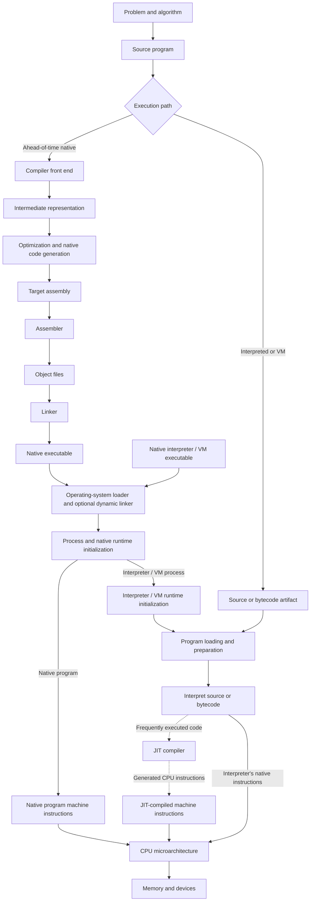

# From Source Code to Silicon: How a Computer Executes a Program

## Abstract

Executing a program requires several systems. A compiler translates source code, a linker constructs an executable, an operating system starts a process, and a processor executes the resulting instructions.

This paper follows a program from source text through compilation and linking, into a process created by an operating system, and finally through instruction execution inside a modern processor. The main path uses ahead-of-time compilation: the compiler produces machine code for the physical central processing unit (CPU) before the program is launched. Later sections explain interpreters and just-in-time (JIT) compilation.

---

## 1. Stages from source to execution

In the ahead-of-time path, the program moves through authoring, compilation, linking, loading, execution, and termination. The compiler and linker build the target program's native executable. In the interpreted or VM path, the operating system instead loads an already-compiled interpreter or VM executable, which later reads the target program's source or bytecode as input. In both paths, the processor executes machine instructions belonging to the resulting process.

Two processor terms recur throughout the paper. The **instruction-set architecture** (ISA) defines the machine instructions and registers visible to software. The **microarchitecture** is the processor design that implements that ISA.



Both paths cross the operating-system loading boundary. In the native path, the loader maps the target program's executable. In the interpreted path, it maps the already-compiled interpreter or VM executable; after that process initializes, the VM loads the source or bytecode artifact. The physical CPU therefore executes either the native program's instructions, the interpreter's native instructions, or machine instructions emitted inside the process by a JIT compiler. The [ELF program-loading specification](https://gabi.xinuos.com/elf/07-pheader.html) describes how executable and shared-object files form a process image, while the Python documentation separately identifies [interpreter initialization](https://docs.python.org/3/c-api/interp-lifecycle.html) and bytecode [used by the compiler and interpreter](https://docs.python.org/3/library/dis.html).

---

## 2. Program, process, thread, and machine state

### 2.1 Program

A **program** expresses a computation in a programming language. Before execution, a compiler may convert the source into representations intended for either a physical CPU or a software virtual machine.

In a native compiler, a **syntax tree** records the grammatical structure established by the parser. The compiler then lowers the syntax tree into one or more **intermediate representations** (IRs). In this paper, *compiler IR* means a middle-end representation that makes operations, values, types, and control flow explicit enough for compiler analyses and transformations. [LLVM IR](https://llvm.org/docs/LangRef.html) is one concrete example. The middle end optimizes the IR, and the back end converts the optimized IR into instructions for the target CPU. A common native path is

```text
source text → syntax tree → compiler IR → optimized compiler IR
→ target assembly → object file → executable
```

**Assembly** is a human-readable notation for target CPU instructions. A compiler can store the back end's output as an assembly file, which an assembler converts into encoded machine instructions inside an object file. When the compiler and assembler are integrated, they may pass this output internally without storing a separate assembly file. The linker then combines object files into an executable. The [Clang toolchain documentation](https://clang.llvm.org/docs/Toolchain.html) describes this backend-to-assembly-to-object-file sequence and notes that implementations may fuse adjacent stages.

Compilation for an interpreter or VM follows a different path:

```text
source text → syntax tree → bytecode → interpreter or VM
```

**Bytecode** contains instructions defined for a software VM rather than for the physical CPU's ISA. The initialized interpreter or VM reads the bytecode as program data; bytecode is therefore an alternative compilation target, not a stage following native machine-code generation. In CPython, the compiler produces a code object containing [Python bytecode](https://docs.python.org/3/library/dis.html). When that code object executes, CPython's evaluation loop reads each bytecode instruction and dispatches the native implementation of its operation. Machine code, by contrast, encodes instructions for a physical ISA.

### 2.2 Process

An executable file contains code and loading information but does nothing by itself. The **kernel** is the central part of the operating system that manages processors, memory, processes, and devices.

When a program is launched, the kernel creates a **process**, meaning one running instance of that program. Each process has a virtual address space—the set of memory addresses its instructions can use—access to operating-system services such as open files, and at least one thread. Two launches of the same executable create two separate processes.

### 2.3 Thread

A **thread** is one sequence of instructions being executed within a process. Each thread has its own call stack and architectural register context. The **call stack** is a region of memory that records the thread's active function calls, including where each function should return. The **architectural register context** is the set of values that the thread expects in the registers defined by the ISA, including its program counter and stack pointer.

The register context does not give each thread a private physical set of CPU registers. While a thread runs on a logical CPU, its current values occupy that logical CPU's architectural registers. When the kernel switches away from the thread, it preserves the values needed to resume the thread in kernel-managed saved state. It then restores another thread's saved values into the logical CPU's registers. The hardware registers are therefore reused across threads that run at different times. Threads that run simultaneously occupy different logical CPUs, each of which presents the architectural register state needed by its current thread.

The kernel **scheduler** decides which thread receives processor time. The saved register values may reside in an architecture-specific thread structure, on a kernel stack, or in a combination of kernel-managed locations; they are not generally copied onto the thread's user call stack. The [Linux kernel debugger documentation](https://docs.kernel.org/process/debugging/kgdb.html) provides a concrete example: it reconstructs a sleeping thread's registers from values saved in that thread's `thread_struct` during `switch_to`. The thread can later resume on any compatible **CPU core**, a hardware unit capable of executing an instruction stream.

Threads in the same process generally share executable code, global variables, dynamically allocated objects, open files, and network connections. Each thread has a distinct call stack and saved architectural register context. Two threads can therefore refer to the same shared object while retaining different function-call histories and different saved register values. A **data race** occurs when threads access the same memory concurrently without coordination that enforces a safe order and at least one access writes to it.

This use of *thread* follows the Portable Operating System Interface (POSIX) definition of a thread as a [single flow of control within a process](https://pubs.opengroup.org/onlinepubs/9699919799/basedefs/V1_chap03.html#tag_03_404).

### 2.4 Machine state

At the ISA level, **machine state** is the information used and changed by machine instructions: the program counter, the registers defined by the ISA, and memory. The program counter identifies the next instruction. An addition changes a register; a store changes memory; a branch changes the program counter.

The processor also contains **caches**, small fast memories that retain recently used data and instructions, and branch predictors, which guess which instruction will follow a conditional branch. These mechanisms affect performance but are normally hidden from the program. The operating system keeps additional information about processes, files, and devices outside the CPU state described by the ISA.

---

## 3. Source-language rules and source files

A programming language defines which programs are valid and what valid programs mean.

### 3.1 Syntax

Syntax defines which sequences of characters and **tokens**—units such as names, numbers, and operators—are grammatically valid. For example:

```c
total = price * quantity;
```

A grammar determines that this contains an assignment whose right side is a multiplication expression.

### 3.2 Rules checked before execution

Rules checked before execution are called **static semantics**. The compiler applies them without running the program. It determines which definition each name refers to, checks types where the language requires it, and rejects constructs that are illegal in their context.

### 3.3 Rules governing execution

Rules governing execution are called **dynamic semantics**. They define how expressions are evaluated, how functions are called, and how language-level errors behave while the program runs. A compiler may transform the program as long as it preserves the behavior required by the language.

### 3.4 Source-file encoding

Source text is stored as encoded bytes, commonly in the 8-bit Unicode Transformation Format (UTF-8). The compiler asks the operating system to read the file, decodes the bytes into characters, and begins language processing.

---

## 4. Compilation: translating the source program

A compiler is itself an executable program. Its machine instructions read the source file as input and produce progressively lower-level representations. In the ahead-of-time path followed here, the compiler back end produces target instructions, the assembler encodes them as machine code in **object files**, and the linker combines those object files into an executable. A compiler driver may coordinate all of these tools, so a command described as “compilation” often runs more than the compiler proper.

A conventional compiler is divided into a front end, middle end, and back end. The front end establishes the source program's structure and legality. The middle end analyzes an IR that is not yet tied to one CPU instruction set. The back end generates instructions for the selected ISA. This terminology matches the organization described in the [Clang user manual](https://clang.llvm.org/docs/UsersManual.html#terminology).

---

## 5. The compiler front end

The front end reads the source described in Section 3.4. It identifies the program's tokens and grammatical structure, then performs the name and type checks required by the language. Its output becomes input to the middle end.

### 5.1 Preprocessing and source expansion

Some languages transform source before parsing. In C and C++, the preprocessor replaces macros with their defined source fragments, inserts source from requested header files, and includes or excludes code according to compile-time conditions.

For example:

```c
#define SQUARE(x) ((x) * (x))
```

may be expanded before the compiler analyzes C expressions.

### 5.2 Lexical analysis

The lexer converts characters into **tokens**.

```c
answer = 6 * 7;
```

might become:

```text
IDENTIFIER("answer")
ASSIGN
INTEGER(6)
MULTIPLY
INTEGER(7)
SEMICOLON
```

The tokens retain the distinctions required by the grammar. Most whitespace, for example, has no grammatical role in C and is omitted.

### 5.3 Parsing

The parser determines the grammatical structure of the token stream and commonly constructs an **abstract syntax tree**, or AST:

```text
Assignment
├── Name: answer
└── Multiply
    ├── Integer: 6
    └── Integer: 7
```

The AST records the program's grammatical structure without preserving its exact formatting.

A syntax error means the token stream cannot be assigned a valid structure under the language grammar.

### 5.4 Name resolution

A **declaration** introduces a name for a variable, function, type, or other program entity. Name resolution determines which declaration each use of a name refers to.

Consider:

```c
int value = 10;

void f(void) {
    int value = 20;
    use(value);
}
```

The `value` passed to `use` refers to the local declaration because **lexical scoping** resolves names from the nested regions of source code surrounding the use.

The compiler records the names and their declarations in a **symbol table**. A name's **scope** is the region of source code in which its declaration is visible. At each use, the compiler searches the applicable scopes. If the language permits several functions with the same name, it also determines which function the call selects.

### 5.5 Type checking and inference

The type system defines which operations are valid for each kind of value. The compiler checks explicit types or infers them from context.

In dynamically typed languages, many corresponding checks occur while the program runs. The compiler may know that an expression produces a value without knowing whether a particular execution will produce an integer or a string.

### 5.6 Static analysis

Static analysis examines the program without executing it. A compiler can use this analysis to detect unreachable code or a variable that may be read before it receives a value.

---

## 6. Intermediate representations

Compilers rarely translate an AST directly into final machine code. They first convert it into one or more **intermediate representations**.

An IR replaces the full source-language syntax with explicit operations and branches that are easier for the compiler to analyze. A source statement such as:

```c
result = (a + b) * c;
```

might become:

```text
t1 = add a, b
t2 = multiply t1, c
store result, t2
```

### 6.1 Control-flow graphs

A function is commonly represented as a **control-flow graph**. Each node is a basic block: a sequence of operations entered at the beginning and exited by a branch, jump, or return at the end.

```text
entry
  ↓
condition
 ↙       ↘
then     else
  ↘       ↙
    merge
      ↓
    return
```

The arrows show every path execution can take through the function. The resulting control-flow graph lets the compiler identify loops and determine which operations can run before others.

### 6.2 Static single assignment form

Many compilers use **static single assignment**, or SSA, in which each compiler-generated variable name is assigned exactly once.

```text
x1 = 10
x2 = 20
x3 = φ(x1, x2)
```

The $\phi$ operation selects `x1` or `x2` according to which branch reached the current block. By giving every computed value a unique name, SSA makes it easier for the compiler to track where values are defined and used.

### 6.3 Lowering

**Lowering** is the gradual replacement of language-level operations with operations closer to the target CPU. A string-concatenation operation, for example, may become a call to a precompiled helper function whose machine code will be linked into the program. The back end then implements that call using the platform ABI and CPU instructions.

---

## 7. Optimization

Optimization changes how the program is implemented without changing the behavior required by the language. For example, the compiler can evaluate `6 * 7` once during compilation instead of generating instructions that repeat the multiplication whenever the program runs.

### 7.1 Loop vectorization

Loops are important because a small body may execute many times. If different iterations do not depend on one another, a compiler may execute several iterations with one vector instruction.

For example, consider a simple elementwise loop:

```c
for (int i = 0; i < 8; ++i) {
    c[i] = a[i] + b[i];
}
```

On a processor with an appropriate vector ISA, the compiler may load several adjacent elements into **vector registers**, which hold several values at once, execute one vector-add instruction, and store several results at once:

```text
load-vector a[0:4]
load-vector b[0:4]
vector-add
store-vector c[0:4]
```

Using one vector instruction for several loop iterations is **data-level parallelism within one thread**. The compiler applies vectorization only when the loop iterations can execute independently.

### 7.2 Preserving visible behavior

A compiler may change or remove operations when the program still produces the required output and the same required interactions with files, devices, and other programs. Language standards commonly express this constraint through an **as-if rule**: the transformed program must behave as if the required source-language operations had occurred.

Source code therefore does not map one-to-one onto machine instructions. A variable may remain only in a register, and a function call may be replaced with the function's operations.

---

## 8. Machine-code generation

The compiler back end converts IR into instructions for a target **instruction-set architecture**, or ISA.

### 8.1 Instruction selection

The compiler chooses target instructions implementing IR operations.

An addition might map directly to an integer `ADD` instruction. A more complex operation may require several instructions or a call to a precompiled support function.

### 8.2 Register allocation

CPUs provide a limited number of registers, while compiler IR can name many temporary values. **Register allocation** decides which values needed by later instructions remain in registers. Other values are temporarily stored in memory.

Moving a value from a register to the stack is called **spilling**. Excessive spilling makes code slower because memory access is generally more expensive than register access.

### 8.3 Instruction scheduling

The compiler may reorder instructions that do not depend on one another. A useful instruction can then execute while another instruction waits for data, provided the reordering does not change the program's required behavior.

### 8.4 Stack-frame construction

A function's **stack frame** is the part of the thread's stack reserved for that call. It can hold local variables, saved register values, and values spilled during register allocation. The compiler determines the frame's size and the location of each item.

### 8.5 Calling conventions and the ABI

Separate components must agree on how to call one another. This agreement is part of the **application binary interface**, or ABI.

The ABI specifies how separately compiled code works together. It defines where a function receives its arguments, where it places its return value, which registers it must restore before returning, and how it uses the stack. A call follows those rules, records where execution should resume, and transfers control to the called function.

---

## 9. Assembly, object files, and relocation

Conceptually, the compiler back end produces target instructions, and the assembler encodes them as machine code. The back end may emit a textual assembly file, or an integrated assembler and object writer may produce an **object file** without storing that textual intermediate form.

An object file contains machine code and data together with the symbol and relocation records needed by the linker.

### 9.1 Symbols

A **symbol** associates a name with a function, global variable, or address in an object file. A reference to a function defined in another file remains unresolved until linking.

### 9.2 Relocations

The compiler often cannot know the final address of a referenced function or variable. A **relocation record** identifies the instruction or stored value that must be updated once the linker or loader knows that address.

---

## 10. Linking

A **library** contains code and data prepared for reuse. The linker combines the program's object files with required library code, resolves symbol references, assigns addresses, applies relocations, and writes an executable file.

### 10.1 Static linking

With static linking, required library code is incorporated into the resulting executable.

Embedding the required library code reduces the number of library files needed at launch, but usually makes the executable larger.

### 10.2 Dynamic linking

With dynamic linking, the executable records dependencies on separately stored shared libraries.

At launch, the dynamic linker locates each required shared library and maps its code and data into the process. It then connects the program's unresolved function and variable references to definitions in those libraries.

Several processes can share the same in-memory copy of read-only library code. A library can also be updated separately from the executable if it continues to follow the same ABI.

---

## 11. Executable formats

A CPU executable uses an operating-system format such as Executable and Linkable Format (ELF), Portable Executable (PE), or Mach object file format (Mach-O). It identifies the target ISA and the address where startup begins, describes the code and data to map into memory, and records any dynamic libraries or relocations needed at launch. The current [generic ABI documentation](https://gabi.xinuos.com/elf/) specifies these structures for ELF systems.

A **section** groups information used while building or inspecting the executable. A **segment** describes a range of bytes that the operating system should map into memory when the program is launched.

A code segment may be readable and executable but not writable. A data segment may be readable and writable but not executable. These permissions prevent ordinary data from being executed as instructions and prevent running code from modifying its own mapped instructions without explicit permission changes.

At launch, the operating-system loader reads the executable's segments and maps them with the recorded permissions.

---

## 12. Program launch and process creation

Launching a program asks the operating system to create a process, map the program's code and data into its virtual address space, and start a thread. On Unix-like systems, `exec` instead replaces the program and address space of an existing process while retaining that process's identifier.

### 12.1 Virtual address space

Each process usually sees a private **virtual address space**: the address system in which the process's machine instructions operate. A pointer such as `0x1000` ordinarily names a location in that process's virtual address space, not a fixed cell of physical RAM.

**Virtual memory** is the mechanism that separates these program-visible addresses from physical memory addresses. The CPU's memory-management unit translates each virtual address through mappings controlled by the operating system. The translated locations reside in physical main memory, commonly called random-access memory (RAM). The same virtual address can therefore refer to different physical memory in two processes:

```text
Process A virtual 0x1000 ──→ one RAM location
Process B virtual 0x1000 ──→ a different RAM location
```

The programs use only their virtual addresses. Their virtual address ranges can be continuous even when the corresponding physical memory is scattered throughout RAM.

Different processes can use the same virtual address while mapping it to different physical memory, which provides isolation. The operating system can also map selected pages into more than one process for shared libraries or shared memory. Each mapping carries permissions that control reading, writing, and execution.

### 12.2 Page tables

Virtual and physical memory are managed in fixed-size units called **pages** and **page frames**. The operating system constructs per-process page tables that describe how virtual page numbers map to physical frames. The **offset** identifies a byte's position within its page. Hardware combines the translated frame number with that unchanged offset.

The hardware treats a virtual address as

```text
[ virtual page number | offset within page ]
```

translation produces

```text
[ physical frame number | same offset ]
```

A page-table entry identifies the physical frame and records whether the program may read, write, or execute the page. It also records whether the CPU can currently use the mapping or must ask the operating system to handle the access.

Page tables can be large, so the CPU keeps recent translations in a **translation lookaside buffer** (TLB), a small cache described further in Section 18.3. When the processor switches to a thread in another process, it uses that process's page tables. The same virtual address can then map to a different physical page. The Linux kernel documentation gives the corresponding [page-table translation model](https://docs.kernel.org/next/mm/page_tables.html).

### 12.3 Demand paging

The operating system does not have to copy the entire executable into RAM at launch. It can record where each mapped page's contents come from. When the program first accesses a page that is not in RAM, the CPU reports a **page fault**. The kernel loads or creates the page, updates the page table, and restarts the interrupted instruction. This mechanism is called **demand paging**.

### 12.4 Starting the first thread

A newly created process begins with one thread. An `exec` operation instead prepares the calling thread to run the new program. In either case, the operating system sets the instruction pointer to the program's startup code, prepares the stack, and supplies command-line arguments and environment variables.

The initial thread begins at an address in startup code supplied by the compiler or language implementation. That code eventually calls the programmer's `main` function or equivalent.

---

## 13. Runtime initialization

The **language runtime** consists of precompiled support code used by the generated program. Startup code prepares any runtime state, initializes global variables that require computation, supplies the program's arguments, and calls `main` or its equivalent.

After `main` or its equivalent returns, the runtime passes the result to the operating system and performs any language-required shutdown work.

---

## 14. Runtime memory organization

The loader established the process's virtual address space in Section 12. The program uses parts of that address space for machine instructions, global variables, thread stacks, and dynamically allocated memory.

### 14.1 Code and constants

Machine instructions are normally mapped as executable and read-only. Constants can also be mapped as read-only. A write to either region then causes a **protection fault**, which reports the prohibited memory access to the operating system instead of changing the contents.

### 14.2 Global and static variables

Global and static variables generally exist for the process's lifetime. Initial values can be stored in the executable. For a region that begins entirely as zero, the executable can record its size without storing all of the zero bytes; the loader supplies zero-filled memory.

### 14.3 Stack

Each thread normally has a stack used for function-call state and temporary storage.

A call establishes a stack frame when it needs one; a return releases it. Allocating and releasing a stack frame usually requires only adjusting the **stack pointer**, the CPU register that marks the current end of the active stack. Optimized code can keep some local values entirely in registers.

### 14.4 Heap

Stack frames are released in reverse call order when functions return. The **heap** provides memory whose lifetime does not follow that order or whose required size is decided while the program runs.

A memory allocator inside the process manages reusable blocks within larger memory regions. Calls such as `malloc` request a block from this allocator. When existing free space is insufficient, the allocator requests more virtual memory from the operating system.

### 14.5 Garbage-collected memory

A garbage-collected language runtime tracks whether the running program can still reach each allocated object. It can reuse the memory of objects that can no longer be reached. Some collectors pause application threads or move objects while performing this work.

---

## 15. Libraries and system calls

A library call executes code inside the process. A **system call** asks the operating-system kernel to perform an operation that application code cannot perform directly.

### 15.1 Privilege levels

Modern processors provide privilege modes. Application code normally executes in **user mode**, where it cannot directly alter page tables, control devices, or schedule processors. The operating system performs those operations in **kernel mode**.

### 15.2 What happens during a system call

A system call places a number identifying the requested operation and its arguments in locations specified by the ABI. A special CPU instruction transfers control to the kernel. The kernel validates the request, performs it, and returns a result to the application.

### 15.3 Files and storage

An application refers to an open file through a small identifier called a **file descriptor** on Unix-like systems or a **handle** on Windows. The kernel associates that identifier with a file and its current access state. A read can be satisfied from data already cached in RAM; otherwise the kernel asks hardware-specific control code called a device driver to retrieve the data from storage.

### 15.4 Devices and drivers

A **device driver** is kernel code that controls a particular kind of hardware. With **direct memory access** (DMA), the driver can configure a device to transfer data between the device and RAM without making the CPU copy each byte. The device notifies the CPU when the transfer finishes.

System-call instructions, privilege modes, and hardware notifications called **interrupts** are part of the interface that the processor presents to machine-level software: the instruction-set architecture.

---

## 16. The instruction-set architecture

The ISA is the interface between machine-level software and the processor. It defines the available instructions, the registers those instructions can name, and the effect of each instruction. It also defines how the processor reports faults and enters privileged operating-system code. The ISA specifies results visible to software without prescribing the processor's internal steps.

### 16.1 Machine code

Machine code stores ISA instructions and their operands as bytes. A disassembler converts those bytes into assembly text that a person can read. The processor reads the bytes themselves.

### 16.2 Registers

The registers defined by the ISA are storage locations that machine instructions can name. Ordinary registers hold values and addresses. Vector registers hold several values so that one instruction can operate on them together. The program counter holds the address of the next instruction. The processor may implement these visible registers using a larger internal register set.

### 16.3 Loads and stores

Processors use **load** operations to copy data from memory into registers and **store** operations to copy register values into memory. Arithmetic instructions operate primarily on register values, although some ISAs also allow a memory operand.

A single source expression may therefore require:

```text
load operand A
load operand B
multiply
store result
```

### 16.4 Exceptions and interrupts

An **exception** is caused by the current instruction, as with a page fault or invalid instruction. An **interrupt** is an asynchronous notification from hardware, such as a timer or completed device operation.

Both exceptions and interrupts cause the processor to save the current instruction position and begin an operating-system handler. The handler can resume the interrupted thread or terminate it.

The ISA defines the results that software must observe after each instruction. The microarchitecture is the internal processor design that produces those results.

---

## 17. Inside a modern CPU

The simple model says that a CPU repeatedly fetches, decodes, and executes instructions. Modern processors produce the same program-visible results while working on several instructions internally at once. A common implementation uses the out-of-order stages described below, although processor details vary. Intel's [architecture manuals](https://www.intel.com/content/www/us/en/developer/articles/technical/intel-sdm.html) document one implementation.

### 17.1 Instruction fetch

The processor uses the program counter to obtain instruction bytes, normally from an instruction cache.

Because control-flow instructions change the next address, the processor predicts branches so that fetching can continue before the branch result is known.

### 17.2 Decode

The decoder identifies each instruction and the operands it names. Some processors translate one ISA instruction into several simpler internal instructions called **micro-operations**.

### 17.3 Register renaming

Two unrelated instructions can reuse the same ISA register name simply because the ISA exposes a limited number of names. **Register renaming** assigns their results to different internal physical registers. The later instruction can then proceed without waiting for an unrelated earlier use of the same ISA register.

### 17.4 Out-of-order execution

An instruction must wait when it needs a value that an earlier instruction has not produced. **Out-of-order execution** allows later instructions that do not need that value to proceed first.

For example, while one instruction waits for memory, later arithmetic unrelated to that memory access can proceed.

### 17.5 Execution units

Different processor circuits perform arithmetic, access memory, and evaluate branches. Because several of these **execution units** are available, independent micro-operations can execute at the same time.

### 17.6 Speculation

The processor executes along predicted paths before knowing whether its assumptions are correct.

If a branch prediction is correct, time is saved. If the prediction is wrong, speculative results are discarded and execution restarts from the correct path.

Results from the wrong path are discarded before they change the ISA-defined registers or memory visible to the program.

### 17.7 Retirement

Completed instructions wait in an ordered bookkeeping structure, commonly called a **reorder buffer**. The processor commits their results in the original instruction order. This final commit is called **retirement**. It preserves the results required by the ISA even though the processor executed some instructions out of order.

---

## 18. The memory hierarchy

Arithmetic instructions operate on values in CPU registers. A load instruction obtains a missing value through the caches and, if necessary, from main memory. Fetching that value can take much longer than the arithmetic itself. The memory hierarchy reduces how often the processor must wait for main memory:

```text
registers
   ↓
level-1 (L1) cache
   ↓
level-2 (L2) cache
   ↓
shared last-level cache, often level 3 (L3)
   ↓
main memory
```

Levels nearer the processor are smaller and faster. Main memory is larger and slower. Persistent storage is outside this CPU cache hierarchy; the operating system first transfers file data into main memory, after which load instructions can bring it through the caches into registers.

### 18.1 Cache lines

Caches move memory in fixed-size blocks called cache lines. Accessing one byte often loads neighboring bytes as well.

Cache use improves when a program reuses recent data or accesses nearby addresses.

### 18.2 Cache misses

If requested data is absent from a cache, it must be obtained from a lower level. The processor may continue other independent work, but an instruction depending on that data must wait.

### 18.3 Translation lookaside buffer

The CPU must translate virtual addresses through page tables. A **TLB** caches recent virtual-to-physical translations.

If the TLB lacks a translation, the processor reads the page tables to find it. This **page-table walk** can succeed even when the translation was absent from the TLB. A page fault occurs only when the page tables indicate that the requested access requires operating-system handling.

### 18.4 Cache coherence

Multiple CPU cores may cache the same memory. A **cache-coherence protocol** prevents the cores from continuing to use conflicting cached values for the same location. When one core writes a cache line, the protocol updates or invalidates other cached copies as required by the ISA.

Thread correctness also depends on the allowed ordering of memory operations. A language's **memory model** defines what one thread is allowed to observe when several threads read and write shared memory. Section 19 explains the synchronization mechanisms that enforce the required ordering.

---

## 19. Scheduling and concurrency

Cache coherence allows cores to share memory, but the operating system still decides which thread runs. A **logical CPU** is one hardware execution slot to which the operating system can assign a thread. A processor core exposes at least one logical CPU and may expose more than one. There may therefore be more threads ready to run than available logical CPUs.

The scheduler introduced in Section 2.3 selects which thread runs on each logical CPU. During a **context switch**, the kernel saves the architectural register values needed to resume one thread and restores another thread's saved values into that logical CPU's registers.

A **running** thread occupies a logical CPU. A **runnable** thread is ready to execute but waiting for a logical CPU. A **blocked** thread cannot continue until an event occurs, such as the arrival of input or the release of a lock. The scheduler can **preempt** a running thread—pause it without waiting for it to yield—and replace it with another runnable thread.

These states correspond to the POSIX definitions of [running and runnable threads](https://pubs.opengroup.org/onlinepubs/9699919799/basedefs/V1_chap03.html#tag_03_331).

Because the scheduler can switch threads at different moments, operations from different threads may occur in a different order on each run. This is one source of **nondeterminism**: the same inputs do not necessarily produce the same sequence of internal events.

**Synchronization** restricts how operations from different threads can be interleaved. A **mutex** is a lock that permits only one thread at a time to execute a protected region of code. An **atomic instruction** performs a shared-memory operation as one indivisible step and is used to implement locks and other coordination.

---

## 20. Interpreters, bytecode, and virtual machines

The preceding sections followed a program compiled into CPU machine code before launch. With an interpreter, the executable launched by the operating system is the interpreter itself. The source program or bytecode is input read by that already-compiled executable.

### 20.1 Interpreter

An **interpreter** is a program that reads instructions defined by another programming language and performs the operations they specify. The interpreter has already been compiled into machine code for the physical CPU.

The physical CPU executes the interpreter's machine code. Each bytecode instruction contains an **operation code**, or **opcode**, identifying the operation to perform. The interpreter repeatedly reads an opcode and selects the machine-code function that implements it:

```text
read the next bytecode instruction
identify its operation
run the machine-code routine for that operation
advance to the next bytecode instruction
repeat
```

The distinction becomes concrete with a tiny stack-based bytecode program:

```text
0: PUSH 6
1: PUSH 7
2: MUL
3: PRINT
4: HALT
```

This example language uses an **operand stack**, a last-in, first-out data structure holding values used by bytecode operations. The interpreter represents that stack in its own process memory. The variable `ip` is the array index of the next bytecode instruction. A simplified interpreter written in C might contain:

```c
while (running) {
    Instruction ins = code[ip++];

    switch (ins.opcode) {
        case PUSH:
            stack_push(ins.operand);
            break;
        case MUL: {
            int right = stack_pop();
            int left = stack_pop();
            stack_push(left * right);
            break;
        }
        case PRINT:
            print_integer(stack_pop());
            break;
        case HALT:
            running = false;
            break;
    }
}
```

When the loop reads `MUL`, the `case MUL` branch removes two values from the interpreter's stack, multiplies them using CPU instructions, and places the result back on the stack. `MUL` itself is data read by the interpreter. The physical CPU executes the machine code previously compiled for the loop and its helper functions.

The example clarifies the informal phrase that an interpreter “loops through the input source code and executes each line as part of the original interpreter program.” Many interpreters first parse the whole source program, and many compile it to bytecode. “As part of the original interpreter program” means that each language operation is carried out by machine code already present in the interpreter or its libraries. It does not mean that the interpreter creates C source or invokes a C compiler for each line.

CPython is a concrete example. It parses Python source into an abstract syntax tree, then compiles that tree into a **code object**, CPython's in-memory representation of a compiled block of Python. The code object stores Python bytecode and the constants and names used by that bytecode. For `print("hello")`, it contains the name `print`, the constant string `"hello"`, and instructions that load both and perform the call. The exact instructions vary between Python versions.

CPython's evaluation loop reads each bytecode instruction and runs the corresponding machine-code function inside CPython. Those functions were written in C and compiled into CPython when CPython was built. While a Python program runs, the physical CPU executes that existing machine code. CPython does not create C source or run a C compiler when `print` is called. The Python documentation describes both [AST compilation](https://docs.python.org/3/library/ast.html) and the [bytecode generated by the Python compiler](https://docs.python.org/3/library/dis.html).

For each bytecode instruction, CPython must read the opcode and select its implementation. Machine code produced before launch does not need this repeated selection. A JIT reduces the extra work by translating selected bytecode into CPU instructions. James Ma's [implementation-oriented comparison of an interpreter and JIT](https://jamesma.dev/2024/jit-vs-interpreter/) demonstrates the difference with a small instruction language.

### 20.2 Bytecode

**Bytecode** is an instruction format read by an interpreter or **virtual machine** (VM), not directly by the physical CPU. The same bytecode version can run on different physical CPUs when each platform provides a compatible VM.

### 20.3 Virtual machine

A language VM is the program that implements the bytecode instructions and the language behavior they require, including function calls and memory management. The VM is compiled into machine code for the physical CPU. It may interpret bytecode, compile it, or use both methods during one run.

---

## 21. JIT compilation

A **just-in-time compiler** generates CPU machine code while the target program is running. A common implementation begins by interpreting bytecode and counting how often each function or loop executes. It compiles frequently executed code, after which the program can call the generated machine code directly. Oracle's description of [HotSpot tiered compilation](https://docs.oracle.com/en/java/javase/22/vm/java-hotspot-virtual-machine-performance-enhancements.html#GUID-70C8DEB5-7A88-4D55-8E51-251B2A3A9F8C) documents one production implementation.

The generated bytes must be stored in memory that the processor is allowed to execute. A JIT typically writes them into memory inside the current process, changes the memory's permission from writable to executable, and calls the generated function.

The JIT can optimize using values observed during the current run. If an operation repeatedly receives integers, for example, it can generate integer instructions preceded by a type check. If a later value is not an integer, the check transfers execution back to the interpreter or to a compiled version that handles every permitted type. This transfer away from specialized code is called **deoptimization**.

JIT compilation therefore spends time and memory during execution in exchange for faster execution of code that runs often. Rarely executed code can remain interpreted, avoiding compilation work whose cost would not be recovered.

---

## 22. A concrete end-to-end example: printing `42`

Returning to the program compiled into CPU machine code before launch, consider:

```c
#include <stdio.h>

int main(void) {
    int answer = 6 * 7;
    printf("%d\n", answer);
    return 0;
}
```

The program follows this path:

1. The compiler preprocesses, parses, and type-checks the source.
2. It folds `6 * 7` to the constant `42` and emits machine code that calls `printf` according to the platform ABI.
3. The linker connects the unresolved `printf` reference to the C standard library and writes the executable.
4. The operating system maps the executable and its shared libraries into a process and starts its initial thread.
5. Runtime startup calls `main`, and the processor executes its machine instructions.
6. `printf` converts the integer into the bytes representing `42` and a newline. It may first place those bytes in a **buffer**, a memory region that collects output before it is written. When the buffer is sent, the C library requests an operating-system write.
7. The kernel delivers those bytes to the program's terminal or redirected output destination.
8. `main` returns zero. Runtime code sends any bytes still in the output buffer and requests process termination. The kernel then closes the process's open files and releases its mapped memory.

---

## 23. Program termination

During orderly termination, runtime code sends any buffered output, runs shutdown functions required by the language, and passes an **exit status**—an integer reporting success or failure—to the operating system. The kernel stops the process's threads, closes its open files and other kernel-managed resources, releases its mapped memory, and makes the exit status available to the parent process or system service that launched it.

An unhandled exception, invalid memory access, explicit kill request, or hardware failure can terminate the process before orderly shutdown completes. The kernel still isolates the process and reclaims its operating-system resources.

---

## Conclusion

An ahead-of-time compiler translates source code into CPU machine code before the program starts. The linker connects separately compiled code and libraries and writes an executable. At launch, the operating system maps that executable into a process and starts a thread. The processor then executes the thread's machine instructions. When those instructions need language support or protected operating-system services, they call runtime-library functions or make system calls.

An interpreter is itself a program already compiled into CPU machine code. It reads source or bytecode as input and performs the specified operations. A JIT compiler translates bytecode into CPU machine code during execution, usually after observing that the same code has run many times.

**Compile time** is the period when source is translated before the target program runs. **Load time** is when the operating system maps the executable and prepares the process. **Runtime** is the period from the moment the target program begins executing until its process terminates.

---

## Continue to Part II

[From Training Data to Updated Weights: How an ML Training Pipeline Executes](../archive/E2E_ML_training.md) extends this execution model through PyTorch and CUDA to graphics processing unit (GPU) training and reproducible checkpointing.
