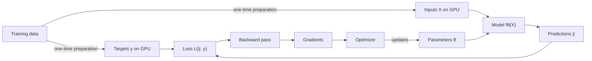

# Full-Batch Training on GPU-Resident Data: Execution and Reproducibility

*Companion to [Part I — From Source Code to Silicon](E2E_execution.md) and [Part II — From Training Data to Updated Weights](E2E_ML_training.md).*

## Abstract

This paper follows full-batch training on one NVIDIA GPU. Before optimization begins, the program prepares the complete training inputs and targets as CUDA tensors. Their backing allocations remain in GPU global memory throughout training, and every optimization step uses the complete tensors directly.

Python invokes the model, loss, backward pass, and optimizer through PyTorch. PyTorch selects compiled tensor implementations, CUDA submits kernels, and the GPU reads the resident tensors while calculating the forward pass, full-dataset loss, gradients, and parameter update.

To continue a saved run exactly, a new process must reconstruct the same training tensors, restore the values the next step will read, and use the same numerical implementations and settings. An execution manifest records the fixed context; each checkpoint records the changing training values.

---

## Table of contents

- [1. The scenario and its assumptions](#1-the-scenario-and-its-assumptions)
- [2. What GPU residency means](#2-what-gpu-residency-means)
- [3. Placing the complete training set on the GPU](#3-placing-the-complete-training-set-on-the-gpu)
- [4. Direct tensor access during training](#4-direct-tensor-access-during-training)
- [5. The resulting full-batch training loop](#5-the-resulting-full-batch-training-loop)
- [6. What must fit in GPU memory](#6-what-must-fit-in-gpu-memory)
- [7. How Python and PyTorch handle one step](#7-how-python-and-pytorch-handle-one-step)
- [8. How CUDA submits the work](#8-how-cuda-submits-the-work)
- [9. How kernels use resident data](#9-how-kernels-use-resident-data)
- [10. Full-batch loss and gradient calculation](#10-full-batch-loss-and-gradient-calculation)
- [11. Randomness in the training path](#11-randomness-in-the-training-path)
- [12. Numerical determinism on the GPU](#12-numerical-determinism-on-the-gpu)
- [13. Precision and compiled execution](#13-precision-and-compiled-execution)
- [14. Checkpoints and exact continuation](#14-checkpoints-and-exact-continuation)
- [15. What the execution record should contain](#15-what-the-execution-record-should-contain)
- [16. End-to-end trace of one training step](#16-end-to-end-trace-of-one-training-step)
- [Conclusion](#conclusion)
- [References](#references)

---

## 1. The scenario and its assumptions

One GPU holds the complete training inputs and targets. Preprocessing finishes before optimization, and the resulting tensor values remain unchanged and allocated on the GPU until training ends. Every optimization step passes those complete tensors directly to the model and loss.

This is **full-batch training**: every optimizer step uses the loss calculated from all $N$ training examples. A representative objective is

$$L(\theta) = \frac{1}{N}\sum_{i=1}^{N}\ell(f_{\theta}(x_i), y_i)$$

The same $N$ examples contribute to every gradient, so the complete training set is the batch for each step. In the supervised-learning case used here, the input tensor is $X$ and the target tensor is $y$. The model produces predictions from $X$, the loss compares those predictions with $y$, and the optimizer updates the model parameters using the gradient of that loss.



The two branches represent different uses of the training data. Inputs $X$ enter the model because they are the values from which the model makes predictions. Targets $y$ enter the loss because they are the known answers against which those predictions are scored. Backward differentiates that scalar loss with respect to the parameters, and the optimizer uses the resulting gradients to update the parameters for the next step. Both $X$ and $y$ remain resident on the GPU throughout this cycle.

---

## 2. What GPU residency means

In CUDA terminology, **device memory** or **global memory** is the GPU-attached DRAM accessible to kernels across the device. A CUDA allocation persists until it is freed, the device is reset, or the process terminates, as specified by the [CUDA programming model](https://docs.nvidia.com/cuda/cuda-programming-guide/01-introduction/programming-model.html).

A PyTorch CUDA tensor consists of a Python object and GPU storage. The Python object records the tensor's dimensions, element type, memory layout, and device; its storage contains the element values in GPU memory.

Calling an operation such as `x.cuda()` or `x.to("cuda")` for a CPU tensor creates CUDA storage and copies the values into it. When a tensor is already on the requested CUDA device, [PyTorch reuses the original object](https://docs.pytorch.org/docs/stable/generated/torch.Tensor.cuda.html).

In this paper, **GPU-resident training data** means that the CUDA allocations backing the training tensors remain live and unchanged throughout the optimization loop. Each step passes references to those same allocations into PyTorch operations.

The training values remain in global memory. While a kernel runs, values referenced by its instructions pass through GPU caches and registers; the kernel may also copy a working tile into shared memory. Later kernels read their required values from global memory again.

The CPU-to-GPU transfer occurs once during preparation. Training-step memory traffic then follows the GPU memory hierarchy as kernels load the values required by their arithmetic instructions.

### 2.1 Residency belongs to a live process

The tensor allocations belong to the running process's CUDA state. After that process exits, a resumed process creates new CUDA tensors and reconstructs the recorded values on the GPU before continuing training.

PyTorch uses a caching allocator for CUDA memory. When a temporary tensor is deleted, PyTorch may keep its released memory reserved for later allocations. Resident training data occupies live tensor storage containing the training values. PyTorch reports memory occupied by tensors and memory reserved by its allocator separately through `torch.cuda.memory_allocated()` and `torch.cuda.memory_reserved()` in its [CUDA memory documentation](https://docs.pytorch.org/docs/stable/cuda.html#memory-management).

---

## 3. Placing the complete training set on the GPU

Before optimization starts, the program loads and preprocesses the training data, creates the final input and target tensors, and places them on the GPU.

A simple one-time placement is:

```python
device = torch.device("cuda:0")

# Loading and deterministic preprocessing occur before this point.
training_inputs = cpu_inputs.to(device)
training_targets = cpu_targets.to(device)

assert training_inputs.device == device
assert training_targets.device == device
```

If the copy also changes dtype, the conversion is part of data preparation and must be recorded. For example, moving FP64 CPU data with `to(device, dtype=torch.float32)` both transfers and rounds the values to FP32. The model consumes those final FP32 values.

After placement, the program preserves the tensor contents throughout training by avoiding in-place writes to `training_inputs` and `training_targets`. An in-place operation would change the training values while preserving their address and device.

For a strict repeat-execution test, the program records the source-data version and the preparation code. It also records a digest of each final tensor together with its dimensions, dtype, and memory layout. The digest identifies the element values, while the tensor description identifies how PyTorch interprets them.

---

## 4. Direct tensor access during training

The training loop begins with final CUDA tensors and passes them directly to the model. The complete tensors already define the batch and its order, so the loop does not need a `DataLoader`, sampler, collation step, or CPU-to-GPU transfer. A `DataLoader` may still be used before training to help construct the tensors.

After a restart, the new process recreates the tensors and verifies their recorded digests and descriptions before continuing.

---

## 5. The resulting full-batch training loop

Once the data, model, and optimizer are on the GPU, a complete loop can be written directly:

```python
model = build_model().to(device)
optimizer = torch.optim.Adam(model.parameters(), lr=LEARNING_RATE)

for completed_step in range(NUM_STEPS):
    optimizer.zero_grad(set_to_none=True)

    prediction = model(training_inputs)
    loss = criterion(prediction, training_targets)

    loss.backward()
    optimizer.step()
```

`training_inputs` and `training_targets` refer to the same CUDA storage on every iteration. Passing them to `model` does not duplicate their values; PyTorch passes tensor information and storage addresses through dispatch to the compiled GPU operations requested by the model.

The forward pass also allocates activations, and the loss and backward pass allocate or reuse additional tensors. The training data remains persistent while these intermediate values follow the shorter lifetimes required by each step.

Each step processes the full training set. In this design, one completed step is also one completed pass through the training data.

---

## 6. What must fit in GPU memory

The training tensors can fit in GPU memory even when a complete training step does not. The step must also hold the model parameters, gradients, optimizer state, and the intermediate values that backward needs. Numerical libraries may request additional temporary memory.

| Memory consumer | Why it is present |
|---|---|
| Training inputs and targets | The persistent resident dataset |
| Model parameters and buffers | Values used by the forward pass |
| Gradients | Derivatives accumulated during backward |
| Optimizer state | Values retained by the selected optimizer between updates |
| Forward activations | Values retained because backward formulas need them |
| Temporary memory | Storage requested by an operation while it runs |

PyTorch can reuse an allocation after its previous value is no longer needed, so the peak is determined by which values are live at the same time.

Full-batch activation memory can dominate because the model retains intermediate values for all $N$ examples until backward uses them. Activation checkpointing lowers this memory use by discarding configured intermediate tensors and recalculating them during backward.

The practical test is the peak allocation during a real forward, backward, and optimizer step. `torch.cuda.max_memory_allocated()` measures the peak memory occupied by tensors; allocator-reserved memory may be larger.

---

## 7. How Python and PyTorch handle one step

Python determines the sequence of calls: clear gradients, call the model, calculate the loss, run backward, and invoke the optimizer. Compiled kernels perform the elementwise and tensor calculations, while an explicit Python loop in the model remains under Python's control.

For each PyTorch call, the operation name identifies the calculation, the tensor device selects CPU or CUDA execution, and the dtype restricts which compiled implementations can accept the values. Because the model and training tensors are on the GPU, PyTorch selects CUDA code. A matrix multiplication, for example, commonly reaches a cuBLAS routine that submits the calculation to the GPU.

Autograd records how forward outputs were produced and retains the tensors needed by gradient formulas. When `loss.backward()` is called, PyTorch traverses the resulting autograd graph in reverse dependency order and invokes the backward operation associated with each recorded forward operation.

The model reads the fixed training tensors. Autograd stores each parameter's accumulated gradient in its `.grad` field, and the optimizer writes the updated parameter value.

---

## 8. How CUDA submits the work

PyTorch's CPU-side CUDA code submits **kernel launches** and numerical-library routines to CUDA streams. A kernel launch is a request to execute one GPU function with specified arguments, thread blocks, and CUDA threads per block. A stream is an ordered sequence of device work. Submission is normally asynchronous with respect to the CPU, so Python can submit later operations before earlier GPU operations have finished.

The stream order supplies the dependencies needed by the training calculation. The loss cannot use a prediction before the forward kernels produce it, and backward cannot use saved activations before they exist. Operations in other streams require explicit dependencies when they exchange values.

Kernel launch arguments contain addresses of the existing CUDA allocations and the dimensions needed by the operation. The CUDA driver submits the kernel and its thread-block configuration to the GPU. The training allocations persist across steps, while activations and other temporary tensors are created and released as each step requires.

---

## 9. How kernels use resident data

One kernel launch creates the requested **grid**, meaning the complete collection of thread blocks for that execution. Each block contains the number of logical CUDA threads specified in the launch request. The GPU assigns blocks to streaming multiprocessors, or SMs. Threads execute in groups called warps and calculate which elements of the tensors they should read or write.

The resident training tensors live in global memory. When a kernel needs an element, a load instruction requests its address. The request may be satisfied by cache; otherwise the value is fetched from global memory. The value ultimately enters registers used by the executing thread. Stores follow the reverse path for outputs.

Neighboring threads often read neighboring tensor elements so the hardware can combine their requests into efficient memory transactions. Reusing a value while it remains in cache can also reduce global-memory traffic.

GPU residency removes the repeated transfer from CPU memory, but it does not eliminate memory access within the GPU. Each step still reads the required training values from GPU global memory, so performance may be limited by global-memory bandwidth, arithmetic throughput, or both.

---

## 10. Full-batch loss and gradient calculation

The model produces one or more outputs for every training example. The loss commonly calculates a per-example contribution and then reduces those contributions to a scalar mean or sum.

A **reduction** combines many values into fewer values. For the mean loss, kernels form partial sums in parallel and combine them. Backward performs further reductions when many examples or graph paths contribute to the same parameter gradient.

Increasing $N$ increases the number of values contributing to the loss and gradient reductions. GPU implementations divide those contributions among threads and blocks and combine their partial results in a reduction tree.

After backward, each parameter's `.grad` field contains the accumulated full-dataset gradient. The optimizer reads that gradient and any retained optimizer state, calculates the update, and writes new parameter values. The resident inputs and targets are unchanged.

The next step repeats the same data access with updated parameters, producing a new full-batch gradient for the updated model.

---

## 11. Randomness in the training path

The fixed input tensors use one fixed order and content. Random-number use during optimization therefore comes from the model or training method.

Parameter initialization can consume random values before the first step. During training, dropout or another explicitly stochastic operation can consume additional values. When the model, loss, and optimizer execute no stochastic operation, the optimization steps do not use an RNG.

A seed initializes a pseudorandom-number generator. Its current state determines where the next request begins. If no operation requests random values after initialization, the generator does not influence later training steps. Reproducing the run from its initial model still requires reproducing parameter initialization.

If dropout remains enabled, each full-batch forward requests new CUDA random values. Exact continuation must then restore the CUDA RNG state after reconstructing the model and optimizer but before the next forward pass.

The checkpoint saves the state of each RNG used by future training operations. It saves Python or NumPy RNG state only when the training path calls those generators.

---

## 12. Numerical determinism on the GPU

Fixed input tensors establish identical data for each repeat execution. Numerical determinism then depends principally on the order of floating-point addition and the algorithms selected for GPU operations.

Floating-point addition is order-sensitive:

$$\operatorname{fl}(\operatorname{fl}(a+b)+c) \neq \operatorname{fl}(a+\operatorname{fl}(b+c))$$

The exact real-number sums are equal, while finite-precision intermediate results are rounded. Parallel loss and gradient reductions therefore depend on their reduction tree. A fixed tree produces a fixed ordering; atomic or runtime-selected accumulation can produce different orderings.

Libraries can select among valid algorithms. cuDNN benchmarking can choose an implementation using timing measurements, and cuBLAS documents reproducibility requirements when concurrent streams share workspace. PyTorch's [reproducibility documentation](https://docs.pytorch.org/docs/stable/notes/randomness.html) states that bitwise equality is not guaranteed across PyTorch releases, platforms, or CPU and GPU execution. A bitwise claim therefore applies only to the recorded PyTorch and CUDA versions and GPU.

When two executions begin a step with identical training tensors, parameters, optimizer state, and relevant RNG state, the first numerical divergence lies in the model, loss, backward calculation, or parameter update. Comparing outputs in that order locates the first operation that differs.

---

## 13. Precision and compiled execution

Numerical precision is independent of data residency. Tensor dtypes determine how stored values are represented. CUDA libraries can also use modes such as TF32 for selected operations on FP32 tensors. Automatic mixed precision chooses lower-precision arithmetic for eligible operations, and gradient scaling reduces the chance that small FP16 gradients round to zero.

Tensor dtype, TF32, and automatic mixed precision affect rounding, range, memory use, and kernel selection. Fixed precision settings do not determine the order of a parallel calculation, so the execution manifest records precision and deterministic-algorithm settings separately.

Eager execution handles each PyTorch operation as Python reaches it. With `torch.compile`, PyTorch can capture operation graphs, generate kernels, fuse neighboring operations, and use autotuning. Compiled and eager implementations can calculate the same mathematical function with different floating-point evaluation orders.

A strict comparison therefore uses the same eager or compiled mode, compiler settings, precision controls, deterministic-algorithm settings, and cuDNN benchmarking behavior. The execution manifest in Section 15 records these fixed choices once for the run.

---

## 14. Checkpoints and exact continuation

Two files serve different purposes. Before training, the program writes an **execution manifest**: a versioned record of the fixed data, code, software, hardware, and numerical settings. During training, each **checkpoint** stores values that the next step will read and a digest of that manifest.

For the loop in Section 5, a checkpoint written after `optimizer.step()` and before the next iteration needs:

| Saved value | Why the next step needs it |
|---|---|
| Completed-step count | Determines schedules and termination |
| Model parameters and persistent buffers | Define the next forward pass |
| Model training or evaluation mode, if it can change | Controls operations such as dropout and batch normalization |
| Optimizer state | Defines the next parameter update |
| Scheduler state, if present | Defines the next learning rate |
| Gradient-scaler state, if present | Defines later mixed-precision scaling decisions |
| CUDA RNG state, if a future operation is stochastic | Defines the next random values |
| Execution-manifest digest | Detects a change in the recorded fixed context |

The example loop clears `.grad` at the start of every step, so its checkpoint can omit retained gradients. A program that reads retained gradients before clearing them saves those values as part of its changing state.

Restoration proceeds in this order:

1. Reconstruct and verify the fixed training tensors on the target GPU.
2. Reconstruct the model, optimizer, scheduler, and scaler with the recorded structure.
3. Load their saved state. When a scheduler is used, construct it first, load its state, and then load the optimizer state in [PyTorch's documented order](https://docs.pytorch.org/docs/stable/generated/torch.optim.Optimizer.load_state_dict.html).
4. Restore CUDA RNG state last if future operations use it.
5. Execute the next full-batch step.

A resumed process creates new GPU allocations containing the recorded tensor values. Exact continuation requires the same values and calculation, not the same memory addresses.

---

## 15. What the execution record should contain

The execution manifest is written after the program applies its numerical settings and constructs the training tensors, but before the first forward pass. It contains the following fixed information:

| Category | Information to record |
|---|---|
| Training tensors | Source-data version, preparation-code revision, tensor digests, dimensions, dtypes, and memory layouts |
| Program | Source revision and the complete training configuration |
| Software | Python and PyTorch builds, CUDA driver and runtime, cuDNN, cuBLAS, and the package or container lock |
| GPU | GPU model and compute capability |
| Numerical settings | Deterministic-algorithm controls, cuDNN and cuBLAS settings, tensor and autocast precision, and gradient-scaler configuration |
| Compilation | Eager or compiled execution and the compiler options used |

The manifest should be serialized canonically and identified by a cryptographic digest. On restoration, the new process measures the table's data, software, hardware, numerical, and compilation fields and compares their digest with the checkpoint. Reusing the old manifest without measuring the new process would not perform this check.

Bitwise continuation is then tested by restoring the checkpoint, running the next step, and comparing the resulting tensors exactly.

---

## 16. End-to-end trace of one training step

After one-time data placement, one training step proceeds as follows:

1. Python clears the previous gradients and calls the model with the resident input tensor.
2. PyTorch selects CUDA implementations and submits their kernels to a stream.
3. GPU threads read the input and parameter values required by the forward pass and write predictions and intermediate activations.
4. The loss compares the predictions with the resident targets and reduces the per-example losses to one scalar.
5. Backward launches the operations that calculate parameter gradients, including reductions across the training examples.
6. The optimizer reads those gradients and its saved optimizer state and updates the parameters.
7. Temporary step values become reusable; the input and target tensors remain allocated and unchanged.
8. At the save point after the update, the program waits for the submitted GPU work and saves the completed step with the execution-manifest digest.

The next step repeats this sequence with the same input and target allocations but updated model parameters.

---

## Conclusion

In this design, training begins from complete CUDA tensors and each step passes them directly to the model. One-time preparation establishes their contents and device placement; subsequent steps reuse the same allocations.

GPU residency means that the tensors' backing allocations persist in device global memory. It does not mean that the complete dataset remains in cache, shared memory, or registers. Kernels bring the portions required for current calculations through those smaller on-chip resources on every step.

Exact continuation requires the same training tensors, restoration of every changing value the next step reads, and the recorded software, GPU, precision, and deterministic settings. The execution manifest records those fixed facts; the checkpoint records changing values. Running and comparing the first resumed step tests whether the records are sufficient.

---

## References

- [PyTorch CUDA semantics and memory management](https://docs.pytorch.org/docs/stable/notes/cuda.html)
- [PyTorch CUDA memory APIs](https://docs.pytorch.org/docs/stable/cuda.html#memory-management)
- [PyTorch copying a tensor to CUDA](https://docs.pytorch.org/docs/stable/generated/torch.Tensor.cuda.html)
- [PyTorch autograd mechanics](https://docs.pytorch.org/docs/stable/notes/autograd.html)
- [PyTorch numerical accuracy](https://docs.pytorch.org/docs/stable/notes/numerical_accuracy.html)
- [PyTorch reproducibility and deterministic algorithms](https://docs.pytorch.org/docs/stable/notes/randomness.html)
- [PyTorch automatic mixed precision](https://docs.pytorch.org/docs/stable/amp.html)
- [PyTorch `torch.compile`](https://docs.pytorch.org/docs/stable/generated/torch.compile)
- [PyTorch saving and loading general checkpoints](https://docs.pytorch.org/tutorials/beginner/saving_loading_models.html#saving-loading-a-general-checkpoint-for-inference-and-or-resuming-training)
- [NVIDIA CUDA programming model and GPU memory](https://docs.nvidia.com/cuda/cuda-programming-guide/01-introduction/programming-model.html)
- [NVIDIA CUDA asynchronous execution](https://docs.nvidia.com/cuda/cuda-programming-guide/02-basics/asynchronous-execution.html)
- [NVIDIA CUDA SIMT kernels and device memory](https://docs.nvidia.com/cuda/cuda-programming-guide/02-basics/writing-cuda-kernels.html)
- [NVIDIA cuBLAS reproducibility guidance](https://docs.nvidia.com/cuda/cublas/index.html#results-reproducibility)
- [Goldberg: *What Every Computer Scientist Should Know About Floating-Point Arithmetic*](https://doi.org/10.1145/103162.103163)
