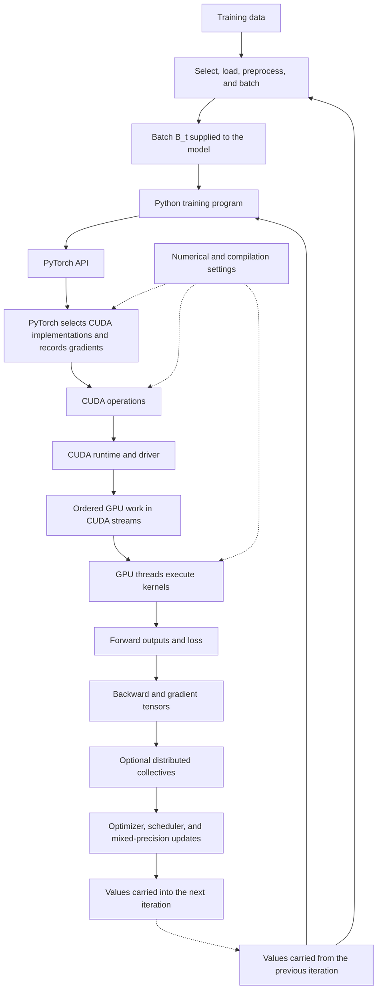

# From Training Data to Updated Weights: How an ML Training Pipeline Executes

## Part II of *From Source Code to Silicon*

**Companion paper:** [Part I — From Source Code to Silicon](E2E_execution.md)

## Abstract

An ML training program can fit in a few lines of Python, but the Python interpreter does not perform most tensor arithmetic. During each iteration, Python retrieves a batch from the data loader and invokes the model, loss function, backward pass, and optimizer through PyTorch. PyTorch then selects compiled implementations for the requested tensor operations. When the tensors are stored on an NVIDIA GPU, those implementations submit work through CUDA, and the GPU performs the arithmetic in parallel.

This paper traces one training iteration in that order: selecting and loading data, running the forward pass, calculating gradients, and updating the model. It follows PyTorch and CUDA as they submit operations to the GPU, then follows GPU threads and memory as they execute those operations.

The same mechanisms explain why repeated runs can differ. Input order can change. Randomized operations can draw different values. Libraries can choose different kernels. Parallel floating-point reductions can add values in different orders. Reproducibility therefore requires stating what was held fixed and how results were compared; setting one seed is not enough.

---

## Table of contents

**Introduction**

- [The training loop this paper follows](#introduction-the-training-loop-this-paper-follows)

**I. From one batch to PyTorch operations**

- [1. What one iteration inherits from the previous one](#1-what-one-iteration-inherits-from-the-previous-one)
- [2. How one iteration moves through the system](#2-how-one-iteration-moves-through-the-system)
- [3. From training data to the model's batch](#3-from-training-data-to-the-models-batch)
- [4. Data loading, multiprocessing, and prefetching](#4-data-loading-multiprocessing-and-prefetching)
- [5. What Python does](#5-what-python-does)
- [6. How NumPy executes work on the CPU](#6-how-numpy-executes-work-on-the-cpu)
- [7. How PyTorch chooses an implementation](#7-how-pytorch-chooses-an-implementation)
- [8. Eager execution and graph compilation](#8-eager-execution-and-graph-compilation)
- [9. How PyTorch calculates gradients](#9-how-pytorch-calculates-gradients)

**II. How the GPU performs the calculation**

- [10. How a PyTorch operation reaches the GPU](#10-how-a-pytorch-operation-reaches-the-gpu)
- [11. CUDA streams and asynchronous execution](#11-cuda-streams-and-asynchronous-execution)
- [12. GPU kernel execution](#12-gpu-kernel-execution)
- [13. The GPU memory hierarchy](#13-the-gpu-memory-hierarchy)
- [14. BLAS, cuBLAS, cuDNN, and kernel libraries](#14-blas-cublas-cudnn-and-kernel-libraries)
- [15. Floating-point arithmetic and reduction order](#15-floating-point-arithmetic-and-reduction-order)
- [16. Precision modes: FP64, FP32, TF32, BF16, and FP16](#16-precision-modes-fp64-fp32-tf32-bf16-and-fp16)
- [17. Automatic mixed precision and gradient scaling](#17-automatic-mixed-precision-and-gradient-scaling)

**III. Randomness, nondeterminism, and distributed execution**

- [18. Randomness enters through specific operations](#18-randomness-enters-through-specific-operations)
- [19. Why GPU operations can be nondeterministic](#19-why-gpu-operations-can-be-nondeterministic)
- [20. Distributed training](#20-distributed-training)
- [21. Distinguishing continuation, reproducibility, and replication](#21-distinguishing-continuation-reproducibility-and-replication)

**IV. Resuming, comparing, and documenting runs**

- [22. Checkpoints and exact continuation](#22-checkpoints-and-exact-continuation)
- [23. A concrete protocol for bit-parity continuation](#23-a-concrete-protocol-for-bit-parity-continuation)
- [24. Performance cost of deterministic execution](#24-performance-cost-of-deterministic-execution)
- [25. Locating divergence between executions](#25-locating-divergence-between-executions)
- [26. Recording how an execution produced its outputs](#26-recording-how-an-execution-produced-its-outputs)
- [27. End-to-end example: one CUDA training step](#27-end-to-end-example-one-cuda-training-step)
- [Conclusion](#conclusion)
- [Appendix A. PyTorch and NVIDIA repeat-execution settings](#appendix-a-pytorch-and-nvidia-repeat-execution-settings)
- [Appendix B. Reference manifest and checkpoint code](#appendix-b-reference-manifest-and-checkpoint-code)
- [Implementation references](#implementation-references)
- [Foundational, provenance, and reproducibility literature](#foundational-provenance-and-reproducibility-literature)

---

## Introduction: the training loop this paper follows

A supervised-learning program repeats four operations. It obtains a batch of examples, runs the model, measures the error in the model's output, and changes the model's weights to reduce that error. The next iteration begins with the updated weights.

The code does not execute in one place. Python runs on the CPU and decides which operation comes next. Most tensor arithmetic enters compiled PyTorch or NumPy code. Operations on GPU tensors are submitted through CUDA and executed by thousands of GPU threads. The CPU can continue submitting work while earlier GPU work is still running.

The division of work among Python, compiled libraries, and the GPU matters for reproducibility. The next result depends on the actual batch presented to the model, the values retained from earlier iterations, and the numerical implementation chosen for each operation. GPU parallelism adds another issue: floating-point addition is sensitive to order, while parallel algorithms do not always combine values in the same order.

Values carried into an iteration determine its starting point. The path through Python, PyTorch, CUDA, and the GPU then determines how those values produce the next model state.

---

## 1. What one iteration inherits from the previous one

Let a model with parameters $\theta_t$ receive minibatch $B_t$ at training step $t$. Using a minibatch to estimate a gradient is the standard stochastic-gradient procedure described in the [optimization literature](https://www.deeplearningbook.org/contents/optimization.html). A simple update is

$$g_t = \nabla_{\theta} \mathcal{L}(\theta_t; B_t)$$

$$\theta_{t+1} = \theta_t - \eta_t g_t$$

where $\eta_t$ is the learning rate. The equation shows the essential dependency: the update at iteration $t$ uses the current weights $\theta_t$ and the current batch $B_t$ to produce new weights $\theta_{t+1}$.

Many optimizers carry additional values from one iteration to the next. Momentum SGD retains a velocity vector computed from earlier gradients. Adam retains exponential moving averages of gradients and squared gradients. These values affect the next update, so saving only the model weights is not enough to resume those optimizers exactly.

A learning-rate scheduler carries its current step into the next iteration. A shuffled input pipeline carries its current position, and stochastic operations such as dropout advance the random-number generators they call. The required state is determined by the operations that the program actually uses.

Intermediate activations, temporary memory, and the autograd graph usually disappear after the update. A checkpoint is therefore normally written between iterations, after the current update has finished and before the next batch is consumed. Resuming from the middle of an iteration is possible in principle but requires preserving much more temporary work.

---

## 2. How one iteration moves through the system

ML training begins on the CPU system described in Part I. The operating system creates a process, and CPU threads execute CPython and PyTorch's compiled code inside it. When the program uses a GPU, the CUDA driver connects that CPU process to the GPU. The GPU has its own instructions, memory mappings, queues of requested work, and parallel execution model.

One training iteration crosses CPU data preparation, PyTorch dispatch, CUDA submission, GPU execution, and the update of retained training state:



The CPU does not wait after every submitted GPU operation. It can submit several operations before it needs a result. Backward calculation and a GPU-based optimizer also pass through PyTorch dispatch and CUDA submission; they execute as additional GPU operations after the forward pass.

The diagram follows a PyTorch operation sent to a GPU. A PyTorch operation sent to the CPU stops at a compiled CPU kernel or numerical library. NumPy follows its own CPU path, explained in Section 6, and does not use PyTorch's dispatcher or autograd system.

---

## 3. From training data to the model's batch

The model receives training data as a batch of tensors. The input code selects examples, loads their values, applies the configured preprocessing, and combines them into the batch denoted by $B_t$ in Section 1.

[PyTorch's data-loading documentation](https://docs.pytorch.org/docs/stable/data.html) calls one item returned by a dataset a **sample**. For a dataset accessed by index, a **sampler** supplies the sequence of indices to load, and collation combines the resulting samples into a minibatch. Order matters because it determines which training examples appear together and the sequence of gradient updates.

The dataset supplies the training examples; the sampler chooses their order. Several workers may finish loading samples at different times, but a loader configured for ordered delivery returns batches in the sampler's order. If that order is randomized, the sampler uses a random-number generator. Deterministic loading and preprocessing do not introduce an additional random dependency.

---

## 4. Data loading, multiprocessing, and prefetching

A GPU-bound batch commonly moves through the following sequence:

1. A sampler chooses the indices of the next training examples.
2. The main process or `DataLoader` workers load and preprocess those examples.
3. Collation combines the examples into a batch.
4. The batch may be placed in pinned host memory to support an asynchronous transfer.
5. The batch tensors are copied to GPU memory.

### 4.1 Why worker count changes behavior

With `num_workers=0`, PyTorch loads samples in the main training process. A positive value starts worker processes. Each worker process has its own memory space and Python runtime, although the operating system's method for starting workers affects how objects are initially transferred or copied. Workers can finish in different orders because some training examples take longer to load or transform than others.

By default, `DataLoader` returns batches in first-in, first-out order even if workers finish out of order; the `in_order=False` option relaxes that guarantee. If workers also perform random transformations, worker assignment can affect which process supplies the random values for a sample. Worker assignment introduces no RNG dependency when worker-side loading and preprocessing are deterministic.

If worker code performs random transformations, each worker needs an intentional random-number sequence. PyTorch assigns a different PyTorch seed to each `DataLoader` worker. Random APIs in other libraries can still begin from duplicated state after a worker is created, so worker initialization must seed any of those APIs that the transformation actually calls.

### 4.2 Pinned host memory

Ordinary pageable host memory may need staging before a GPU transfer. Pinned memory cannot be paged out, allowing a direct-memory-access (DMA) engine to transfer it more directly. Combined with nonblocking copies and separate CUDA streams, pinned memory can overlap input transfer with GPU computation.

Pinned memory and nonblocking copies change timing, not the mathematical training rule. In a correctly synchronized program, pinned memory does not by itself change the values delivered to the model. Performance measurements can change because transfer and computation may overlap.

### 4.3 Prefetch state and exact resume

Workers often prepare batches before the training loop asks for them. A checkpoint written in the middle of an epoch may therefore find that the loader has already selected or transformed future samples. Saving only the epoch number cannot reproduce that exact position.

A program that needs exact mid-epoch continuation must either save enough loader information to reconstruct the next batch or write checkpoints only at points where the loader can be restarted deliberately. Ordinary reproducibility does not require serializing an internal prefetch queue.

---

## 5. What Python does

Once the loader has assembled a batch, the main training process passes it through the model. In a conventional PyTorch program, Python requests the forward pass, loss, backward pass, and optimizer update:

```python
optimizer.zero_grad(set_to_none=True)
prediction = model(batch)
loss = criterion(prediction, target)
loss.backward()
optimizer.step()
```

The Python interpreter executes attribute lookups, loops, conditionals, and function calls. Large tensor operations normally leave Python and enter compiled extension code.

The Global Interpreter Lock affects concurrent execution of Python bytecode in conventional CPython. Compiled extensions can release it while they perform work that does not require Python objects; [many NumPy operations do so](https://numpy.org/doc/stable/reference/thread_safety.html). GPU kernels execute independently of the Python interpreter after launch. Consequently, a Python program can control massive parallelism without Python itself executing one instruction per tensor element.

Python also imports the installed versions of NumPy, PyTorch, and their extensions. Library versions determine which compiled implementations are available. Environment variables read during library initialization can change thread counts or numerical-library behavior. The installed code and initialization settings therefore affect tensor arithmetic even though Python does not perform that arithmetic itself.

---

## 6. How NumPy executes work on the CPU

As described in the [NumPy array internals documentation](https://numpy.org/doc/stable/dev/internals.html), an array consists of a data buffer plus information describing how to interpret it. Its shape gives the number of elements along each dimension. Its dtype gives the representation of each element. Its strides give the number of bytes to move when an index changes. For a two-dimensional array, NumPy locates element $(i,j)$ conceptually as

$$\operatorname{address}(i,j) = \operatorname{base} + i\,\operatorname{stride}_0 + j\,\operatorname{stride}_1$$

An array can own its data buffer or view a buffer owned by another object. A view keeps a reference to its base object so that the memory remains valid.

When Python asks NumPy to add two arrays, NumPy runs a compiled loop over their elements. That loop may use single-instruction, multiple-data (SIMD) CPU instructions, which apply one instruction to several values at once. Matrix operations may instead call a Basic Linear Algebra Subprograms (BLAS) or Linear Algebra Package (LAPACK) library installed with NumPy. The Python expression alone does not identify which library implementation will run.

### 6.1 What a reduction is

A **reduction** combines a collection of values into fewer values by repeatedly applying an operation. Summing the vector $[2,5,1,4]$ is a reduction from four values to one:

$$2+5+1+4=12$$

Maximum is another reduction: reducing the same vector with `max` produces $5$. For a matrix, an operation can reduce each row to one value, each column to one value, or the entire matrix to one scalar. The word *reduction* refers to reducing the number of values in the output, not to making their numerical magnitudes smaller.

A dot product first multiplies corresponding vector elements and then reduces those products with addition. A loss function often reduces one loss per training example to a mean or sum. During backward, PyTorch reduces multiple gradient contributions into one gradient for each parameter.

Parallel hardware can divide a reduction among workers. Each worker combines part of the input into a **partial result**, and later work combines the partial results. For a sum, those partial results are partial sums. The pattern of combinations forms a reduction tree. Section 15 explains why two valid trees can produce different floating-point bits.

### 6.2 BLAS is an interface, not one algorithm

[The reference BLAS](https://netlib.org/blas/) groups operations by the dimensional structure of their operands. Level 1 covers vector operations, level 2 covers matrix-vector operations, and level 3 covers matrix-matrix operations. BLAS defines the routines; an implementation still chooses how to divide work among CPU instructions and threads.

`numpy.matmul` or `numpy.dot` can therefore reach different machine code on different installations. The installed library decides which CPU instructions to use and how to divide the calculation among CPU threads.

Threaded BLAS can partition a dot product among workers and combine partial sums in a backend-dependent order. Thread count may be influenced by variables such as `OMP_NUM_THREADS`, `MKL_NUM_THREADS`, or `OPENBLAS_NUM_THREADS`, depending on the library. Fixing the thread count reduces one source of variation but does not create a cross-library or cross-version bitwise guarantee.

---

## 7. How PyTorch chooses an implementation

Consider the operation

```python
y = torch.matmul(a, b)
```

The call identifies matrix multiplication. If `a` and `b` are CPU tensors, PyTorch selects CPU code; if they are CUDA tensors, it selects GPU code. Their dtype further restricts the compiled implementations that can accept them. Autograd separately decides whether to record the operation for a later backward pass.

PyTorch calls the CPU-or-GPU implementation selection **dispatch**. Its ATen library defines common tensor operations and connects them to compiled implementations. CUDA matrix multiplication commonly reaches cuBLAS, while CPU matrix multiplication commonly reaches a CPU numerical library.

The CPU routine or GPU kernel reached through dispatch determines how the matrix multiplication is divided and how partial sums are combined. Graph compilation can also combine the multiplication with neighboring operations. Kernel selection and graph compilation can change intermediate precision or addition order while implementing the same requested tensor operation.

---

## 8. Eager execution and graph compilation

In eager mode, each PyTorch operation is handled when the Python program executes it. PyTorch selects an implementation immediately, although a selected GPU operation may finish later because CUDA launches are asynchronous.

With [`torch.compile`](https://docs.pytorch.org/docs/stable/generated/torch.compile), PyTorch records supported sequences of tensor operations in a computation graph. Its compiler can generate GPU kernels and combine several operations into one kernel.

In eager execution, consecutive operators may each launch a kernel and write their intermediate tensors to device memory. A fused kernel can perform several of those operations while keeping intermediate values in registers or shared memory. Fusion therefore reduces kernel launches and memory traffic, but it can also change floating-point evaluation order.

A compiled kernel can be specialized for tensor dimensions, dtype, or a Python value observed during compilation. PyTorch records checks for these facts called **guards**. If a guard fails on a later call, PyTorch may use another compiled version or compile a new one.

A **graph break** is different. It occurs when PyTorch stops capturing a region of Python code and resumes ordinary Python execution. Execution may enter another compiled region later. Because compilation can fuse operations and rearrange intermediate calculations, eager and compiled execution can be mathematically equivalent without producing identical bits. Comparisons between runs must therefore keep the compilation mode and backend fixed.

---

## 9. How PyTorch calculates gradients

[PyTorch autograd](https://docs.pytorch.org/docs/stable/notes/autograd.html) implements reverse-mode automatic differentiation. During the forward pass, an operation involving tensors that require gradients records how its output was produced and saves values needed by its gradient formula. These recorded dependencies form the autograd graph. In ordinary eager execution, PyTorch builds a new graph on every iteration, so it reflects the Python operations that actually ran.

If

$$z = f(y), \qquad y = g(x)$$

then reverse mode applies the chain rule:

$$\frac{\partial z}{\partial x} = \frac{\partial z}{\partial y}\frac{\partial y}{\partial x}$$

Backward normally starts from a scalar loss and follows the recorded dependencies toward the model parameters. If backward starts from a non-scalar tensor, the caller must supply the initial gradient for that tensor. PyTorch keeps the forward tensors required by each gradient formula. Activation checkpointing reduces this memory use by discarding configured intermediate tensors after the forward pass and recomputing them during backward.

Gradient accumulation is another reduction. If several graph paths contribute to a parameter, their partial gradients must be summed into one gradient. Different scheduling or fusion can change summation order and therefore low-order floating-point bits.

PyTorch also adds new gradients into a parameter's `.grad` field until the program clears it. Training can use this behavior to combine several microbatches before one optimizer update. If a checkpoint is written in the middle of that accumulation, the saved state must include the gradients collected so far and the number of microbatches already processed.

### 9.1 How the optimizer uses the gradients

The backward pass produces gradient tensors; it does not update parameters by itself. The optimizer consumes those gradients and its own prior state. Momentum SGD, for example, performs

$$v_{t+1} = \mu v_t + g_t$$

$$\theta_{t+1} = \theta_t - \eta_t v_{t+1}$$

The velocity $v_t$ must carry into the next iteration because it changes the next update even if the next gradient is unchanged. Adam similarly retains running averages and a step count. Learning-rate schedules and mixed-precision scalers retain values for the same reason: later calculations read them.

PyTorch can update parameters with separate operations or grouped and fused implementations. The update form affects the number of GPU launches and can affect floating-point evaluation order, so bitwise comparisons must use the same optimizer implementation.

---

## 10. How a PyTorch operation reaches the GPU

When an operation uses a CUDA tensor, the CPU does not perform the tensor calculation itself. PyTorch's CPU-side code asks CUDA to run compiled GPU code for the requested operation. The [CUDA programming model](https://docs.nvidia.com/cuda/cuda-programming-guide/01-introduction/programming-model.html) calls the CPU and its memory the **host**, and the GPU and its memory the **device**. The request passes through these layers:

```text
PyTorch operator
    ↓
PyTorch CUDA implementation
    ↓
CUDA runtime API
    ↓
CUDA driver and device context
    ↓
GPU kernel or memory-copy execution
```

The CUDA runtime is the programming interface normally used by PyTorch. The CUDA driver manages the lower-level connection to the GPU. CUDA work occurs inside a [**device context**](https://docs.nvidia.com/cuda/cuda-programming-guide/03-advanced/driver-api.html), which owns an address space, loaded GPU code, and other driver-managed resources. The runtime API normally uses one primary context for each GPU in a process, although the driver API can create additional contexts.

A function executed on the GPU is called a **kernel**. A **kernel launch** is the CPU-side request to execute that function once. The request supplies the kernel's arguments and specifies the number of thread blocks and CUDA threads per block. CUDA places the request in a stream, as explained in Section 11.

The kernel's code may already contain instructions for the installed GPU, or it may be supplied as PTX. PTX is an intermediate instruction language defined by NVIDIA. When PTX is used, the driver translates it into instructions for the particular GPU before running the kernel. This is a form of just-in-time compilation, even though Python and PyTorch themselves were installed earlier.

---

## 11. CUDA streams and asynchronous execution

A [CUDA stream](https://docs.nvidia.com/cuda/cuda-programming-guide/02-basics/asynchronous-execution.html) is an ordered sequence of device work. Operations in one stream execute in submission order. Operations in different streams may overlap when dependencies and hardware resources permit.

A stream can contain kernel launches, memory copies, and event operations. An event marks progress in one stream; another stream can wait for that event before continuing.

Kernel launch is normally asynchronous with respect to the CPU. Python may return from an operation after enqueueing it, not after the GPU has finished it.

A host synchronization call makes the CPU wait for specified GPU work. An event wait can delay one GPU stream until work in another stream reaches the event without stopping the CPU. If the CPU asks to read a result produced by the GPU, it must likewise wait until that result is ready. Profilers and debugging modes can insert additional waits, changing timing even when the intended calculation remains the same.

Timing GPU code without synchronization can measure submission latency rather than execution time. Conversely, forcing global synchronization after every operation destroys useful overlap and changes the performance model.

---

## 12. GPU kernel execution

A CUDA **thread** is not an operating-system thread. It is one logical instance of a kernel. Each instance has a thread index and its own register values, and it can follow a different branch from neighboring instances. One kernel launch creates the requested **grid**, meaning the complete collection of **thread blocks** for that execution. Each block contains the number of CUDA threads specified in the launch request. Threads in one block can use shared memory and synchronize with one another; ordinary threads in different blocks cannot assume they execute together.

NVIDIA hardware schedules block threads in groups of 32 called **warps**. Under the single-instruction, multiple-thread (SIMT) model, a warp supplies one instruction stream to multiple lanes while retaining per-thread data and branch state.

### 12.1 Streaming multiprocessors

The GPU contains streaming multiprocessors, or SMs. In ordinary SIMT execution, a block is assigned to one SM for its execution. Multiple blocks and many warps can be resident on one SM if register and shared-memory requirements allow.

Inside an SM, warp schedulers choose instructions that are ready to run. Execution units perform arithmetic, calculate addresses, load and store values, and execute tensor operations. The SM's register file, shared memory, and L1 cache keep active data close to those execution units. Because registers and shared memory have finite capacity, a kernel that needs more of them can keep fewer blocks and warps active at once.

The scheduler selects ready warps. When one warp waits on a memory dependency, another can execute. GPU throughput relies heavily on having enough active warps to hide latency.

### 12.2 SIMT and divergence

Threads in a warp execute the same kernel but may take different branches. When lanes diverge, the hardware executes the relevant paths with masks selecting participating lanes. Divergence can reduce throughput because not all lanes perform useful work on each path.

### 12.3 CUDA does not define a global execution order for blocks

CUDA does not generally guarantee the order in which blocks execute. The programming model requires blocks to be independently schedulable unless a specialized cooperative mechanism is used. A kernel that assumes block 0 completes before block 1 is therefore invalid in the ordinary model.

The absence of a fixed block order allows the same grid to run on GPUs with different numbers of SMs. Algorithms combining results from many blocks must explicitly define synchronization and reduction behavior when order matters.

---

## 13. The GPU memory hierarchy

A GPU kernel reads and writes several kinds of storage. They differ in access cost, which threads can use them, and how long their contents remain valid:

| Storage | Visibility and lifetime | Role in kernel execution |
|---|---|---|
| Registers | Private to one logical thread while its warp is resident | Hold immediate operands and thread-local state |
| Shared memory | Shared by threads in one block for that block's lifetime | Stage tiles and support explicit cooperation |
| L1 cache | Associated with an SM and managed primarily by hardware | Reuse recently accessed data near resident warps |
| L2 cache | Shared across the device | Reduce repeated traffic to device memory |
| Global device memory | Addressable by kernels across the device | Hold tensors and other persistent device allocations |

The table describes storage on the GPU. Before a training batch reaches the GPU, its tensors usually occupy **host memory**: system RAM attached to the CPU. Moving the batch to the GPU copies its values across an interconnect into **device memory**, usually GDDR or high-bandwidth memory (HBM).

CUDA can place host and device allocations in one unified virtual address space, so one pointer-sized address can identify either kind of allocation. This does not merge the physical memories: system RAM and GPU memory still have different locations and access costs.

### 13.1 Coalescing

When neighboring threads access neighboring addresses, requests can be combined into efficient memory transactions. Strided or scattered access creates additional transactions and reduces effective bandwidth.

### 13.2 Shared memory

Threads in one block can cooperate through low-latency shared memory. Correct cooperation requires barriers or other synchronization primitives. Missing synchronization creates data races whose results may vary by scheduling.

### 13.3 Tensor cores

Tensor cores accelerate matrix multiply-accumulate operations on supported dtypes and shapes. They trade a more specialized execution model and, for some modes, reduced input or accumulation precision for high throughput.

The source operation remains matrix multiplication, but its physical execution may be tiled across thread blocks, staged through shared memory, and decomposed into warp-level tensor instructions.

---

## 14. BLAS, cuBLAS, cuDNN, and kernel libraries

Fast GPU implementations are difficult to write and must be tuned for particular GPU architectures. PyTorch therefore delegates many common operations to NVIDIA libraries that provide optimized kernels.

### 14.1 BLAS and cuBLAS

BLAS defines linear-algebra operations. cuBLAS implements analogous operations for NVIDIA GPUs. Its general matrix-multiplication operation, conventionally called GEMM, computes

$$C \leftarrow \alpha AB + \beta C$$

cuBLAS may select among algorithms according to the matrix dimensions and orientation, tensor dtype, GPU, available workspace, and stream configuration.

### 14.2 cuDNN

cuDNN supplies GPU implementations of deep-learning operations such as convolution, pooling, and normalization. There is more than one way to calculate a convolution. The alternatives can require different amounts of temporary memory, load data in different patterns, and add partial results in different orders. PyTorch requests the operation from cuDNN and can restrict which alternatives cuDNN is allowed to use.

### 14.3 Autotuning

An autotuner benchmarks candidate implementations for a particular input shape and chooses a fast one. Measurement noise and concurrent device load can affect the timing result. Library versions can also change the available candidates.

Autotuning leaves the requested operation unchanged but chooses its implementation by measurement. Different implementations can sum values in different orders or use different intermediate precision, causing different bits in the result.

---

## 15. Floating-point arithmetic and reduction order

Section 6.1 described what a reduction computes. Its implementation matters because floating-point values have finite precision, as explained in [Goldberg's standard treatment of floating-point arithmetic](https://doi.org/10.1145/103162.103163) and in [PyTorch's numerical-accuracy notes](https://docs.pytorch.org/docs/stable/notes/numerical_accuracy.html). Most real numbers cannot be represented exactly. After an arithmetic operation, the exact mathematical result is rounded to a representable floating-point value. For three or more terms, changing the grouping changes which intermediate results are rounded. Floating-point addition is therefore not generally associative:

$$\operatorname{fl}(\operatorname{fl}(a+b)+c) \neq \operatorname{fl}(a+\operatorname{fl}(b+c))$$

This does not mean that one binary addition has an unspecified order. It means that a sequence of additions can produce different results when its terms are grouped differently. In FP32, the effect can be large enough to see directly:

```python
import numpy as np

a = np.float32(1e20)
b = np.float32(-1e20)
c = np.float32(3.14)

left = np.float32(np.float32(a + b) + c)   # approximately 3.14
right = np.float32(a + np.float32(b + c))  # 0.0
```

In the left grouping, $a+b$ rounds to zero, after which $c$ remains. In the right grouping, $c$ is too small to change the stored value of $b$, so $b+c$ rounds back to $b$; adding $a$ then produces zero. Exact real-number addition is associative, but the rounding after each floating-point operation breaks that property.

A reduction of values $x_0,\ldots,x_{n-1}$ must choose a grouping. A serial CPU loop may add from left to right. A GPU reduction commonly lets many threads form partial sums and then combines those sums as a tree. Both implement summation, but different trees place the rounding steps differently. A fixed tree can be deterministic. Variation arises when an implementation changes the tree, uses schedule-dependent atomic updates, selects another kernel, or changes its intermediate precision.

### 15.1 Deterministic does not mean mathematically exact

An algorithm can be deterministic and still have approximation error. Determinism means repeated execution under its defined conditions produces the same result. It does not mean the result equals the exact real-number answer.

### 15.2 Numerically close does not mean bitwise identical

Two valid algorithms may produce slightly different floating-point values while both meet an accuracy tolerance. ML optimization can amplify tiny differences: changed low-order bits alter later gradients, and after thousands of nonlinear updates the final parameters may differ substantially while training quality remains statistically equivalent.

### 15.3 Fused multiply-add

A fused multiply-add computes $ab+c$ with one final rounding rather than separately rounding the multiplication and addition. This is often more accurate, but its bits can differ from non-fused execution.

---

## 16. Precision modes: FP64, FP32, TF32, BF16, and FP16

Floating-point formats divide their bits among a sign, an exponent that controls dynamic range, and a significand that controls precision. Formats can allocate those bits differently. Fewer exponent bits increase overflow and underflow risk; fewer significand bits increase rounding error. BF16, for example, keeps the same exponent width as FP32 but uses fewer significand bits.

| Format | Role in a typical ML stack | Principal numerical consequence |
|---|---|---|
| FP64 | High-precision storage and arithmetic | Wide range and fine precision, but relatively low throughput on many ML-oriented GPUs |
| FP32 | Common parameter, activation, and accumulation baseline | Moderate range and precision with broad hardware support |
| TF32 | Tensor-core input mode for selected operations on FP32 tensors | FP32-like exponent range with coarser input precision; it is an execution mode rather than a general tensor storage dtype |
| BF16 | Reduced-width storage and arithmetic with an FP32-sized exponent field | Preserves range better than FP16 but rounds significands more aggressively |
| FP16 | Reduced-width storage and high-throughput arithmetic | Saves memory and bandwidth but has a narrower range, making underflow and overflow more likely |

Precision settings are distinct from determinism. A TF32 matrix multiplication can be deterministic, and a full-FP32 reduction can be nondeterministic. The first question asks which numerical representation and operations are used; the second asks whether repeated execution fixes their order and implementation.

On supported NVIDIA hardware, PyTorch can use TF32 for eligible matrix multiplication and convolution operations. The exact framework APIs that select these settings are version-specific; Appendix A shows the representative settings for the software stack used in this paper.

The performance and numerical effects depend on how precision changes. Narrower stored values use less memory and memory bandwidth. Some formats allow the operation to use tensor cores. The accumulator format determines where intermediate sums are rounded. Two settings described loosely as “lower precision” can therefore behave differently.

---

## 17. Automatic mixed precision and gradient scaling

Automatic mixed precision, or AMP, applies PyTorch's autocast rules to choose a dtype for each supported operation. Matrix operations often use a lower-precision dtype, while operations that require more range or precision remain in FP32.

A common pattern creates a gradient scaler, uses autocasting for the forward pass, and applies the scaler during backward and the optimizer step:

```python
scaler = torch.amp.GradScaler("cuda")

with torch.autocast(device_type="cuda", dtype=torch.float16):
    prediction = model(batch)
    loss = criterion(prediction, target)

scaler.scale(loss).backward()
scaler.step(optimizer)
scaler.update()
```

For FP16, small gradients can underflow. Scaling multiplies the loss and therefore the gradients before backward; gradients are unscaled before the optimizer update. If nonfinite gradients are detected, an optimizer step can be skipped and the scale adjusted.

The scaler remembers its current scale and how many recent steps have completed without an overflow. Together with its configured growth and backoff rules, these values determine the scale used on later steps. They must therefore be saved when a checkpoint is expected to resume training exactly.

Mixed precision can be deterministic within a fixed environment while differing numerically from full-precision training.

---

## 18. Randomness enters through specific operations

Precision settings determine how arithmetic values are represented. A randomized operation depends on something different: a pseudorandom-number generator, abbreviated RNG. An RNG is an algorithm that produces a deterministic sequence from stored internal state. Each request returns one or more values and advances that state. The number of requests for random values is not the same as the number of training iterations.

A **seed** is an input used to construct the generator's initial state. The seed is not normally returned as the next random value, nor does the generator keep returning calculations made directly from that seed. After initialization, the generator repeatedly transforms its current state and emits values derived from it. The same seed reproduces the same sequence only when the generator implementation and the sequence of requests are also the same.

The difference between a seed and current generator state is visible with an explicit [PyTorch generator](https://docs.pytorch.org/docs/stable/generated/torch.Generator.html):

```python
import torch

g = torch.Generator().manual_seed(1729)

first = torch.rand(3, generator=g)
saved_state = g.get_state()

next_a = torch.rand(3, generator=g)
g.set_state(saved_state)
next_b = torch.rand(3, generator=g)

assert torch.equal(next_a, next_b)
```

Calling `manual_seed(1729)` again would return the generator to the beginning, before `first`. Restoring `saved_state` returns it to the point immediately after `first`. A checkpoint that continues an interrupted run therefore needs current state, not merely the original seed.

Randomness enters training only when an operation requests random values. Common examples are shuffling, random cropping, dropout, and randomized parameter initialization. If an execution path contains no randomized operation, it has no RNG dependency on that path.

A stochastic operation can be replayed when the same generator implementation begins from the same state and random values are requested in the same order. A seed initializes that state; it does not control how many values the program later requests. Adding a dropout call, changing worker assignment, or conditionally skipping a request can therefore shift the later sequence even when the initial seed is unchanged.

### 18.1 Generator ownership in Python, NumPy, and PyTorch

Python, NumPy, and PyTorch maintain separate pseudorandom-number generators. Python's `random` module has module-level state. NumPy retains a legacy module-level generator, while every modern `numpy.random.Generator` has a separate `BitGenerator`. PyTorch has default generator state for CPU operations and for each CUDA device; it also permits explicit `torch.Generator` objects. A program depends only on the generators that its executed code actually calls.

`np.random.seed(seed)` affects NumPy's legacy global generator. It does not affect an independently constructed generator such as

```python
rng = np.random.default_rng(seed)
```

Similarly, `torch.manual_seed(seed)` does not seed Python's `random` module or a generator created by another library. Replaying a randomized operation therefore requires identifying the API it called and restoring that API's generator state. Changing the program's control flow or compilation mode can change which randomized operations execute and therefore how the relevant generator state advances.

### 18.2 Counter-based generation

A GPU cannot efficiently make thousands of threads update one shared RNG state in sequence. [Counter-based RNGs](https://www.thesalmons.org/john/random123/papers/random123sc11.pdf) avoid that bottleneck: a key and counter identify the generated values, so different GPU threads can calculate different counter positions independently. Exact replay still requires the same operation to receive the same key-and-counter range. A seed alone does not specify how a framework assigns those ranges.

---

## 19. Why GPU operations can be nondeterministic

As Section 15 shows, summing three or more floating-point values can depend on how the additions are grouped. A GPU result can therefore vary when an implementation combines partial results in an order that depends on thread arrival, or when a library is allowed to select different algorithms between executions.

### 19.1 Atomic updates

Suppose many threads add to one destination using an atomic operation. Atomics prevent lost updates, but the arrival order may vary. Since floating-point addition is non-associative, different valid serialization orders can produce different bits.

### 19.2 Parallel reductions

A parallel reduction divides the inputs among threads, forms partial results, and combines them as described in Section 6.1. It may use a fixed dependency tree, in which case block scheduling alone does not change the arithmetic order. Variation appears when the implementation permits partial results to be combined according to arrival order, atomic-update order, runtime algorithm selection, or another schedule-dependent mechanism.

### 19.3 Race conditions

Unsynchronized conflicting accesses constitute a programming error. Unlike legitimate reduction-order variation, a data race may produce unconstrained or undefined behavior.

### 19.4 Algorithm selection

Algorithm selection can introduce variation before a kernel even begins. An autotuner may choose among implementations with different reduction trees or intermediate precision. If benchmarking noise, workspace availability, or runtime configuration changes that choice, repeated executions need not return the same bits even though every candidate implements the requested operation correctly.

### 19.5 Multiple streams

Concurrent streams allow operations to overlap without imposing one global order. Stream overlap does not change a correctly synchronized calculation by itself. Variation can arise when concurrent library calls share internal resources.

[NVIDIA documents a cuBLAS reproducibility condition involving concurrent streams](https://docs.nvidia.com/cuda/cublas/index.html#results-reproducibility). When several streams share the library's workspace, cuBLAS may choose different internal implementations to improve total throughput. For the routines covered by that documentation, separate workspaces or handles—or the documented workspace configuration—remove this source of variation.

### 19.6 Uninitialized memory

Reading memory before writing it makes results depend on leftover bytes from previous allocations. PyTorch's deterministic mode can fill certain uninitialized memory to prevent variation caused by these accidental reads, at a performance cost.

---

## 20. Distributed training

On one GPU, the backward pass produces gradients and the optimizer uses them to update the model. [DistributedDataParallel](https://docs.pytorch.org/docs/stable/notes/ddp.html) adds gradient communication between those two events.

Each participating process is assigned an integer called a **rank** and usually controls one GPU. Every rank runs the model on a local minibatch—typically a different subset of the training data—and calculates local gradients. The ranks then perform an **all-reduce**: they combine corresponding gradient values and return the combined result to every rank. Only then does each rank update its copy of the model.

The name describes both parts of the operation. *Reduce* means combining the values supplied by the ranks, commonly by summing them. *All* means every participating rank receives the result, rather than only one designated rank.

For $p$ ranks, the intended average gradient is

$$\bar{g}_t = \frac{1}{p}\sum_{r=0}^{p-1} g_{t,r}$$

On CUDA systems, PyTorch commonly performs all-reduce through the [NVIDIA Collective Communications Library (NCCL)](https://docs.nvidia.com/deeplearning/nccl/user-guide/docs/usage/collectives.html). Each rank's local gradient first depends on the training examples processed by that rank.

PyTorch groups gradients into communication buckets so that it can begin reducing completed gradients while the backward pass continues. NCCL chooses how the data travels among GPUs. The communicated dtype determines the precision of the partial sums. Changes to the partition, bucket order, communication algorithm, or dtype can therefore change the order or precision of the additions.

All ranks must agree on collective order. A mismatch can hang because one rank waits in a collective that others never enter.

If distributed code requests random values, it must also decide which draws should agree across ranks. Replicated parameter initialization may require identical values, while rank-local sampling or dropout may require distinct values. The program implements that choice through its generator construction and communication logic; distributed training does not imply one universal formula for rank-specific seeds.

---

## 21. Distinguishing continuation, reproducibility, and replication

The terms *reproducibility* and *replicability* have been used inconsistently across fields. This paper follows the computational terminology adopted by the [U.S. National Academies](https://www.nationalacademies.org/read/25303/chapter/3) and used in the [NeurIPS reproducibility program report](https://www.jmlr.org/papers/v22/20-303.html). Computational reproducibility means obtaining consistent results with the same data and computational procedures. Replication tests the scientific question in a new study.

A seed, a deterministic-kernel setting, and a bitwise comparison serve different purposes. They are execution settings or ways to compare results, not separate levels of reproducibility.

### 21.1 Exact continuation

Exact continuation asks whether training resumed from a checkpoint proceeds as it would have proceeded without the interruption. The checkpoint must therefore restore every value on which later calculations depend. Exact continuation does not establish whether the earlier computation can be reproduced from scratch or whether the scientific conclusion is sound.

### 21.2 Repeat execution in a fixed implementation

A repeat-execution test runs the same program twice from the same starting values. Both runs use the same data-loading rules and the same software and hardware configuration.

The first comparison is the batch supplied to the model. If the inputs differ, later comparisons cannot isolate the model's numerical behavior. If they match, intermediate and final results can be compared either bit for bit or within a stated tolerance. Deterministic-algorithm controls help by preventing PyTorch from choosing implementations whose results can vary between runs.

A bitwise comparison is the strictest way to compare two results. It is not portable across arbitrary environments: PyTorch explicitly declines to guarantee identical results across releases, platforms, or CPU and GPU implementations.

### 21.3 Computational reproducibility

Computational reproducibility asks whether the reported result can be obtained consistently using the same input data, computational steps, methods, code, and analysis conditions. This is a claim about the complete computation, not merely about whether one training kernel is deterministic. Reconstructing it requires the relevant data and code versions, configuration, software environment, execution instructions, and evaluation procedure.

### 21.4 Replication and robustness of the finding

Replication asks whether a new study addressing the same scientific question reaches a consistent result. In ML, robustness is also tested by repeating training and evaluation across random initializations, data partitions, or other declared sources of experimental variation. These analyses require distributions, uncertainty estimates, and a fixed evaluation protocol rather than bitwise equality of parameters.

Exact numerical repetition can aid debugging, but one repeated trajectory does not establish that a reported finding is robust.

---

## 22. Checkpoints and exact continuation

A checkpoint is a saved snapshot, not a history of how training reached that point. A checkpoint used only for inference may contain the learned parameters and the model's persistent buffers, such as the running statistics maintained by batch normalization. To continue training exactly, the checkpoint must also restore every value that the remaining training code will use.

For a typical run, the changing state includes optimizer accumulators and step counters, the learning-rate scheduler, and the mixed-precision scaler when one is used. Model buffers must be saved alongside parameters.

If a checkpoint is taken while gradients are being accumulated across several minibatches, it must also save the gradients collected so far. Random-number-generator state is required only for generators that later operations will use. Resuming partway through an epoch requires the data sampler to continue from the correct position. A distributed checkpoint must record how its tensors were divided among processes so that they can be reconstructed correctly.

The required contents depend on the program. A full-batch loop with fixed preprocessing may have no sampler position or data-augmentation generator to save. A custom data transform may remember values that PyTorch's default checkpoint functions do not know about. The practical test is simple: after restoration, the next iteration must read the same values it would have read if training had never stopped.

A checkpoint format must identify how its stored values should be interpreted. Parameter names, optimizer layouts, sharding schemes, and serialization conventions can change between software versions. Without compatible loading rules, the program may be unable to reconstruct the tensors and optimizer values even when the saved bytes remain intact.

---

## 23. A concrete protocol for bit-parity continuation

Here, **bit-parity continuation** means that after loading a checkpoint, the next batches, intermediate tensors, gradients, and updated parameters have the same dtypes, shapes, and element bits as an uninterrupted execution. It does not mean that two checkpoint files must have identical bytes: serialization metadata can differ while the stored tensors are equal.

PyTorch does not guarantee bitwise equality across releases, platforms, or CPU and GPU implementations. A bit-parity claim must therefore identify the context in which it was tested. An **execution manifest** records the data, program, software, hardware, and numerical settings that remain fixed. A **training checkpoint** stores the values that change while training runs.

Recording a setting does not enforce it. The startup code must apply the numerical settings described in Appendix A. For strict bit-parity testing, deterministic mode must raise an error when an executed operation lacks a deterministic implementation.

### 23.1 Record the fixed execution context at startup

Environment variables that affect CUDA or numerical libraries must be set by the launcher before Python imports and initializes those libraries. After imports and deterministic or precision settings have been applied—but before model construction, data-loader iteration, or another intentional random draw—the program should write an execution manifest. Appendix A identifies the environment variables used by the reference configuration.

The manifest records the parts of the fixed context that can change the calculation:

| Manifest category | Information to record | Why it affects bit parity |
|---|---|---|
| Training data | Version and split; preprocessing and loader settings used by the run | Determines the batches supplied to the model |
| Program | Source revision and complete training configuration, with digests for uncommitted or external files | Determines the operations and their order |
| Software | Python, PyTorch, CUDA, cuDNN, NCCL, NumPy, and numerical-library versions and builds | Different releases can contain different kernels and compiler behavior |
| Hardware | CPU model when CPU numerical code is used; GPU model, count, driver, and distributed rank mapping | Kernel and collective behavior can depend on the processors and their arrangement |
| Numerical settings | Deterministic mode, cuDNN benchmarking, precision controls, automatic mixed precision settings, and relevant environment variables | Selects algorithms and intermediate precision |
| Compilation and distribution | Eager or compiled execution, compiler settings, world size, and communication settings when used | Can change generated kernels and arithmetic order |

Appendix B implements `write_execution_manifest`. The caller supplies the source revision, training configuration, and training-data version because PyTorch cannot infer them.

For compiled execution, `compilation_config` must identify the compiler backend, mode, and options. If the compiler selects kernels by benchmarking, it must also state whether the resumed run reuses the original compiled output or repeats that selection process.

The call to `write_execution_manifest` belongs in the startup sequence after numerical settings and seeds have been applied, but before constructors or iterator creation can consume random values:

```python
random.seed(SEED)                         # If Python random is used
np.random.seed(SEED)                      # If legacy NumPy random is used
numpy_rng = np.random.default_rng(SEED)   # If this explicit generator is used
torch.manual_seed(SEED)

torch.use_deterministic_algorithms(True)
torch.backends.cudnn.benchmark = False
torch.backends.cudnn.deterministic = True
torch.backends.cuda.matmul.fp32_precision = "ieee"
torch.backends.cudnn.conv.fp32_precision = "ieee"

execution_manifest_sha256 = write_execution_manifest(...)

model = build_model()              # May consume random values
loader = build_data_loader()
optimizer = build_optimizer(model)
```

Here, `SEED`, the selected precision values, and whether each generator is used belong in `training_config`. The required environment variables were already set before Python started.

Store the package or container lock, any uncommitted source patch, and external configuration files in versioned storage. Put their cryptographic digests in `supporting_file_digests`. Record `np.show_config()` when NumPy performs numerical work in the training calculation, because it identifies the installed numerical libraries.

Record the data-loader options that the run uses, including worker count, ordering, prefetching, and the sampler's generator when applicable. The launcher can supply the NVIDIA driver version and hardware identity. Distributed runs must also record world size, rank-to-GPU mapping, and communication settings.

The function returns a SHA-256 digest of the manifest, and the checkpoint stores that digest. On restoration, the program measures the current execution context, creates a new manifest, and compares its digest with the checkpoint. The digest comparison verifies the current context rather than merely rereading the old manifest.

### 23.2 Save changing state at a defined point in the loop

For the loop used here, the checkpoint point is after the optimizer, gradient scaler, and scheduled update for an iteration have completed, but before the program begins the next iteration. The checkpoint then represents a completed step. If gradients are accumulated across several minibatches, either checkpoint only after the final minibatch and update or also save the partial gradients and accumulation count.

For a single-process, single-GPU run, `save_training_checkpoint` in Appendix B captures the usual changing state. `data_state` is supplied by the input pipeline because PyTorch's general `DataLoader` has no universal state dictionary for sampler position, worker queues, and custom transforms.

In a representative AMP loop, `save_training_checkpoint` is called here:

```python
scaler.step(optimizer)
scaler.update()
scheduler.step()       # If this is where the program normally advances it
completed_step += 1

if should_checkpoint(completed_step):
    save_training_checkpoint(...)  # Before the next loop iteration
```

The program must keep its original optimizer and scheduler order; the example does not prescribe a universal scheduling convention.

[`model.state_dict()`](https://docs.pytorch.org/docs/stable/generated/torch.nn.Module.html#torch.nn.Module.state_dict) includes parameters and persistent model buffers, but not each module's training/evaluation mode, each parameter's `requires_grad` flag, or the current gradient buffers. The example saves those values separately. If the program checkpoints after clearing gradients and clears them again before the next backward pass, the `gradients` entry can be omitted.

The optimizer, scheduler, and scaler dictionaries contain their retained update state. Python, legacy NumPy, PyTorch CPU, and all CUDA default-generator states are saved separately because none is a substitute for another. Explicit NumPy and data-loader generators are included only when the program uses them; other explicit generators need equivalent entries.

Any custom value that affects later computation but is absent from the model, optimizer, scheduler, scaler, and RNG state dictionaries must be added explicitly. Examples include a module's non-persistent buffer, an exponential moving average maintained outside the model, or a custom optimizer counter.

In this single-GPU example, `torch.cuda.synchronize()` waits for GPU work already submitted to the device before serialization begins. It does not make a nondeterministic kernel deterministic.

### 23.3 Treat the input pipeline as part of continuation

At an epoch boundary, exact continuation records the completed epoch, restores the generator used for the next shuffle, and constructs the next iterator in the same way. Recreating worker processes at the boundary provides a defined restart point.

Mid-epoch continuation is harder. Workers may already have selected, transformed, or queued later batches. A sampler's next index alone does not describe the prefetched queues or the RNG states inside persistent worker processes. A strict implementation must use an input pipeline that exposes and restores those queues and RNG states, or checkpoint only at a point where the workers and iterator are recreated. A field named `sampler_position` is useful only if the loader can restore it and produce the same next batch.

The most direct verification is to record the indices and a hash of the next batch during a test run. After restoration, compare the actual next batch before investigating GPU arithmetic.

### 23.4 Restore object state first and RNG state last

Model and optimizer construction can consume random values. Restore RNG state only after all such objects have been reconstructed and their state dictionaries loaded. `restore_training_checkpoint` in Appendix B follows this order and returns immediately before the program recreates the data iterator or executes another stochastic operation.

The model, optimizer, scheduler, scaler, generators, and input pipeline must be constructed with the same structure as the saved run. The scheduler must already be attached to the reconstructed optimizer. Load the scheduler state before the optimizer state, following [PyTorch's documented restoration order](https://docs.pytorch.org/docs/stable/generated/torch.optim.Optimizer.load_state_dict.html).

`restore_data_state` must restore saved values without creating an iterator or drawing random values. Create the iterator after restoring RNG state. Diagnostic code must not draw random values before the resumed operation; even a temporary `torch.rand` call advances the sequence.

### 23.5 Distributed checkpoints require rank-local state

In DistributedDataParallel, each rank can have different CUDA RNG and input-sampler state. A bit-parity checkpoint must save those rank-local values, not only rank 0's copy. Sharded models or optimizers likewise require all shards or a documented resharding procedure.

All ranks should reach the same completed training step, finish outstanding GPU and collective work, and enter a coordinated checkpoint operation. The execution manifest must keep the world size, rank-to-GPU mapping, PyTorch and NCCL versions, collective configuration, and hardware topology fixed. Even with all required state captured, the claim should be verified by comparing the first resumed batch, forward result, gradients, and updated parameters as described in Section 25.

---

## 24. Performance cost of deterministic execution

[PyTorch warns that deterministic operations are often slower](https://docs.pytorch.org/docs/stable/notes/randomness.html). Deterministic mode restricts the implementations PyTorch may select. Disabling cuDNN benchmarking gives up timing-based algorithm selection, while limiting a CPU numerical library to one thread gives up its parallel speedup. [NVIDIA notes](https://docs.nvidia.com/cuda/cublas/index.html#results-reproducibility) that reproducible cuBLAS workspace settings can either limit performance or use more GPU memory. If PyTorch knows that an executed operation has no deterministic implementation, strict deterministic mode raises an error.

---

## 25. Locating divergence between executions

To find why two runs differ, compare them in the order that one iteration executes. The first unequal result narrows the cause to the work performed since the preceding comparison.

### 25.1 Inputs supplied to the model

Compare the actual tensors, targets, and ordering supplied to the model. Sample indices and loader settings can help explain a difference, but the direct test is whether the batches themselves are equal. If the suspected problem occurs near the end of an epoch or while workers prepare batches ahead of time, include that part of the run in the test.

### 25.2 Values present before the tested iteration

When applicable, compare the sampler's current position, the model parameters and buffers, any gradients already being accumulated, optimizer values, the learning-rate schedule, and the mixed-precision scaler. Compare a random-number generator only if an operation in the tested iteration uses it.

### 25.3 Step-level comparison

Then compare the outputs of successive parts of the iteration:

| Point in the iteration | Values to compare | If this is the first difference, inspect |
|---|---|---|
| Model input | Tensor values, targets, and order | Selection, loading, collation, or a stochastic transform if present |
| Forward result | Predictions and loss; named intermediate outputs when needed to isolate an operation | Dispatch, kernels, precision, or a stochastic model operation if present |
| Local backward result | Gradients before communication | Autograd traversal and backward kernels |
| Collective result, if distributed | Gradients after communication | Bucketing, topology, collective implementation, or overlap |
| Values after the update | Parameters and optimizer state; scheduler or scaler state when updated at this point | The optimizer update or an earlier numerical difference that was not measured |

The first difference tells you which part of the iteration to inspect. Comparing only the final checkpoints shows that the runs diverged, but not where.

### 25.4 How results should be compared

Use a comparison that matches the question being asked:

| Claim | Appropriate comparison |
|---|---|
| Serialized identity | Byte equality after fixing the serialization format, field ordering, and metadata representation |
| Exact tensor identity | Equal dtype, shape, and element bits |
| Numerical equivalence | Stated absolute and relative tolerances derived from the operation and downstream risk |
| Computational reproducibility | Re-execution of the complete documented workflow and comparison of its reported results |
| Replication or robustness | Statistical comparison across independently executed studies or stated sources of experimental variation |

Tolerance should follow numerical analysis and domain consequences, not be widened until a test passes.

---

## 26. Recording how an execution produced its outputs

Provenance connects a trained model to the data, code, configuration, and execution that produced it. The [W3C PROV data model](https://www.w3.org/TR/prov-dm/) organizes that information around entities, activities, agents, and the relations among them.

In W3C PROV terms, the training run is an **activity**. The dataset version, source revision, configuration, software environment, and initial checkpoint are **entities** used by that activity. The resulting checkpoints and evaluation outputs are entities generated by it. A person, organization, or execution service can be recorded as an **agent** associated with the activity. Relations such as `used`, `wasGeneratedBy`, and `wasDerivedFrom` connect these statements into a provenance graph.

The provenance graph answers questions that a checkpoint cannot: which source revision and dataset produced a model, which evaluation produced a reported metric, and who or what initiated the run. [ML-Schema](https://arxiv.org/abs/1807.05351) provides a vocabulary for describing machine-learning algorithms, datasets, and experiments. [PROV-ML](https://arxiv.org/abs/1910.04223) builds on both W3C PROV and ML-Schema to represent provenance across the machine-learning lifecycle.

Run provenance and dataset documentation answer different questions. [Datasheets for Datasets](https://www.microsoft.com/en-us/research/uploads/prod/2019/01/1803.09010.pdf) documents why and how a dataset was created. [Croissant](https://proceedings.neurips.cc/paper_files/paper/2024/file/9547b09b722f2948ff3ddb5d86002bc0-Paper-Datasets_and_Benchmarks_Track.pdf) describes dataset resources and structure in a machine-readable format. The run record should identify the dataset version used for training and link to that documentation; it need not duplicate it.

Provenance literature distinguishes the planned computation from the execution that actually occurred. The source program and workflow describe the plan. A completed run supplies facts such as the exact code and input versions, parameters, start and end times, software environment, and outputs. [Dey et al.](https://www.usenix.org/system/files/tapp15-dey.pdf) analyze how planned and observed records can be linked, while [noWorkflow](https://www.usenix.org/system/files/tapp15-pimentel.pdf) demonstrates runtime capture from executed Python code.

What a provenance record should contain depends on the question it must answer. A practical run record normally identifies the GPU model, libraries, precision settings, and deterministic-algorithm settings. The order in which individual warps ran and the contents of GPU registers explain execution mechanisms but are not useful fields in a practical run record.

---

## 27. End-to-end example: one CUDA training step

For one minibatch, a representative CUDA training iteration proceeds as follows:

1. The sampler selects the next training examples. Loader workers load and preprocess them, and collation forms the CPU batch.
2. The batch is copied to GPU memory, optionally using pinned host memory and an asynchronous copy.
3. Python calls the model. PyTorch selects CUDA implementations for the tensor operations and records the dependencies needed by autograd.
4. CUDA places the resulting kernel launches and copies in streams. The GPU assigns thread blocks to streaming multiprocessors, where warps execute the kernel instructions.
5. The forward operations produce the prediction and loss while retaining values needed for differentiation.
6. Backward follows the autograd graph, launches gradient calculations, and combines partial gradient contributions. DistributedDataParallel also combines gradients across ranks when used.
7. Automatic mixed precision unscales and checks gradients when enabled. The optimizer then updates the model parameters, followed by any scheduled learning-rate update.
8. The input pipeline and every random-number generator used during the step have advanced. A checkpoint written before the next batch is consumed records the completed step as described in Section 23.

A numerical difference before the optimizer update can affect that update and every later iteration. Differences in timing matter only when they change operation order or expose a race.

---

## Conclusion

An ML training iteration begins with a batch, the current model weights, and any values retained by the optimizer or other enabled features. Python directs the work. PyTorch selects implementations and records how to calculate gradients. CUDA submits GPU work, and the GPU executes kernels in parallel. The optimizer then uses the gradients to produce the weights for the next iteration.

The GPU extends the execution stack described in Part I; it does not replace it. The CPU still executes Python and compiled runtime code, and the operating system still manages processes and virtual memory. CUDA adds GPU programs, command streams, device memory, and a processor designed to run many related threads at once.

Exact continuation requires the same next batch and random draws, the same numerical implementation, and restoration of every training value used by the next step. The checkpoint contains changing values; the execution manifest identifies the fixed context. A provenance record connects both to the data, code, execution, and outputs of the completed run.

---

## Appendix A. PyTorch and NVIDIA repeat-execution settings

This appendix follows the PyTorch 2.13 and CUDA Toolkit 13.3 documentation available in August 2026. These APIs and the operations covered by deterministic mode can change between versions, so a run record should identify the installed versions and link to their documentation.

### A.1 Controls and their architectural effects

| Setting | What it changes | What it does not establish |
|---|---|---|
| `torch.manual_seed(seed)` | Initializes PyTorch's default CPU generator and the default generator for every CUDA device | It does not seed Python, NumPy, or arbitrary explicit generator objects |
| `torch.use_deterministic_algorithms(True)` | Selects deterministic implementations where PyTorch provides them and otherwise raises an error | It does not promise identical results across framework releases or devices |
| `torch.backends.cudnn.benchmark = False` | Disables timing-based cuDNN algorithm search for new convolution shapes | The remaining selected algorithm is not necessarily deterministic by this setting alone |
| `torch.backends.cudnn.deterministic = True` | Restricts applicable cuDNN operations to deterministic algorithms | It covers only the relevant cuDNN behavior, not every PyTorch operation |
| `CUBLAS_WORKSPACE_CONFIG` | Selects a fixed cuBLAS workspace configuration; NVIDIA documents `:16:8` and `:4096:8` as ways to retain bitwise reproducibility when multiple streams share a cuBLAS handle | It is neither an RNG seed nor a general CUDA determinism switch |
| FP32/TF32 and reduced-precision settings | Select numerical representations, accumulation behavior, and eligible hardware paths | Fixed precision does not fix parallel scheduling or algorithm selection |
| `CUDA_LAUNCH_BLOCKING=1` | Makes host submission effectively synchronous for debugging | It is not a general determinism guarantee and substantially changes timing |

Deterministic implementations may be slower. `warn_only=True` on PyTorch's deterministic-algorithm API converts unsupported-operation failures into warnings; it is useful for discovery but weakens enforcement.

The [CUDA 13.3 cuBLAS documentation](https://docs.nvidia.com/cuda/cublas/index.html#floating-point-emulation) describes lower-precision implementations that emulate FP32 or FP64 calculations. Fixed-point emulation can change implementations if temporary-memory allocation fails. A strict run using PyTorch can avoid that fallback by disabling both forms of emulation before the library initializes; a program that deliberately uses emulation instead must provide sufficient cuBLAS workspace and record that configuration.

### A.2 Representative process configuration

Many libraries read environment variables only when they initialize. Set the following variables before importing or otherwise initializing the corresponding libraries:

```bash
export CUBLAS_WORKSPACE_CONFIG=:4096:8
export CUBLAS_EMULATE_SINGLE_PRECISION=0
export CUBLAS_EMULATE_DOUBLE_PRECISION=0
export OMP_NUM_THREADS=1
export MKL_NUM_THREADS=1
export OPENBLAS_NUM_THREADS=1
```

The three thread variables limit CPU threads used by OpenMP, Intel MKL, and OpenBLAS, respectively. A program is affected only by the libraries it actually loads. Setting each limit to one is useful when isolating variation during debugging, but it is not a general performance recommendation.

Configure only the random APIs that the program actually uses:

```python
import random

import numpy as np
import torch

SEED = 1729

random.seed(SEED)                         # If Python random is used
np.random.seed(SEED)                      # If legacy NumPy random is used
numpy_rng = np.random.default_rng(SEED)   # Explicit modern NumPy generator

torch.manual_seed(SEED)
torch.use_deterministic_algorithms(True)
torch.backends.cudnn.benchmark = False
torch.backends.cudnn.deterministic = True

torch.backends.cuda.matmul.fp32_precision = "ieee"
torch.backends.cudnn.conv.fp32_precision = "ieee"
```

The explicit `numpy_rng` object is independent of NumPy's legacy module-level state. The variable is relevant only if subsequent code calls that object.

### A.3 DataLoader workers when stochastic loading is present

The following PyTorch pattern is relevant when shuffling or worker-side code calls Python or legacy NumPy random APIs:

```python
def seed_worker(worker_id: int) -> None:
    worker_seed = torch.initial_seed() % (2**32)
    np.random.seed(worker_seed)
    random.seed(worker_seed)

loader_generator = torch.Generator()
loader_generator.manual_seed(SEED)

loader = torch.utils.data.DataLoader(
    dataset,
    shuffle=True,
    num_workers=4,
    worker_init_fn=seed_worker,
    generator=loader_generator,
)
```

Here, `loader_generator` is a specific `torch.Generator` passed to the loader. PyTorch uses it to randomize index order and to derive a seed for each worker. Inside a worker, `torch.initial_seed()` returns that assigned seed. The callback then seeds Python's `random` module and NumPy's legacy random API in that worker process.

These calls are unnecessary when worker code is deterministic or uses neither API. If worker code creates other generator objects, it must initialize those objects separately.

These settings reduce variation when the same program is repeated in one recorded environment. Computational reproducibility additionally requires the data, code, configuration, environment, execution procedure, and evaluation described in Section 21.3.

---

## Appendix B. Reference manifest and checkpoint code

The following single-process, single-GPU reference implementation supplies the functions used in Section 23. The training program must still implement `data_state` and `restore_data_state` for its own input pipeline. Distributed execution requires the rank-local additions described in Section 23.5.

```python
import hashlib
import json
import os
import platform
import random
import sys

import numpy as np
import torch

RELEVANT_ENV = (
    "PYTHONHASHSEED",
    "OMP_NUM_THREADS",
    "MKL_NUM_THREADS",
    "OPENBLAS_NUM_THREADS",
    "CUBLAS_WORKSPACE_CONFIG",
    "CUBLAS_EMULATION_STRATEGY",
    "CUBLAS_EMULATION_SPECIAL_VALUES_SUPPORT_MASK",
    "CUBLAS_EMULATE_SINGLE_PRECISION",
    "CUBLAS_EMULATE_DOUBLE_PRECISION",
    "CUBLAS_FIXEDPOINT_EMULATION_MANTISSA_BIT_COUNT",
    "CUDA_VISIBLE_DEVICES",
    "NVIDIA_TF32_OVERRIDE",
    "TORCH_ALLOW_TF32_CUBLAS_OVERRIDE",
)


def write_execution_manifest(
    path,
    *,
    source_revision,
    training_data_version,
    training_config,
    driver_version,
    compilation_config,
    supporting_file_digests,
):
    gpus = []
    for device in range(torch.cuda.device_count()):
        properties = torch.cuda.get_device_properties(device)
        gpus.append({
            "index": device,
            "name": properties.name,
            "compute_capability": list(torch.cuda.get_device_capability(device)),
            "sm_count": properties.multi_processor_count,
            "total_memory": properties.total_memory,
        })

    execution_manifest = {
        "program": {
            "source_revision": source_revision,
            "supporting_file_digests": supporting_file_digests,
            "training_data_version": training_data_version,
            "training_config": training_config,
        },
        "software": {
            "python": sys.version,
            "numpy": np.__version__,
            "pytorch": torch.__version__,
            "pytorch_build": torch.__config__.show(),
            "cuda_used_to_build_pytorch": torch.version.cuda,
            "cudnn": torch.backends.cudnn.version(),
        },
        "hardware": {
            "platform": platform.platform(),
            "cpu_machine": platform.machine(),
            "cpu_model": platform.processor(),
            "driver_version": driver_version,
            "gpus": gpus,
        },
        "numerical_settings": {
            "deterministic_algorithms":
                torch.are_deterministic_algorithms_enabled(),
            "deterministic_warn_only":
                torch.is_deterministic_algorithms_warn_only_enabled(),
            "cudnn_benchmark": torch.backends.cudnn.benchmark,
            "cudnn_deterministic": torch.backends.cudnn.deterministic,
            "torch_cpu_threads": torch.get_num_threads(),
            "torch_interop_threads": torch.get_num_interop_threads(),
            "cuda_matmul_fp32_precision":
                torch.backends.cuda.matmul.fp32_precision,
            "backend_fp32_precision": torch.backends.fp32_precision,
            "cudnn_fp32_precision": torch.backends.cudnn.fp32_precision,
            "cudnn_conv_fp32_precision":
                torch.backends.cudnn.conv.fp32_precision,
            "cudnn_rnn_fp32_precision":
                torch.backends.cudnn.rnn.fp32_precision,
            "fp16_reduced_precision_reduction":
                torch.backends.cuda.matmul.allow_fp16_reduced_precision_reduction,
            "fp16_reduced_precision_reduction_split_k":
                torch.backends.cuda.matmul.allow_fp16_reduced_precision_reduction_split_k,
            "bf16_reduced_precision_reduction":
                torch.backends.cuda.matmul.allow_bf16_reduced_precision_reduction,
            "bf16_reduced_precision_reduction_split_k":
                torch.backends.cuda.matmul.allow_bf16_reduced_precision_reduction_split_k,
            "fp16_accumulation":
                torch.backends.cuda.matmul.allow_fp16_accumulation,
            "fp16_bf16_reduction_math_sdp":
                torch.backends.cuda.fp16_bf16_reduction_math_sdp_allowed(),
            "environment": {
                name: os.environ.get(name) for name in RELEVANT_ENV
            },
        },
        "compilation": compilation_config,
    }
    with open(path, "w", encoding="utf-8") as output:
        json.dump(execution_manifest, output, indent=2, sort_keys=True)
        output.write("\n")

    canonical_manifest = json.dumps(
        execution_manifest,
        sort_keys=True,
        separators=(",", ":"),
    ).encode("utf-8")
    return hashlib.sha256(canonical_manifest).hexdigest()


def save_training_checkpoint(
    path,
    *,
    model,
    optimizer,
    scheduler,
    scaler,
    completed_step,
    execution_manifest_sha256,
    data_state,
    numpy_rng=None,
    loader_generator=None,
):
    torch.cuda.synchronize()

    rng_state = {
        "python": random.getstate(),
        "numpy_legacy": np.random.get_state(),
        "numpy_explicit": (
            numpy_rng.bit_generator.state if numpy_rng is not None else None
        ),
        "torch_cpu": torch.get_rng_state(),
        "torch_cuda": torch.cuda.get_rng_state_all(),
        "loader_generator": (
            loader_generator.get_state()
            if loader_generator is not None else None
        ),
    }

    torch.save({
        "completed_step": completed_step,
        "execution_manifest_sha256": execution_manifest_sha256,
        "model": model.state_dict(),
        "module_training": {
            name: module.training for name, module in model.named_modules()
        },
        "parameter_requires_grad": {
            name: parameter.requires_grad
            for name, parameter in model.named_parameters()
        },
        "gradients": {
            name: parameter.grad
            for name, parameter in model.named_parameters()
        },
        "optimizer": optimizer.state_dict(),
        "scheduler": scheduler.state_dict() if scheduler is not None else None,
        "scaler": scaler.state_dict() if scaler is not None else None,
        "data": data_state,
        "rng": rng_state,
    }, path)


def restore_training_checkpoint(
    path,
    *,
    model,
    optimizer,
    scheduler,
    scaler,
    current_execution_manifest_sha256,
    numpy_rng=None,
    loader_generator=None,
    restore_data_state,
):
    # Load pickle-based checkpoints only from trusted sources.
    checkpoint = torch.load(path, weights_only=False)

    if (
        checkpoint["execution_manifest_sha256"]
        != current_execution_manifest_sha256
    ):
        raise RuntimeError("checkpoint and current execution manifest do not match")

    model.load_state_dict(checkpoint["model"])
    modules = dict(model.named_modules())
    for name, training in checkpoint["module_training"].items():
        modules[name].training = training

    parameters = dict(model.named_parameters())
    for name, requires_grad in checkpoint["parameter_requires_grad"].items():
        parameters[name].requires_grad_(requires_grad)
    for name, gradient in checkpoint["gradients"].items():
        parameters[name].grad = gradient

    if scheduler is not None:
        scheduler.load_state_dict(checkpoint["scheduler"])
    optimizer.load_state_dict(checkpoint["optimizer"])
    if scaler is not None:
        scaler.load_state_dict(checkpoint["scaler"])
    restore_data_state(checkpoint["data"])

    rng_state = checkpoint["rng"]
    random.setstate(rng_state["python"])
    np.random.set_state(rng_state["numpy_legacy"])
    if numpy_rng is not None:
        numpy_rng.bit_generator.state = rng_state["numpy_explicit"]
    torch.set_rng_state(rng_state["torch_cpu"])
    torch.cuda.set_rng_state_all(rng_state["torch_cuda"])
    if loader_generator is not None:
        loader_generator.set_state(rng_state["loader_generator"])

    return checkpoint["completed_step"]
```

---

## Implementation references

- [PyTorch reproducibility and randomness](https://docs.pytorch.org/docs/stable/notes/randomness)
- [PyTorch numerical accuracy](https://docs.pytorch.org/docs/stable/notes/numerical_accuracy.html)
- [PyTorch autograd mechanics](https://docs.pytorch.org/docs/stable/notes/autograd)
- [PyTorch automatic mixed precision](https://docs.pytorch.org/docs/stable/amp.html)
- [PyTorch `torch.compile`](https://docs.pytorch.org/docs/stable/generated/torch.compile)
- [PyTorch data loading and worker behavior](https://docs.pytorch.org/docs/stable/data.html)
- [PyTorch DistributedDataParallel design note](https://docs.pytorch.org/docs/stable/notes/ddp.html)
- [PyTorch serialization semantics](https://docs.pytorch.org/docs/stable/notes/serialization.html)
- [PyTorch generator state](https://docs.pytorch.org/docs/stable/generated/torch.Generator.html)
- [PyTorch CPU and CUDA RNG-state APIs](https://docs.pytorch.org/docs/stable/cuda.html#random-number-generator)
- [PyTorch general training checkpoints](https://docs.pytorch.org/tutorials/beginner/saving_loading_models.html#saving-loading-a-general-checkpoint-for-inference-and-or-resuming-training)
- [PyTorch module state dictionaries](https://docs.pytorch.org/docs/stable/generated/torch.nn.Module.html#torch.nn.Module.state_dict)
- [PyTorch optimizer-state restoration](https://docs.pytorch.org/docs/stable/generated/torch.optim.Optimizer.load_state_dict.html)
- [NumPy array internals](https://numpy.org/doc/stable/dev/internals.html)
- [NumPy thread-safety and GIL behavior](https://numpy.org/doc/stable/reference/thread_safety.html)
- [NumPy random sampling and generator architecture](https://numpy.org/doc/stable/reference/random/)
- [NumPy bit generators and seeding](https://numpy.org/doc/stable/reference/random/bit_generators/)
- [Python `random` generator state](https://docs.python.org/3/library/random.html#random.getstate)
- [NumPy BLAS and LAPACK configuration](https://numpy.org/doc/stable/building/blas_lapack.html)
- [Netlib reference BLAS](https://netlib.org/blas/)
- [NVIDIA CUDA programming model](https://docs.nvidia.com/cuda/cuda-programming-guide/01-introduction/programming-model.html)
- [NVIDIA CUDA asynchronous execution and streams](https://docs.nvidia.com/cuda/cuda-programming-guide/02-basics/asynchronous-execution.html)
- [NVIDIA CUDA driver API and contexts](https://docs.nvidia.com/cuda/cuda-programming-guide/03-advanced/driver-api.html)
- [NVIDIA CUDA SIMT kernels](https://docs.nvidia.com/cuda/cuda-programming-guide/02-basics/writing-cuda-kernels.html)
- [NVIDIA cuBLAS reproducibility guidance](https://docs.nvidia.com/cuda/cublas/index.html?highlight=Reproducibility)
- [NVIDIA NCCL collective operations](https://docs.nvidia.com/deeplearning/nccl/user-guide/docs/usage/collectives.html)

## Foundational, provenance, and reproducibility literature

- [Goodfellow, Bengio, and Courville: *Deep Learning*, Chapter 8, “Optimization for Training Deep Models”](https://www.deeplearningbook.org/contents/optimization.html)
- [Goldberg: *What Every Computer Scientist Should Know About Floating-Point Arithmetic*](https://doi.org/10.1145/103162.103163)
- [Salmon et al.: *Parallel Random Numbers: As Easy as 1, 2, 3*](https://www.thesalmons.org/john/random123/papers/random123sc11.pdf)
- [W3C PROV-DM: The PROV Data Model](https://www.w3.org/TR/prov-dm/)
- [National Academies: *Reproducibility and Replicability in Science*](https://www.nationalacademies.org/read/25303/chapter/3)
- [Pineau et al.: *Improving Reproducibility in Machine Learning Research*](https://www.jmlr.org/papers/v22/20-303.html)
- [Gebru et al.: *Datasheets for Datasets*](https://www.microsoft.com/en-us/research/uploads/prod/2019/01/1803.09010.pdf)
- [Croissant: A Metadata Format for ML-Ready Datasets](https://proceedings.neurips.cc/paper_files/paper/2024/file/9547b09b722f2948ff3ddb5d86002bc0-Paper-Datasets_and_Benchmarks_Track.pdf)
- [ML-Schema: Exposing the Semantics of Machine Learning with Schemas and Ontologies](https://arxiv.org/abs/1807.05351)
- [PROV-ML: Provenance Data in the Machine Learning Lifecycle](https://arxiv.org/abs/1910.04223)
- [Dey et al.: *Linking Prospective and Retrospective Provenance in Scripts*](https://www.usenix.org/system/files/tapp15-dey.pdf)
- [Pimentel et al.: *Collecting and Analyzing Provenance on Interactive Notebooks: When IPython Meets noWorkflow*](https://www.usenix.org/system/files/tapp15-pimentel.pdf)
