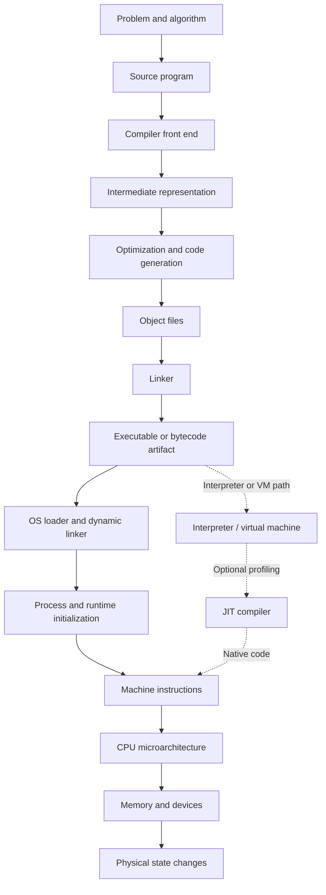

# From Source Code to Silicon: How a Computer Executes a Program

## Abstract

Executing a program is not one operation. It is a chain of transformations and coordinated abstractions spanning programming languages, compilers, executable formats, runtime systems, operating systems, instruction-set architectures, processor microarchitecture, memory, devices, and physical circuitry.

This paper follows a program end-to-end: from source text written by a programmer, through compilation and linking, into a process created by an operating system, and finally through instruction execution inside a modern processor. It uses a conventional stored-program computer, a native ahead-of-time compiler, a virtual-memory operating system, and a general-purpose CPU as the representative case. These assumptions are sufficiently general to explain most contemporary systems. Interpreters, JIT compilers, virtual machines, and managed runtimes are treated as variations on the same underlying pipeline.

---

## 1. The two dimensions: lifecycle and stack

Two independent dimensions organize the entire subject.

The **lifecycle** describes when events occur:

$$
\text{authoring} \rightarrow \text{compile time} \rightarrow \text{link time}
\rightarrow \text{load time} \rightarrow \text{runtime} \rightarrow \text{termination}
$$

The **stack** describes which layer is responsible:

$$
\text{language} \rightarrow \text{toolchain} \rightarrow \text{runtime}
\rightarrow \text{operating system} \rightarrow \text{ISA}
\rightarrow \text{microarchitecture} \rightarrow \text{circuits}
$$

Compile time and runtime are therefore not themselves layers. They are phases during which different layers perform work.



---

## 2. The foundational ontology

Before tracing the pipeline, several entities must be distinguished.

### 2.1 Algorithm

An **algorithm** is an abstract procedure. Binary search, for example, exists independently of C, Java, a particular computer, or any particular execution.

### 2.2 Program

A **program** is a formal specification of computations in a programming language. It describes operations and their relationships, but it is not necessarily tied to one physical representation.

The same program may appear as:

- source text;
- an abstract syntax tree;
- compiler intermediate representation;
- bytecode;
- assembly;
- native machine code.

These are representations of related computational meaning.

### 2.3 Artifact

An **artifact** is a stored representation produced or consumed by the toolchain: a source file, object file, library, bytecode module, executable, debugging-symbol file, or deployment package.

### 2.4 Process

A **process** is a running instance of a program, together with an operating-system-managed execution environment.

Two processes launched from the same executable are different entities. Each normally receives its own:

- virtual address space;
- process identifier;
- security credentials;
- resource handles;
- threads;
- runtime state.

### 2.5 Thread

A **thread** is one schedulable path of instruction execution within a process. Threads in the same process generally share code, global data, heap memory, and operating-system resources, while each has its own stack and register state.

### 2.6 Machine state

At an abstract level, execution is a sequence of state transitions:

$$
S_0 \rightarrow S_1 \rightarrow S_2 \rightarrow \cdots
$$

A machine state can include:

$$
S_i =
\left(
\mathrm{PC},
\mathrm{registers},
\mathrm{memory},
\mathrm{privilege\ state},
\mathrm{device\ state},
\mathrm{OS\ state}
\right)
$$

The program counter, or PC, identifies the next instruction. Executing an instruction transforms $S_i$ into $S_{i+1}$.

This state-transition model remains valid whether the “machine” is a physical CPU, a bytecode virtual machine, or an interpreter defined in software.

---

## 3. Stage zero: requirements, algorithms, and source code

A programmer begins with intended behavior, not machine instructions. That intent is decomposed into:

- data representations;
- algorithms;
- control flow;
- interfaces;
- invariants;
- error-handling policies;
- interactions with external systems.

A programming language provides abstractions for expressing these ideas. Its formal character has several parts:

### 3.1 Syntax

Syntax defines which symbol sequences are grammatically valid. For example:

```c
total = price * quantity;
```

A grammar determines that this contains an assignment whose right side is a multiplication expression.

### 3.2 Static semantics

Static semantics defines properties checked without executing the relevant program:

- whether names are declared;
- whether types are compatible;
- whether control-flow constructs are legal;
- whether access restrictions are satisfied;
- whether required interfaces exist.

“Static” does not mean trivial. Type inference, lifetime analysis, trait resolution, and template instantiation can involve substantial computation.

### 3.3 Dynamic semantics

Dynamic semantics defines how valid programs behave when executed. It answers questions such as:

- In what order are operands evaluated?
- What does addition do?
- How are functions called?
- What happens on integer overflow?
- When is an object destroyed?
- How are exceptions propagated?

The language specification defines an abstract machine. A language implementation must preserve its observable behavior, but it need not reproduce every source-level step literally.

### 3.4 Source code is already encoded data

Source text is stored as bytes using an encoding such as UTF-8. Before the compiler can understand a variable, the operating system and filesystem have already reduced the source file to a named sequence of bytes.

The compiler reads those bytes through operating-system facilities, decodes them into characters, and begins language processing.

---

## 4. Compilation: turning language into a lower-level representation

A compiler is itself a program. When it compiles another program, the compiler’s own machine instructions execute on a CPU, consume source bytes, allocate memory, and produce new bytes.

A conventional compiler is divided into a front end, middle end, and back end.

---

## 5. The compiler front end

### 5.1 Preprocessing and source expansion

Some languages perform textual or structural processing before parsing.

In C and C++, the preprocessor handles:

- file inclusion;
- conditional compilation;
- macro expansion;
- source-line directives.

For example:

```c
#define SQUARE(x) ((x) * (x))
```

may be expanded before the compiler analyzes C expressions.

Other ecosystems perform analogous work through module resolution, generated source, annotations, procedural macros, or build scripts.

### 5.2 Lexical analysis

The lexer converts characters into **tokens**.

```c
answer = 6 * 7;
```

might become:

```text
IDENTIFIER("answer")
ASSIGN
INTEGER(6)
MULTIPLY
INTEGER(7)
SEMICOLON
```

Lexing removes distinctions that no longer matter, such as most whitespace, while preserving meaningful categories and source locations.

### 5.3 Parsing

The parser determines the grammatical structure of the token stream and commonly constructs an **abstract syntax tree**, or AST:

```text
Assignment
├── Name: answer
└── Multiply
    ├── Integer: 6
    └── Integer: 7
```

The AST captures semantic structure rather than the exact typography of the source.

A syntax error means the token stream cannot be assigned a valid structure under the language grammar.

### 5.4 Name resolution

The compiler determines which declaration each name denotes.

Consider:

```c
int value = 10;

void f(void) {
    int value = 20;
    use(value);
}
```

The `value` passed to `use` refers to the local declaration because lexical scoping selects it over the global one.

Name resolution constructs symbol tables and handles:

- scopes;
- namespaces;
- imports;
- overload sets;
- visibility;
- captured variables;
- generic parameters.

### 5.5 Type checking and inference

The type system constrains operations and values. The compiler may verify explicitly written types or infer them from context.

Types can determine:

- permitted operations;
- data size and alignment;
- calling conventions;
- method selection;
- memory ownership;
- possible optimizations.

In dynamically typed languages, many corresponding checks are deferred to runtime. The compiler may know that an expression produces “some value,” but not whether that value will be an integer or string in a particular execution.

### 5.6 Static analysis

Compilers may also compute:

- reachability;
- definite initialization;
- nullability;
- ownership and borrowing;
- lifetime constraints;
- exception flow;
- constant values;
- possible call targets.

Compilation fails if a mandatory rule cannot be established. Optional analyses may instead produce warnings.

---

## 6. Intermediate representations

Compilers rarely translate an AST directly into final machine code. They lower it through one or more **intermediate representations**.

An IR simplifies analysis by expressing computation in a smaller, more regular vocabulary. A source statement such as:

```c
result = (a + b) * c;
```

might become:

```text
t1 = add a, b
t2 = multiply t1, c
store result, t2
```

### 6.1 Control-flow graphs

A function is commonly represented as a **control-flow graph**. Its nodes are basic blocks: straight-line instruction sequences with one entry and one terminating transfer.

```text
entry
  ↓
condition
 ↙       ↘
then     else
  ↘       ↙
    merge
      ↓
    return
```

The graph makes loops, branches, reachability, and data flow explicit.

### 6.2 Static single assignment form

Many compilers use **static single assignment**, or SSA, in which each virtual variable is assigned exactly once.

```text
x1 = 10
x2 = 20
x3 = φ(x1, x2)
```

The $\phi$ operation represents a value selected according to which control-flow edge was taken.

SSA makes producer-consumer relationships explicit and simplifies constant propagation, dead-code elimination, and other optimizations.

### 6.3 Lowering

Lowering gradually replaces high-level operations with more concrete ones:

```text
high-level string concatenation
    ↓
runtime-library call
    ↓
memory allocation and copying
    ↓
target-specific loads, stores, and branches
```

Different languages begin at different abstraction levels, but every operation eventually must be implemented using instructions or calls available in the target environment.

---

## 7. Optimization

Optimization means transforming a program while preserving its permitted observable behavior.

That qualification matters. A compiler is not required to preserve source structure, instruction count, local variable locations, or intermediate calculations if the language says they are unobservable.

Common transformations include:

### 7.1 Constant folding

```c
x = 6 * 7;
```

becomes:

```c
x = 42;
```

### 7.2 Constant propagation

If the compiler proves that a variable always equals a known constant, it substitutes the constant into later expressions.

### 7.3 Dead-code elimination

Calculations whose results cannot affect observable behavior can be removed.

### 7.4 Common-subexpression elimination

If the same pure expression is computed repeatedly and its inputs have not changed, one result may be reused.

### 7.5 Inlining

A call:

```c
y = square(x);
```

may be replaced by the body of `square`. This removes call overhead and exposes additional optimization opportunities.

Inlining is not always beneficial: it can increase executable size and instruction-cache pressure.

### 7.6 Loop transformations

Compilers may perform:

- invariant-code motion;
- unrolling;
- vectorization;
- fusion;
- interchange;
- strength reduction.

Vectorization turns scalar operations into SIMD instructions that process multiple values simultaneously.

### 7.7 Escape analysis

If an object cannot outlive a function or become visible elsewhere, the compiler may place it on the stack, eliminate its allocation, or even replace it with independent scalar values.

### 7.8 The “as-if” principle

A compiler can perform any transformation whose externally observable result is allowed by the language.

Consequently, source code does not map one-to-one onto machine instructions. A source variable might never occupy memory. A function might disappear through inlining. An entire loop might be computed at compile time.

---

## 8. Machine-code generation

The compiler back end converts IR into instructions for a target **instruction-set architecture**, or ISA.

### 8.1 Instruction selection

The compiler chooses target instructions implementing IR operations.

An addition might map directly to an integer `ADD` instruction. A more complex operation may require several instructions or a runtime-library call.

Instruction selection considers available addressing modes, data widths, vector instructions, and processor features.

### 8.2 Register allocation

CPUs provide a small, fast set of architectural registers. Compiler IR may contain thousands of temporary values, so the compiler decides:

- which values occupy registers;
- when registers may be reused;
- which values must be temporarily placed in memory.

Moving a value from a register to the stack is called **spilling**. Excessive spilling makes code slower because memory access is generally more expensive than register access.

### 8.3 Instruction scheduling

The compiler reorders independent instructions to reduce stalls and expose parallelism, subject to data dependencies and the language’s memory rules.

### 8.4 Stack-frame construction

For each function, the compiler determines a stack-frame layout that may contain:

- local variables;
- spilled register values;
- saved registers;
- return information;
- temporary storage;
- exception-handling metadata.

Optimized functions may omit a conventional frame or keep many conceptual local variables entirely in registers.

### 8.5 Calling conventions and the ABI

Separate components must agree on how to call one another. This agreement is part of the **application binary interface**, or ABI.

An ABI defines matters such as:

- where arguments are placed;
- where return values appear;
- which registers a caller must preserve;
- which registers a callee must preserve;
- stack alignment;
- object-file conventions;
- data layout;
- symbol naming;
- system-call interfaces.

A function call may therefore involve:

1. placing arguments in specified registers or stack locations;
2. saving required caller state;
3. writing a return address;
4. transferring control to the callee;
5. creating the callee’s stack frame;
6. computing the result;
7. restoring state;
8. returning to the saved address.

---

## 9. Assembly, object files, and relocation

The compiler may emit textual assembly, but modern toolchains can also emit machine code directly into an **object file**.

An object file is not merely a sequence of instructions. It usually contains named sections such as:

- executable code;
- initialized data;
- zero-initialized data descriptions;
- read-only constants;
- symbol tables;
- relocation entries;
- exception-unwinding information;
- debugging metadata.

### 9.1 Symbols

A symbol associates a name with a function, object, or location. Some symbols are defined in the object file; others are unresolved references expected to be supplied elsewhere.

### 9.2 Relocations

The compiler often cannot know final addresses. It emits placeholder values and relocation records saying, in effect:

> When the final address of symbol $X$ is known, patch this instruction or data field using rule $R$.

The linker or loader later performs the required address calculation.

---

## 10. Linking

The linker combines object files and libraries into a larger artifact.

Its primary responsibilities are:

- collecting code and data sections;
- resolving symbol references;
- assigning final or relative addresses;
- applying relocations;
- selecting library components;
- constructing executable-format metadata.

### 10.1 Static linking

With static linking, required library code is incorporated into the resulting executable.

Advantages include simpler deployment and less runtime dependency resolution. Costs include larger executables and duplicated library code across processes or files.

### 10.2 Dynamic linking

With dynamic linking, the executable records dependencies on separately stored shared libraries.

At load time, a dynamic linker:

- locates compatible libraries;
- maps them into the process;
- resolves imported symbols;
- applies dynamic relocations;
- arranges indirection tables where required.

Dynamic linking allows code sharing and independent library updates, but introduces compatibility, lookup, and deployment concerns.

### 10.3 Link-time optimization

Traditional compilation optimizes one translation unit at a time. Link-time optimization preserves IR across compilation and lets the linker or compiler optimize across module boundaries.

This can improve inlining, dead-code removal, and whole-program analysis.

---

## 11. Executable formats

An executable is a structured binary document. Common format families include ELF, PE, and Mach-O.

Although details differ, an executable generally records:

- target architecture;
- entry point;
- code and data regions;
- required memory permissions;
- alignment constraints;
- dynamic-library dependencies;
- relocation information;
- thread-local storage descriptions;
- optional signatures and debugging information.

A crucial distinction is:

- **Sections** organize information for linking and analysis.
- **Segments** describe how portions should be mapped into process memory.

A code segment may be readable and executable but not writable. A data segment may be readable and writable but not executable. These permissions enforce a security boundary.

---

## 12. Program launch and process creation

Launching a program asks the operating system to construct a new execution context.

Depending on the OS, this may involve creating a new process directly or replacing an existing process image.

### 12.1 Virtual address space

Each process usually sees a private **virtual address space**. Addresses used by the program are virtual addresses, not direct identifiers of physical RAM cells.

A simplified layout might contain:

```text
high addresses
┌─────────────────────────┐
│ Thread stacks           │
├─────────────────────────┤
│ Shared libraries        │
├─────────────────────────┤
│ Memory-mapped regions   │
├─────────────────────────┤
│ Heap                    │
├─────────────────────────┤
│ Writable global data    │
├─────────────────────────┤
│ Read-only data          │
├─────────────────────────┤
│ Executable code         │
└─────────────────────────┘
low addresses
```

The exact arrangement varies and is commonly randomized for security.

### 12.2 Page tables

Virtual memory is divided into pages. The operating system constructs page tables mapping virtual pages to physical page frames or other backing storage.

A page-table entry can encode:

- whether the page is present;
- whether it is writable;
- whether it is executable;
- whether user-mode code may access it;
- whether it has been accessed or modified.

Virtual memory provides:

- process isolation;
- flexible address placement;
- shared mappings;
- memory-mapped files;
- demand paging;
- copy-on-write behavior;
- protection enforcement.

### 12.3 Demand paging

The entire executable does not necessarily enter RAM immediately. The loader creates mappings describing where data can be obtained.

When the program first accesses a nonresident page, the CPU raises a page fault. The kernel:

1. validates the access;
2. obtains or creates the page;
3. updates the page table;
4. resumes the interrupted instruction.

Thus, “loading a program” is frequently lazy.

### 12.4 Address-space randomization

Address-space layout randomization places code, libraries, heaps, and stacks at varying addresses. Position-independent code and relocation mechanisms allow programs to operate despite this variation.

### 12.5 Initial thread state

The loader constructs the initial thread with:

- an instruction pointer;
- stack pointer;
- arguments;
- environment data;
- architecture- and OS-specific startup information;
- thread-local state.

Control is normally transferred to runtime startup code rather than directly to the source-level `main` function.

---

## 13. Runtime initialization

Startup code bridges the OS process model and the programming-language model.

It may:

- initialize the language runtime;
- prepare global constructors;
- configure thread-local storage;
- initialize memory allocators;
- establish exception machinery;
- process command-line arguments;
- configure standard input, output, and error streams;
- invoke the program’s designated entry function.

After `main` or its equivalent returns, runtime code also commonly coordinates orderly termination.

---

## 14. Runtime memory organization

### 14.1 Code and constants

Machine instructions and immutable constants are mapped into protected memory. Read-only protection prevents accidental or malicious modification.

### 14.2 Static storage

Global and static objects generally exist for the process’s lifetime. Some are stored with initial values; zero-initialized regions may be represented compactly in the executable and materialized by the loader.

### 14.3 Stack

Each thread normally has a stack used for function-call state and temporary storage.

A call may push or otherwise establish a frame; a return releases it. Stack allocation is efficient because it often requires only adjusting a stack pointer.

The stack is not conceptually required to grow in a particular direction, and optimized code need not place every local variable there.

### 14.4 Heap

The heap supplies dynamically sized or dynamically lived objects.

A language-level allocator requests blocks from a user-space memory allocator. That allocator manages arenas, size classes, and free lists. It obtains larger regions from the operating system through virtual-memory facilities.

Thus:

```text
new / malloc
    ↓
language or C allocator
    ↓
allocator metadata and free lists
    ↓
OS virtual-memory request when necessary
    ↓
physical pages supplied on demand
```

### 14.5 Managed memory

A garbage-collected runtime tracks object reachability and reclaims objects that can no longer affect execution.

Collectors may be:

- tracing or reference-counting;
- generational;
- copying or compacting;
- concurrent or stop-the-world;
- incremental.

Garbage collection changes memory-management policy, but it still ultimately operates on process memory supplied by the OS.

---

## 15. Libraries and system calls

Most application operations are not implemented solely by the program’s own machine code.

A library call executes ordinary user-mode code. A **system call** deliberately crosses from an unprivileged application into the privileged operating-system kernel.

### 15.1 Privilege levels

Modern processors provide privilege modes. Application code normally executes in user mode, where sensitive operations are forbidden.

Kernel mode permits operations such as:

- configuring page tables;
- controlling devices;
- handling interrupts;
- scheduling processors;
- enforcing process isolation.

### 15.2 System-call transition

A system call generally involves:

1. placing a system-call identifier and arguments in ABI-defined locations;
2. executing a special instruction;
3. switching to a privileged kernel entry point;
4. validating the request and user memory;
5. performing or initiating the operation;
6. recording a result or error;
7. restoring user-mode state;
8. resuming the application.

The transition has overhead, so libraries often buffer or batch operations.

### 15.3 Files and the VFS

Applications typically interact with file descriptors or handles rather than physical disks.

A filesystem layer maps generic operations such as open, read, and write onto:

- filesystem implementations;
- caches;
- block-storage layers;
- device drivers;
- storage hardware.

### 15.4 Devices and drivers

A device driver translates generic kernel requests into device-specific operations. Devices may communicate through memory-mapped control registers, command queues, interrupts, and direct memory access.

With **DMA**, a device can transfer data to or from RAM without requiring the CPU to copy each byte. The CPU configures the transfer and is notified when work completes.

---

## 16. The instruction-set architecture

The ISA is the contract between machine-level software and a processor implementation.

It defines:

- instruction encodings;
- architectural registers;
- supported data types;
- addressing modes;
- control-flow operations;
- exception behavior;
- privilege mechanisms;
- atomic operations;
- visible memory-ordering rules.

An ISA instruction might state abstractly:

$$
R_0 \leftarrow R_1 + R_2
$$

The ISA defines the resulting architectural state. It usually does not prescribe the processor’s internal steps.

### 16.1 Machine code

Machine code is a byte encoding of ISA instructions and operands. A disassembler can convert these bytes into assembly notation, but the processor consumes the encoded form.

### 16.2 Registers

Architectural registers include:

- general-purpose integer registers;
- floating-point and vector registers;
- the program counter;
- stack-related registers;
- status and control registers.

Registers are named locations exposed by the ISA. Their physical implementation can be more complex than the architecture suggests.

### 16.3 Loads and stores

Most modern instruction sets distinguish computation from memory access.

A load copies data from memory into a register. A store copies data from a register into memory. Arithmetic usually operates on register values.

A single source expression may therefore require:

```text
load operand A
load operand B
multiply
store result
```

### 16.4 Exceptions and interrupts

An **exception** is a synchronous event caused by instruction execution, such as an invalid instruction, division fault, page fault, or protection violation.

An **interrupt** is generally an asynchronous notification from hardware, such as a timer or device-completion event.

Both transfer control to privileged handling code while preserving enough state to resume or terminate the interrupted computation.

---

## 17. Inside a modern CPU

The simple model says the CPU repeatedly fetches, decodes, and executes instructions. Modern processors preserve that architectural illusion while performing substantial internal parallelism.

### 17.1 Instruction fetch

The processor uses the program counter to obtain instruction bytes, normally from an instruction cache.

Because control-flow instructions change the next address, the processor predicts branches so that fetching can continue before the branch result is known.

### 17.2 Decode

Instruction bytes are decoded into internal operations, often called micro-operations. A complex architectural instruction may become several simpler internal operations.

### 17.3 Register renaming

Architectural register names create apparent dependencies. Register renaming maps them onto a larger set of physical registers, eliminating false write-related dependencies.

### 17.4 Out-of-order execution

Once true operand dependencies are satisfied, independent operations may execute before earlier stalled operations.

For example, while one instruction waits for memory, later arithmetic unrelated to that memory access can proceed.

### 17.5 Execution units

Different units handle different work:

- integer arithmetic;
- floating-point operations;
- vector operations;
- address generation;
- loads and stores;
- branches.

Multiple units allow several operations to be active simultaneously.

### 17.6 Speculation

The processor executes along predicted paths before knowing whether its assumptions are correct.

If a prediction is correct, time is saved. If it is wrong, speculative results are discarded and execution restarts from the correct path.

Speculation must preserve architectural correctness, although speculative side effects on caches and predictors have important security implications.

### 17.7 Retirement

Instructions generally **retire** in program order through a reorder buffer. Retirement makes their results architecturally visible.

This provides the appearance of orderly execution even though internal execution was parallel and out of order.

---

## 18. The memory hierarchy

CPU arithmetic is much faster than access to distant memory. Computers therefore use a hierarchy:

```text
registers
   ↓
L1 cache
   ↓
L2 cache
   ↓
shared last-level cache
   ↓
main memory
   ↓
persistent storage
```

Higher levels are smaller and faster. Lower levels are larger and slower.

### 18.1 Cache lines

Caches move memory in fixed-size blocks called cache lines. Accessing one byte often loads neighboring bytes as well.

Programs are faster when they exhibit:

- **temporal locality:** recently used data is reused;
- **spatial locality:** nearby data is accessed together.

### 18.2 Cache misses

If requested data is absent from a cache, it must be obtained from a lower level. The processor may continue other independent work, but an instruction depending on that data must wait.

### 18.3 Translation lookaside buffer

The CPU must translate virtual addresses through page tables. A **TLB** caches recent virtual-to-physical translations.

A TLB miss triggers a page-table walk. This differs from a page fault: the mapping may exist even if its translation is not currently cached.

### 18.4 Cache coherence

Multiple CPU cores may cache the same memory. A coherence protocol coordinates those cached copies so that writes become visible according to defined rules.

Coherence does not automatically make concurrent programs correct. Languages and ISAs specify memory models governing when operations may be reordered and what synchronization constructs guarantee.

---

## 19. Scheduling and concurrency

A machine may have more runnable threads than hardware execution contexts.

The kernel scheduler selects which thread runs on each logical processor. A context switch saves one thread’s architectural state and restores another’s.

A thread may stop running because:

- its time slice expires;
- it blocks waiting for input;
- it waits for a lock;
- a higher-priority thread becomes runnable;
- it voluntarily yields;
- it terminates.

Concurrency introduces nondeterminism: the precise interleaving of threads may differ between executions.

Synchronization mechanisms—including mutexes, semaphores, condition variables, atomic operations, and message passing—constrain possible interleavings.

---

## 20. Interpreters, bytecode, and virtual machines

A native executable is only one possible artifact.

### 20.1 Interpreter

An interpreter is a machine-code program implementing another language’s abstract machine.

Conceptually:

```text
read next represented instruction
decode its meaning
perform the corresponding operation
repeat
```

If the guest instruction means “add,” the interpreter executes its own native instructions to inspect guest values, verify their types if necessary, perform addition, store the result, and advance the guest instruction pointer.

There are therefore two levels of program state:

- the interpreter’s native machine state;
- the interpreted program’s simulated state.

### 20.2 Bytecode

Bytecode is a compact instruction representation designed for a software virtual machine rather than a particular physical ISA.

It can provide:

- portability;
- simpler verification;
- smaller artifacts;
- a stable deployment target;
- easier interpretation and JIT compilation.

### 20.3 Virtual machine

A language VM manages the bytecode execution model, object representation, call stacks, memory management, exceptions, class loading, and often concurrency.

The VM is not metaphysically separate from the computer. It is ordinary native code implementing an additional abstract machine.

---

## 21. JIT compilation

A JIT compiler moves some compilation into the running process.

A tiered runtime may proceed as follows:

1. Parse source or load bytecode.
2. Interpret it or compile it quickly with minimal optimization.
3. Collect execution profiles.
4. Identify frequently executed functions or loops.
5. compile those regions into optimized native code.
6. transfer execution into that code.
7. invalidate or replace it if assumptions cease to hold.

### 21.1 Runtime profiling

The runtime may observe:

- operand types;
- branch frequencies;
- call targets;
- object layouts;
- loop counts;
- allocation behavior.

### 21.2 Speculative optimization

Suppose a JavaScript addition has only received integers. The JIT may generate a fast integer path guarded by a type check.

```text
if both operands are integers:
    execute specialized integer addition
else:
    transfer to generic handling
```

### 21.3 Deoptimization

Optimized code may assume that a method has not been replaced or that an object has a particular layout. If the assumption becomes false, execution returns to a more general representation.

The runtime reconstructs the logical state expected by the interpreter or less-optimized code. This is deoptimization.

JIT compilation therefore trades startup work, memory, and implementation complexity for optimization informed by the current execution.

---

## 22. A concrete end-to-end example: printing `42`

Consider:

```c
#include <stdio.h>

int main(void) {
    int answer = 6 * 7;
    printf("%d\n", answer);
    return 0;
}
```

A representative path is:

1. The source is stored as encoded bytes.
2. Preprocessing incorporates the declaration of `printf`.
3. Lexing and parsing create the program structure.
4. Type checking verifies the call and arithmetic.
5. IR represents multiplication, formatting call, and return.
6. Constant folding replaces `6 * 7` with `42`.
7. Code generation places the `printf` arguments according to the ABI.
8. The object file contains machine code plus an unresolved `printf` reference.
9. The linker records or resolves that reference through the standard library.
10. The OS maps the executable and libraries into a new process.
11. Runtime startup initializes the process and calls `main`.
12. The CPU fetches and executes the instructions.
13. The standard library parses the format string and converts `42` into character bytes.
14. Buffered output code eventually requests an OS write.
15. A system-call instruction transfers control to the kernel.
16. The kernel validates the buffer and routes the bytes to the terminal endpoint.
17. Terminal software interprets the bytes as text.
18. The graphics system renders glyphs into a pixel buffer.
19. Display hardware reads pixel data and drives physical display elements.
20. `main` returns zero.
21. Runtime termination code flushes buffers and invokes process exit.
22. The kernel closes resources, records termination status, and reclaims the process’s mappings.

Even this tiny program activates nearly every layer of the system.

---

## 23. Program termination

Termination can be orderly or abnormal.

During orderly termination, a runtime may:

- run destructors or shutdown hooks;
- flush buffered streams;
- release language-managed resources;
- notify the operating system of an exit status.

The kernel then:

- marks the process as terminated;
- closes its remaining handles;
- releases or dereferences memory mappings;
- notifies interested parent or monitoring processes;
- preserves limited status information until collected.

Abnormal termination may result from:

- an unhandled language exception;
- an invalid memory access;
- an illegal instruction;
- an explicit kill request;
- resource-policy enforcement;
- hardware failure.

The OS remains responsible for isolating the failure and reclaiming process-level resources.

---

## 24. What “architecture” can mean

The word **architecture** is used at several levels:

| Term | Meaning |
|---|---|
| Software architecture | Organization of modules, services, interfaces, and dependencies |
| Runtime architecture | Organization of VM, allocator, collector, scheduler, and libraries |
| System architecture | Relationship among applications, OS, devices, and machines |
| Instruction-set architecture | Machine-visible instruction and state contract |
| Microarchitecture | Internal processor implementation of that ISA |
| Hardware architecture | Broader organization of CPUs, memory, buses, accelerators, and devices |

Confusion arises when these meanings are treated as interchangeable.

---

## 25. The deepest unifying model

The entire pipeline can be understood as three recurring operations.

### 25.1 Representation

The program exists in progressively different forms:

$$
\text{intent} \rightarrow \text{source} \rightarrow \text{AST}
\rightarrow \text{IR} \rightarrow \text{machine code}
$$

### 25.2 Interpretation

At every level, one system assigns meaning to another representation:

- the compiler interprets source according to a language specification;
- the linker interprets symbols and relocations;
- the loader interprets an executable format;
- the CPU interprets machine instructions according to an ISA;
- circuits implement the CPU’s state transitions.

### 25.3 State transition

Ultimately, execution means changing state:

- variable values change;
- registers change;
- memory changes;
- files change;
- packets move;
- pixels change;
- electrical charges and voltages change.

The layers exist so that a programmer can reason in terms such as functions, objects, tables, and messages rather than transistor voltages.

---

## Conclusion

A computer does not directly execute source code, functions, or algorithms. It executes machine instructions within an operating-system-created process. Those instructions are the endpoint of a chain of representations, agreements, and transformations.

The compiler preserves language meaning while lowering abstractions. The linker assembles independently produced components. The executable format describes how a program should be loaded. The OS creates an isolated virtual machine-like environment using processes and virtual memory. Runtime systems provide language services not expressed directly by the ISA. The ISA defines the processor-visible machine. The microarchitecture executes that contract using caches, prediction, speculation, parallel execution, and memory translation. Circuits finally realize those operations as physical state changes.

The most general formulation is:

> **A program is an abstract state-transition system whose representations are progressively lowered until a physical machine can realize those transitions.**

Compile time determines some of those transformations before execution. Load time constructs the execution environment. Runtime supplies the values and events that cannot be known in advance. The distinction between compilers, interpreters, and JITs is largely a question of **which representation is executed or translated, by what mechanism, and at what point in the lifecycle**.

---

## Continue to Part II

[From Dataset to Updated Weights: How an ML Training Pipeline Executes](E2E_ML_training.md) extends this execution model through Python, NumPy, PyTorch, CUDA, GPU microarchitecture, random state, numerical determinism, distributed training, and reproducible checkpointing.
